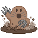
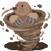
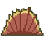
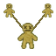
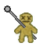
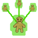

# All abilities

Every ability of the 70 fruits in one table: **click a column** to sort it, **type in the box** to keep only the rows that match. Values are those of the ability's tooltip in game; an ability with several modes shows each mode's value, separated by `/`. Hidden abilities are left out.

<input class="table-filter" type="search" placeholder="Filter by ability, fruit or type" aria-label="Filter the abilities">

| Ability | Fruit | Type | Cooldown | Charge | Hold | Damage | Range |
|---|---|---|---|---|---|---|---|
| { .ability-mini }[World Wash](fruits/awa-awa-no-mi.md#world-wash) | [Awa Awa no Mi](fruits/awa-awa-no-mi.md) | Active · Zone | 120 s | 3–12 s |  |  | 128 blocks (zone) |
| { .ability-mini }[Bubble Cage](fruits/awa-awa-no-mi.md#bubble-cage) | [Awa Awa no Mi](fruits/awa-awa-no-mi.md) | Active | 45 s | 1 s | 10 s | 120 |  |
| { .ability-mini }[Squeaky Clean](fruits/awa-awa-no-mi.md#squeaky-clean) | [Awa Awa no Mi](fruits/awa-awa-no-mi.md) | Passive |  |  |  |  |  |
| { .ability-mini }[Bakumetal Genesis](fruits/baku-baku-no-mi.md#bakumetal-genesis) | [Baku Baku no Mi](fruits/baku-baku-no-mi.md) | Active |  |  |  |  |  |
| { .ability-mini }[Armor Munch](fruits/baku-baku-no-mi.md#armor-munch) | [Baku Baku no Mi](fruits/baku-baku-no-mi.md) | Active | 30 s |  | 60 s | 80 | 6 blocks |
| { .ability-mini }[Iron Stomach](fruits/baku-baku-no-mi.md#iron-stomach) | [Baku Baku no Mi](fruits/baku-baku-no-mi.md) | Passive |  |  |  |  |  |
| { .ability-mini }[Spring Domain](fruits/bane-bane-no-mi.md#spring-domain) | [Bane Bane no Mi](fruits/bane-bane-no-mi.md) | Active · Zone | 120 s | 3–12 s |  |  | 128 blocks (zone) |
| { .ability-mini }[Spring Fajin](fruits/bane-bane-no-mi.md#spring-fajin) | [Bane Bane no Mi](fruits/bane-bane-no-mi.md) | Active | 30 s | 3 s |  | 90 | 2.6 blocks (line) |
| { .ability-mini }[Ricochet](fruits/bane-bane-no-mi.md#ricochet) | [Bane Bane no Mi](fruits/bane-bane-no-mi.md) | Passive |  |  |  | 30 | 12 blocks |
| { .ability-mini }[Dislocation Punch](fruits/bara-bara-no-mi.md#dislocation-punch) | [Bara Bara No Mi](fruits/bara-bara-no-mi.md) | Active · Punch |  |  |  |  |  |
| { .ability-mini }[Bara Bara Parade](fruits/bara-bara-no-mi.md#bara-bara-parade) | [Bara Bara No Mi](fruits/bara-bara-no-mi.md) | Active | 60 s |  |  | 40 | 32 blocks (area) |
| { .ability-mini }[Severed Grip](fruits/bara-bara-no-mi.md#severed-grip) | [Bara Bara No Mi](fruits/bara-bara-no-mi.md) | Passive |  |  | 5 s |  |  |
| { .ability-mini }[God's Bulwark](fruits/bari-bari-no-mi.md#gods-bulwark) | [Bari Bari no Mi](fruits/bari-bari-no-mi.md) | Active | 45–180 s |  | 10 s |  |  |
| { .ability-mini }[Barrier Eruption](fruits/bari-bari-no-mi.md#barrier-eruption) | [Bari Bari no Mi](fruits/bari-bari-no-mi.md) | Active | 30 s | 1 s |  | 60 | 10 blocks (area) |
| { .ability-mini }[Grand Repulsion](fruits/bari-bari-no-mi.md#grand-repulsion) | [Bari Bari no Mi](fruits/bari-bari-no-mi.md) | Active | 45 s | 1 s |  | 80 | 12 blocks (area) |
| { .ability-mini }[Beta Beta Ocean](fruits/beta-beta-no-mi.md#beta-beta-ocean) | [Beta Beta no Mi](fruits/beta-beta-no-mi.md) | Active | 40 s | 1 s |  |  | 32 blocks (area) |
| { .ability-mini }[Beta Beta Surge](fruits/beta-beta-no-mi.md#beta-beta-surge) | [Beta Beta no Mi](fruits/beta-beta-no-mi.md) | Active | 45 s |  |  | 40 | 24 blocks (line) |
| { .ability-mini }[Slick Passage](fruits/beta-beta-no-mi.md#slick-passage) | [Beta Beta no Mi](fruits/beta-beta-no-mi.md) | Passive |  |  |  |  |  |
| { .ability-mini }[Airburst](fruits/bomu-bomu-no-mi.md#airburst) | [Bomu Bomu no Mi](fruits/bomu-bomu-no-mi.md) | Active | 30 s |  |  | 30 |  |
| { .ability-mini }[Blast Jump](fruits/bomu-bomu-no-mi.md#blast-jump) | [Bomu Bomu no Mi](fruits/bomu-bomu-no-mi.md) | Active |  |  |  | 40 |  |
| { .ability-mini }[Piercing Blast](fruits/bomu-bomu-no-mi.md#piercing-blast) | [Bomu Bomu no Mi](fruits/bomu-bomu-no-mi.md) | Active | 10–120 s | 0–60 s |  | 1–300 |  |
| { .ability-mini }[Word of Recovery](fruits/chiyu-chiyu-no-mi.md#word-of-recovery) | [Chiyu Chiyu no Mi](fruits/chiyu-chiyu-no-mi.md) | Active · Punch |  |  |  |  |  |
| { .ability-mini }[Cellular Overgrowth](fruits/chiyu-chiyu-no-mi.md#cellular-overgrowth) | [Chiyu Chiyu no Mi](fruits/chiyu-chiyu-no-mi.md) | Active · Punch |  |  |  | 40–75 |  |
| { .ability-mini }[Overflow](fruits/chiyu-chiyu-no-mi.md#overflow) | [Chiyu Chiyu no Mi](fruits/chiyu-chiyu-no-mi.md) | Passive |  |  |  |  |  |
| { .ability-mini }[Titan](fruits/deka-deka-no-mi.md#titan) | [Deka Deka no Mi](fruits/deka-deka-no-mi.md) | Active · Transformation | 1 s |  | ∞ s |  |  |
| { .ability-mini }[Titan Trample](fruits/deka-deka-no-mi.md#titan-trample) | [Deka Deka no Mi](fruits/deka-deka-no-mi.md) | Passive |  |  |  | 7.2 | 10 blocks (area) |
| { .ability-mini }[Titan Smash](fruits/deka-deka-no-mi.md#titan-smash) | [Deka Deka no Mi](fruits/deka-deka-no-mi.md) | Active | 20 s | 4 s |  | 150 |  |
| { .ability-mini }[Hide and Seek](fruits/doa-doa-no-mi.md#hide-and-seek) | [Doa Doa no Mi](fruits/doa-doa-no-mi.md) | Active · Zone | 240 s | 2 s |  |  | 20 blocks (zone) |
| { .ability-mini }[Living Gate](fruits/doa-doa-no-mi.md#living-gate) | [Doa Doa no Mi](fruits/doa-doa-no-mi.md) | Active | 30 s |  | 10 s |  |  |
| { .ability-mini }[Backdoor](fruits/doa-doa-no-mi.md#backdoor) | [Doa Doa no Mi](fruits/doa-doa-no-mi.md) | Passive |  |  |  |  | 32 blocks |
| { .ability-mini }[Venom World](fruits/doku-doku-no-mi.md#venom-world) | [Doku Doku no Mi](fruits/doku-doku-no-mi.md) | Active | 50 s | 1 s |  |  | 40 blocks (area) |
| { .ability-mini }[Compound Hydra](fruits/doku-doku-no-mi.md#compound-hydra) | [Doku Doku no Mi](fruits/doku-doku-no-mi.md) | Active |  |  |  |  |  |
| { .ability-mini }[Virulence](fruits/doku-doku-no-mi.md#virulence) | [Doku Doku no Mi](fruits/doku-doku-no-mi.md) | Passive |  |  |  |  |  |
| { .ability-mini }[Candle World](fruits/doru-doru-no-mi.md#candle-world) | [Doru Doru no Mi](fruits/doru-doru-no-mi.md) | Active · Zone | 120 s | 3–12 s |  |  | 50 blocks (area) |
| { .ability-mini }[Wax Master](fruits/doru-doru-no-mi.md#wax-master) | [Doru Doru no Mi](fruits/doru-doru-no-mi.md) | Passive |  |  |  |  |  |
| { .ability-mini }[Wick](fruits/doru-doru-no-mi.md#wick) | [Doru Doru no Mi](fruits/doru-doru-no-mi.md) | Active | 30 s | 1 s |  |  | 32 blocks (area) |
| { .ability-mini }[Taiki](fruits/gasu-gasu-no-mi.md#taiki) | [Gasu Gasu no Mi](fruits/gasu-gasu-no-mi.md) | Active · Zone | 60 s | 3–9 s |  | 12 | 64 blocks (zone) |
| { .ability-mini }[Asshuku](fruits/gasu-gasu-no-mi.md#asshuku) | [Gasu Gasu no Mi](fruits/gasu-gasu-no-mi.md) | Active | 30 s |  |  | 45–135 |  |
| { .ability-mini }[Chuwa](fruits/gasu-gasu-no-mi.md#chuwa) | [Gasu Gasu no Mi](fruits/gasu-gasu-no-mi.md) | Passive |  |  |  |  | 24 blocks |
| { .ability-mini }[High-Frequency Wall](fruits/goe-goe-no-mi.md#high-frequency-wall) | [Goe Goe no Mi](fruits/goe-goe-no-mi.md) | Active | 15–125 s |  | 30 s |  |  |
| { .ability-mini }[Resonating World](fruits/goe-goe-no-mi.md#resonating-world) | [Goe Goe no Mi](fruits/goe-goe-no-mi.md) | Active · Zone | 120 s | 3–12 s |  | 6–17 | 128 blocks (zone) |
| { .ability-mini }[Broken Focus](fruits/goe-goe-no-mi.md#broken-focus) | [Goe Goe no Mi](fruits/goe-goe-no-mi.md) | Passive |  |  |  |  |  |
| { .ability-mini }[Godland](fruits/goro-goro-no-mi.md#kami-no-kuni) | [Goro Goro no Mi](fruits/goro-goro-no-mi.md) | Active · Zone | 90 s | 3–12 s |  | 20–65 | 128 blocks (zone) |
| { .ability-mini }[Stormstep](fruits/goro-goro-no-mi.md#stormstep) | [Goro Goro no Mi](fruits/goro-goro-no-mi.md) | Active | 25 s | 2 s |  | 90–144 |  |
| { .ability-mini }[Storm Sovereign](fruits/goro-goro-no-mi.md#storm-sovereign) | [Goro Goro no Mi](fruits/goro-goro-no-mi.md) | Passive |  |  |  |  |  |
| { .ability-mini }[Tenchi Hokai](fruits/gura-gura-no-mi.md#tenchi-hokai) | [Gura Gura no Mi](fruits/gura-gura-no-mi.md) | Active | 240 s | 12 s |  | 24–80 | 80 blocks (area) |
| { .ability-mini }[Funshin](fruits/gura-gura-no-mi.md#funshin) | [Gura Gura no Mi](fruits/gura-gura-no-mi.md) | Active | 25 s | 1 s |  | 40 |  |
| { .ability-mini }[Aftershock](fruits/gura-gura-no-mi.md#aftershock) | [Gura Gura no Mi](fruits/gura-gura-no-mi.md) | Passive |  |  |  |  |  |
| { .ability-mini }[Diosa Fleur](fruits/hana-hana-no-mi.md#diosa-fleur) | [Hana Hana No Mi](fruits/hana-hana-no-mi.md) | Active | 50–250 s | 1 s |  |  |  |
| { .ability-mini }[Bloom Crusher](fruits/hana-hana-no-mi.md#bloom-crusher) | [Hana Hana No Mi](fruits/hana-hana-no-mi.md) | Active | 40 s | 1 s |  | 100 | 40 blocks (line) |
| { .ability-mini }[Clutch Lock](fruits/hana-hana-no-mi.md#clutch-lock) | [Hana Hana No Mi](fruits/hana-hana-no-mi.md) | Passive |  |  |  | 25 |  |
| { .ability-mini }[Ice Epoch](fruits/hie-hie-no-mi.md#ice-epoch) | [Hie Hie no Mi](fruits/hie-hie-no-mi.md) | Active | 240 s | 10 s |  |  | 120 blocks (area) |
| { .ability-mini }[Hyosai](fruits/hie-hie-no-mi.md#hyosai) | [Hie Hie no Mi](fruits/hie-hie-no-mi.md) | Active | 30 s | 2 s |  |  | 24 blocks (area) |
| { .ability-mini }[Hyoten](fruits/hie-hie-no-mi.md#hyoten) | [Hie Hie no Mi](fruits/hie-hie-no-mi.md) | Passive |  |  |  |  |  |
| { .ability-mini }[Ethereal Whisper](fruits/hiso-hiso-no-mi.md#ethereal-whisper) | [Hiso Hiso No Mi](fruits/hiso-hiso-no-mi.md) | Active | 25 s | 3 s |  | 80 |  |
| { .ability-mini }[Call of the Wild](fruits/hiso-hiso-no-mi.md#call-of-the-wild) | [Hiso Hiso No Mi](fruits/hiso-hiso-no-mi.md) | Active | 90 s |  | 30 s |  | 32 blocks |
| { .ability-mini }[Eavesdrop](fruits/hiso-hiso-no-mi.md#eavesdrop) | [Hiso Hiso No Mi](fruits/hiso-hiso-no-mi.md) | Passive |  |  |  |  |  |
| { .ability-mini }[Awaken Human Form](fruits/hito-hito-no-mi.md#awaken-human-form) | [Hito Hito no Mi](fruits/hito-hito-no-mi.md) | Active · Transformation |  |  |  |  |  |
| { .ability-mini }[Insight](fruits/hito-hito-no-mi.md#insight) | [Hito Hito no Mi](fruits/hito-hito-no-mi.md) | Active | 45 s | 2 s | 20 s |  | 32 blocks |
| { .ability-mini }[Adaptive Mind](fruits/hito-hito-no-mi.md#adaptive-mind) | [Hito Hito no Mi](fruits/hito-hito-no-mi.md) | Passive |  |  |  |  |  |
| { .ability-mini }[Awaken Daibutsu Point](fruits/hito-hito-no-mi-model-daibutsu.md#awaken-daibutsu-point) | [Hito Hito no Mi, Model: Daibutsu](fruits/hito-hito-no-mi-model-daibutsu.md) | Active · Transformation | 1 s |  | ∞ s |  |  |
| { .ability-mini }[Nyorai Shinshō](fruits/hito-hito-no-mi-model-daibutsu.md#nyorai-shinsho) | [Hito Hito no Mi, Model: Daibutsu](fruits/hito-hito-no-mi-model-daibutsu.md) | Active | 90 s | 1 s |  | 120 | 14 blocks (area) |
| { .ability-mini }[Sanctuary](fruits/hito-hito-no-mi-model-daibutsu.md#sanctuary) | [Hito Hito no Mi, Model: Daibutsu](fruits/hito-hito-no-mi-model-daibutsu.md) | Active | 90 s |  | 60 s |  |  |
| { .ability-mini }[Hollow Shroud](fruits/horo-horo-no-mi.md#hollow-shroud) | [Horo Horo no Mi](fruits/horo-horo-no-mi.md) | Passive · Aura |  |  |  |  | 12 blocks (area) |
| { .ability-mini }[Ghost Legion](fruits/horo-horo-no-mi.md#ghost-legion) | [Horo Horo no Mi](fruits/horo-horo-no-mi.md) | Active | 45 s | 1 s |  | 35 | 48 blocks (area) |
| { .ability-mini }[Phantom Payload](fruits/horo-horo-no-mi.md#phantom-payload) | [Horo Horo no Mi](fruits/horo-horo-no-mi.md) | Active | 50 s |  |  | 100 | 7 blocks (area) |
| { .ability-mini }[Hormonal Fog](fruits/horu-horu-no-mi.md#hormonal-fog) | [Horu Horu no Mi](fruits/horu-horu-no-mi.md) | Active · Zone | 120 s | 3–12 s |  |  | 128 blocks (zone) |
| { .ability-mini }[Hell Wink](fruits/horu-horu-no-mi.md#hell-wink) | [Horu Horu no Mi](fruits/horu-horu-no-mi.md) | Active | 30 s |  |  | 60–150 | 32 blocks |
| { .ability-mini }[Iron Constitution](fruits/horu-horu-no-mi.md#iron-constitution) | [Horu Horu no Mi](fruits/horu-horu-no-mi.md) | Passive |  |  |  |  | 16 blocks |
| { .ability-mini }[Ever White](fruits/ito-ito-no-mi.md#ever-white) | [Ito Ito no Mi](fruits/ito-ito-no-mi.md) | Active · Zone | 120 s | 2–6 s |  |  | 90 blocks (area) |
| { .ability-mini }[Break White](fruits/ito-ito-no-mi.md#break-white) | [Ito Ito no Mi](fruits/ito-ito-no-mi.md) | Active | 40 s | 1 s |  | 36–100 | 30 blocks (area) |
| { .ability-mini }[White Ground](fruits/ito-ito-no-mi.md#white-ground) | [Ito Ito no Mi](fruits/ito-ito-no-mi.md) | Passive |  |  |  |  |  |
| { .ability-mini }[Assign World](fruits/jiki-jiki-no-mi.md#assign-world) | [Jiki Jiki no Mi](fruits/jiki-jiki-no-mi.md) | Active · Zone | 120 s | 2–6 s |  |  | 60 blocks (area) |
| { .ability-mini }[Scrap Tempest](fruits/jiki-jiki-no-mi.md#scrap-tempest) | [Jiki Jiki no Mi](fruits/jiki-jiki-no-mi.md) | Active | 15–45 s | 2 s |  | 24–88 | 14 blocks (area) |
| { .ability-mini }[Ferrous Dominion](fruits/jiki-jiki-no-mi.md#ferrous-dominion) | [Jiki Jiki no Mi](fruits/jiki-jiki-no-mi.md) | Passive |  |  |  |  |  |
| { .ability-mini }[Aura of Friction](fruits/kachi-kachi-no-mi.md#aura-of-friction) | [Kachi Kachi no Mi](fruits/kachi-kachi-no-mi.md) | Active · Zone | 120 s | 3–12 s |  |  | 128 blocks (zone) |
| { .ability-mini }[Scalding Steam](fruits/kachi-kachi-no-mi.md#scalding-steam) | [Kachi Kachi no Mi](fruits/kachi-kachi-no-mi.md) | Active | 30 s |  |  | 40–90 | 16 blocks |
| { .ability-mini }[Friction Burn](fruits/kachi-kachi-no-mi.md#friction-burn) | [Kachi Kachi no Mi](fruits/kachi-kachi-no-mi.md) | Passive |  |  |  |  |  |
| { .ability-mini }[Nightmare Banquet](fruits/kage-kage-no-mi.md#nightmare-banquet) | [Kage Kage no Mi](fruits/kage-kage-no-mi.md) | Active · Zone | 120 s | 3–12 s |  |  | 128 blocks (zone) |
| { .ability-mini }[Shadow Marionette](fruits/kage-kage-no-mi.md#shadow-marionette) | [Kage Kage no Mi](fruits/kage-kage-no-mi.md) | Active | 30–180 s |  |  |  | 12 blocks |
| { .ability-mini }[Sunless Brand](fruits/kage-kage-no-mi.md#sunless-brand) | [Kage Kage no Mi](fruits/kage-kage-no-mi.md) | Passive |  |  |  | 5 | 16 blocks (zone) |
| { .ability-mini }[Awaken Kame Walk Point](fruits/kame-kame-no-mi.md#awaken-kame-walk-point) | [Kame Kame no Mi](fruits/kame-kame-no-mi.md) | Active · Transformation |  |  | ∞ s |  |  |
| { .ability-mini }[Awaken Kame Guard Point](fruits/kame-kame-no-mi.md#awaken-kame-guard-point) | [Kame Kame no Mi](fruits/kame-kame-no-mi.md) | Active · Transformation | 1 s |  | ∞ s |  |  |
| { .ability-mini }[Spin](fruits/kame-kame-no-mi.md#spin) | [Kame Kame no Mi](fruits/kame-kame-no-mi.md) | Active | 30 s |  | 5 s | 18 | 4 blocks (area) |
| { .ability-mini }[Snapping Jaw](fruits/kame-kame-no-mi.md#snapping-jaw) | [Kame Kame no Mi](fruits/kame-kame-no-mi.md) | Active | 45 s |  |  | 40 |  |
| { .ability-mini }[Inga Samsara](fruits/karu-karu-no-mi.md#inga-samsara) | [Karu Karu no Mi](fruits/karu-karu-no-mi.md) | Active · Zone | 120 s | 3–12 s |  |  | 128 blocks (zone) |
| { .ability-mini }[Inga Impact](fruits/karu-karu-no-mi.md#inga-impact) | [Karu Karu no Mi](fruits/karu-karu-no-mi.md) | Active | 15 s | 2 s |  | 12.75 |  |
| { .ability-mini }[Karmic Return](fruits/karu-karu-no-mi.md#karmic-return) | [Karu Karu no Mi](fruits/karu-karu-no-mi.md) | Passive |  |  |  |  |  |
| { .ability-mini }[Gravity Zone](fruits/kilo-kilo-no-mi.md#gravity-zone) | [Kilo Kilo no Mi](fruits/kilo-kilo-no-mi.md) | Active · Zone | 120 s | 3–12 s |  | 10 | 128 blocks (zone) |
| { .ability-mini }[Infinity Kilo Punch](fruits/kilo-kilo-no-mi.md#infinity-kilo-punch) | [Kilo Kilo no Mi](fruits/kilo-kilo-no-mi.md) | Active · Punch |  |  |  |  |  |
| { .ability-mini }[Weight Shift](fruits/kilo-kilo-no-mi.md#weight-shift) | [Kilo Kilo no Mi](fruits/kilo-kilo-no-mi.md) | Passive |  |  |  |  |  |
| { .ability-mini }[Glittering Storm](fruits/kira-kira-no-mi.md#glittering-storm) | [Kira Kira no Mi](fruits/kira-kira-no-mi.md) | Active | 60 s |  | 8 s | 15 |  |
| { .ability-mini }[Brilliant Meteor](fruits/kira-kira-no-mi.md#brilliant-meteor) | [Kira Kira no Mi](fruits/kira-kira-no-mi.md) | Active | 30 s | 2 s |  | 70 | 6 blocks (area) |
| { .ability-mini }[Unscratchable](fruits/kira-kira-no-mi.md#unscratchable) | [Kira Kira no Mi](fruits/kira-kira-no-mi.md) | Passive |  |  |  | <15 |  |
| { .ability-mini }[One Man Army](fruits/kobu-kobu-no-mi.md#one-man-army) | [Kobu Kobu No Mi](fruits/kobu-kobu-no-mi.md) | Active | 60–180 s | 3 s | 60 s |  |  |
| { .ability-mini }[Battlefield Resonance](fruits/kobu-kobu-no-mi.md#battlefield-resonance) | [Kobu Kobu No Mi](fruits/kobu-kobu-no-mi.md) | Active · Zone | 120 s | 3–12 s |  |  | 128 blocks (zone) |
| { .ability-mini }[Never Surrender](fruits/kobu-kobu-no-mi.md#never-surrender) | [Kobu Kobu No Mi](fruits/kobu-kobu-no-mi.md) | Passive |  |  |  |  | 24 blocks |
| { .ability-mini }[Living Feast](fruits/kuku-kuku-no-mi.md#living-feast) | [Kuku Kuku no Mi](fruits/kuku-kuku-no-mi.md) | Active | 50–250 s |  | ∞ s |  |  |
| { .ability-mini }[Cake Transmutation](fruits/kuku-kuku-no-mi.md#cake-transmutation) | [Kuku Kuku no Mi](fruits/kuku-kuku-no-mi.md) | Active | 20 s |  |  | 40 |  |
| { .ability-mini }[Gourmet Metabolism](fruits/kuku-kuku-no-mi.md#gourmet-metabolism) | [Kuku Kuku no Mi](fruits/kuku-kuku-no-mi.md) | Passive |  |  |  |  |  |
| { .ability-mini }[Meigo no Jidai](fruits/magu-magu-no-mi.md#meigo-no-jidai) | [Magu Magu no Mi](fruits/magu-magu-no-mi.md) | Active | 240 s | 10 s |  | 60 | 120 blocks (area) |
| { .ability-mini }[Kagutsuchi](fruits/magu-magu-no-mi.md#kagutsuchi) | [Magu Magu no Mi](fruits/magu-magu-no-mi.md) | Active · Punch |  |  |  |  |  |
| { .ability-mini }[Netsuryo](fruits/magu-magu-no-mi.md#netsuryo) | [Magu Magu no Mi](fruits/magu-magu-no-mi.md) | Passive |  |  |  |  |  |
| { .ability-mini }[Crown of Flames](fruits/mera-mera-no-mi.md#crown-of-flames) | [Mera Mera no Mi](fruits/mera-mera-no-mi.md) | Active | 10–120 s | 3 s | 60 s |  |  |
| { .ability-mini }[Homura](fruits/mera-mera-no-mi.md#homura) | [Mera Mera no Mi](fruits/mera-mera-no-mi.md) | Passive · Aura |  |  |  | 1–10 | 6 blocks (area) |
| { .ability-mini }[Love's Punishment](fruits/mero-mero-no-mi.md#loves-punishment) | [Mero Mero no Mi](fruits/mero-mero-no-mi.md) | Passive · Aura |  |  |  |  | 14 blocks (area) |
| { .ability-mini }[Enthralling Gaze](fruits/mero-mero-no-mi.md#enthralling-gaze) | [Mero Mero no Mi](fruits/mero-mero-no-mi.md) | Active | 45 s |  |  |  | 32 blocks (area) |
| { .ability-mini }[Heart Rebound](fruits/mero-mero-no-mi.md#heart-rebound) | [Mero Mero no Mi](fruits/mero-mero-no-mi.md) | Active | 20 s |  |  | 70 | 30 blocks (line) |
| { .ability-mini }[Gulliver's Nightmare](fruits/mini-mini-no-mi.md#gullivers-nightmare) | [Mini Mini No Mi](fruits/mini-mini-no-mi.md) | Active · Zone | 120 s | 3–12 s |  |  | 128 blocks (zone) |
| { .ability-mini }[Lilliput Crush](fruits/mini-mini-no-mi.md#lilliput-crush) | [Mini Mini No Mi](fruits/mini-mini-no-mi.md) | Active | 20 s | 1 s |  | 30–120 | 10 blocks (area) |
| { .ability-mini }[Tiny Titan](fruits/mini-mini-no-mi.md#tiny-titan) | [Mini Mini No Mi](fruits/mini-mini-no-mi.md) | Passive |  |  |  |  |  |
| { .ability-mini }[Awaken Mogu Heavy Point](fruits/mogu-mogu-no-mi.md#awaken-mogu-heavy-point) | [Mogu Mogu no Mi](fruits/mogu-mogu-no-mi.md) | Active · Transformation | 1 s |  | ∞ s |  |  |
| { .ability-mini }[Mogu Dig](fruits/mogu-mogu-no-mi.md#mogu-dig) | [Mogu Mogu no Mi](fruits/mogu-mogu-no-mi.md) | Active | 1 s |  | ∞ s |  |  |
| { .ability-mini }[Subterranean Dash](fruits/mogu-mogu-no-mi.md#subterranean-dash) | [Mogu Mogu no Mi](fruits/mogu-mogu-no-mi.md) | Active | 6 s |  |  | 25 | 1.6 blocks (area) |
| { .ability-mini }[White Night](fruits/moku-moku-no-mi.md#white-night) | [Moku Moku no Mi](fruits/moku-moku-no-mi.md) | Active · Zone | 45 s | 3–9 s |  | 6–20 | 128 blocks (zone) |
| { .ability-mini }[White Ash](fruits/moku-moku-no-mi.md#white-ash) | [Moku Moku no Mi](fruits/moku-moku-no-mi.md) | Active | 30 s | 3 s |  | 30–130 | 100 blocks (area) |
| { .ability-mini }[White Plague](fruits/moku-moku-no-mi.md#white-plague) | [Moku Moku no Mi](fruits/moku-moku-no-mi.md) | Passive |  |  |  |  | 48 blocks |
| { .ability-mini }[Total Isolation](fruits/nagi-nagi-no-mi.md#total-isolation) | [Nagi Nagi no Mi](fruits/nagi-nagi-no-mi.md) | Active · Punch |  |  |  |  |  |
| { .ability-mini }[Soundless Step](fruits/nagi-nagi-no-mi.md#soundless-step) | [Nagi Nagi no Mi](fruits/nagi-nagi-no-mi.md) | Active · Punch |  |  |  |  |  |
| { .ability-mini }[Dead Air](fruits/nagi-nagi-no-mi.md#dead-air) | [Nagi Nagi no Mi](fruits/nagi-nagi-no-mi.md) | Passive |  |  |  |  | 30 blocks (area) |
| { .ability-mini }[Awaken Leopard Heavy Point](fruits/neko-neko-no-mi-model-leopard.md#awaken-leopard-heavy-point) | [Neko Neko no Mi, Model: Leopard](fruits/neko-neko-no-mi-model-leopard.md) | Active · Transformation | 1 s |  | ∞ s |  |  |
| { .ability-mini }[Awaken Leopard Walk Point](fruits/neko-neko-no-mi-model-leopard.md#awaken-leopard-walk-point) | [Neko Neko no Mi, Model: Leopard](fruits/neko-neko-no-mi-model-leopard.md) | Active · Transformation | 1 s |  | ∞ s |  |  |
| { .ability-mini }[Shugan](fruits/neko-neko-no-mi-model-leopard.md#shugan) | [Neko Neko no Mi, Model: Leopard](fruits/neko-neko-no-mi-model-leopard.md) | Active · Punch |  |  |  |  |  |
| { .ability-mini }[Hyozan: Kyousou](fruits/neko-neko-no-mi-model-leopard.md#hyozan-kyousou) | [Neko Neko no Mi, Model: Leopard](fruits/neko-neko-no-mi-model-leopard.md) | Active | 30 s | 2 s |  | 40 | 40 blocks (line) |
| { .ability-mini }[Netto Jigoku](fruits/netsu-netsu-no-mi.md#netto-jigoku) | [Netsu Netsu no Mi](fruits/netsu-netsu-no-mi.md) | Active · Zone | 120 s | 3–12 s |  |  | 128 blocks (zone) |
| { .ability-mini }[Melting Point](fruits/netsu-netsu-no-mi.md#melting-point) | [Netsu Netsu no Mi](fruits/netsu-netsu-no-mi.md) | Active | 60 s |  |  | 0–16 | 24 blocks (area) |
| { .ability-mini }[Scorching Fist](fruits/netsu-netsu-no-mi.md#scorching-fist) | [Netsu Netsu no Mi](fruits/netsu-netsu-no-mi.md) | Active · Punch |  |  |  | 40–90 |  |
| { .ability-mini }[Dai Hanpatsu](fruits/nikyu-nikyu-no-mi.md#dai-hanpatsu) | [Nikyu Nikyu no Mi](fruits/nikyu-nikyu-no-mi.md) | Active · Punch |  |  |  |  |  |
| { .ability-mini }[Ursus Calamiti](fruits/nikyu-nikyu-no-mi.md#ursus-calamiti) | [Nikyu Nikyu no Mi](fruits/nikyu-nikyu-no-mi.md) | Active | 60 s | 2 s |  |  |  |
| { .ability-mini }[Reverse Slow](fruits/noro-noro-no-mi.md#reverse-slow) | [Noro Noro no Mi](fruits/noro-noro-no-mi.md) | Active | 20 s / 40 s / 60 s / 80 s | 1 s / 2 s / 4 s | 60 s | 10 / 20 / 35 / 60 |  |
| { .ability-mini }[Reverse Slow : Smash](fruits/noro-noro-no-mi.md#reverse-slow-smash) | [Noro Noro no Mi](fruits/noro-noro-no-mi.md) | Passive |  |  |  |  |  |
| { .ability-mini }[Noroma Field](fruits/noro-noro-no-mi.md#noroma-field) | [Noro Noro no Mi](fruits/noro-noro-no-mi.md) | Active · Zone | 60 s | 1–2 s |  |  | 24 blocks (zone) |
| { .ability-mini }[K-Room](fruits/ope-ope-no-mi.md#k-room) | [Ope Ope no Mi](fruits/ope-ope-no-mi.md) | Active | 20 s | 1 s | 60 s |  |  |
| { .ability-mini }[Shock Wille](fruits/ope-ope-no-mi.md#shock-wille) | [Ope Ope no Mi](fruits/ope-ope-no-mi.md) | Active | 60 s |  | 10 s | 110 |  |
| { .ability-mini }[Puncture Wille](fruits/ope-ope-no-mi.md#puncture-wille) | [Ope Ope no Mi](fruits/ope-ope-no-mi.md) | Active | 60 s | 2 s |  |  |  |
| { .ability-mini }[Anesthesia](fruits/ope-ope-no-mi.md#anesthesia) | [Ope Ope no Mi](fruits/ope-ope-no-mi.md) | Passive |  |  |  |  |  |
| { .ability-mini }[Spirit Seal](fruits/ori-ori-no-mi.md#spirit-seal) | [Ori Ori no Mi](fruits/ori-ori-no-mi.md) | Active · Punch |  |  |  |  |  |
| { .ability-mini }[Iron Tether](fruits/ori-ori-no-mi.md#iron-tether) | [Ori Ori no Mi](fruits/ori-ori-no-mi.md) | Active | 90 s |  | 90 s | 60 |  |
| { .ability-mini }[Bound Hands](fruits/ori-ori-no-mi.md#bound-hands) | [Ori Ori no Mi](fruits/ori-ori-no-mi.md) | Passive |  |  |  |  | 30 blocks (area) |
| { .ability-mini }[Rhythmic Purgatory](fruits/oto-oto-no-mi.md#rhythmic-purgatory) | [Oto Oto no Mi](fruits/oto-oto-no-mi.md) | Active · Zone | 120 s | 3–12 s |  | 48 | 128 blocks (zone) |
| { .ability-mini }[Grand Finale](fruits/oto-oto-no-mi.md#grand-finale) | [Oto Oto no Mi](fruits/oto-oto-no-mi.md) | Active | 40 s | 1 s |  | 80 | 48 blocks (line) |
| { .ability-mini }[On the Beat](fruits/oto-oto-no-mi.md#on-the-beat) | [Oto Oto no Mi](fruits/oto-oto-no-mi.md) | Passive |  |  |  | +8–40 |  |
| { .ability-mini }[Candy Transmutation](fruits/pero-pero-no-mi.md#candy-transmutation) | [Pero Pero no Mi](fruits/pero-pero-no-mi.md) | Active | 20 s |  |  | 50 |  |
| { .ability-mini }[Sugar Shell](fruits/pero-pero-no-mi.md#sugar-shell) | [Pero Pero no Mi](fruits/pero-pero-no-mi.md) | Active | 45 s |  |  |  | 20 blocks (area) |
| { .ability-mini }[Sugar Coffin](fruits/pero-pero-no-mi.md#sugar-coffin) | [Pero Pero no Mi](fruits/pero-pero-no-mi.md) | Active | 40 s |  |  | 100 | 32 blocks (line) |
| { .ability-mini }[Lightfall Domain](fruits/pika-pika-no-mi.md#lightfall-domain) | [Pika Pika no Mi](fruits/pika-pika-no-mi.md) | Active · Zone | 45 s | 3–9 s |  |  | 128 blocks (zone) |
| { .ability-mini }[Kousoku](fruits/pika-pika-no-mi.md#kousoku) | [Pika Pika no Mi](fruits/pika-pika-no-mi.md) | Active | 23 s | 2 s |  | 44–110 |  |
| { .ability-mini }[Sun's Blessing](fruits/pika-pika-no-mi.md#hi-no-megumi) | [Pika Pika no Mi](fruits/pika-pika-no-mi.md) | Passive |  |  |  |  |  |
| { .ability-mini }[Awaken Allosaurus Heavy Point](fruits/ryu-ryu-no-mi-model-allosaurus.md#awaken-allosaurus-heavy-point) | [Ryu Ryu no Mi, Model: Allosaurus](fruits/ryu-ryu-no-mi-model-allosaurus.md) | Active · Transformation | 1 s |  | ∞ s |  |  |
| { .ability-mini }[Awaken Allosaurus Walk Point](fruits/ryu-ryu-no-mi-model-allosaurus.md#awaken-allosaurus-walk-point) | [Ryu Ryu no Mi, Model: Allosaurus](fruits/ryu-ryu-no-mi-model-allosaurus.md) | Active · Transformation | 1 s |  | ∞ s |  |  |
| { .ability-mini }[Ancient Spine Saw](fruits/ryu-ryu-no-mi-model-allosaurus.md#ancient-spine-saw) | [Ryu Ryu no Mi, Model: Allosaurus](fruits/ryu-ryu-no-mi-model-allosaurus.md) | Active | 60 s |  | 10 s | 45 |  |
| { .ability-mini }[Apex Pursuit](fruits/ryu-ryu-no-mi-model-allosaurus.md#apex-pursuit) | [Ryu Ryu no Mi, Model: Allosaurus](fruits/ryu-ryu-no-mi-model-allosaurus.md) | Active | 30 s |  | 8 s | 60 | 48 blocks |
| { .ability-mini }[Awaken Brachiosaurus Heavy Point](fruits/ryu-ryu-no-mi-model-brachiosaurus.md#awaken-brachiosaurus-heavy-point) | [Ryu Ryu no Mi, Model: Brachiosaurus](fruits/ryu-ryu-no-mi-model-brachiosaurus.md) | Active · Transformation | 1 s |  | ∞ s |  |  |
| { .ability-mini }[Awaken Brachiosaurus Guard Point](fruits/ryu-ryu-no-mi-model-brachiosaurus.md#awaken-brachiosaurus-guard-point) | [Ryu Ryu no Mi, Model: Brachiosaurus](fruits/ryu-ryu-no-mi-model-brachiosaurus.md) | Active · Transformation | 1 s |  | ∞ s |  |  |
| { .ability-mini }[Brachio Stomp](fruits/ryu-ryu-no-mi-model-brachiosaurus.md#brachio-stomp) | [Ryu Ryu no Mi, Model: Brachiosaurus](fruits/ryu-ryu-no-mi-model-brachiosaurus.md) | Active | 60 s |  |  | 20 | 8 blocks (area) |
| { .ability-mini }[Neck Catapult](fruits/ryu-ryu-no-mi-model-brachiosaurus.md#neck-catapult) | [Ryu Ryu no Mi, Model: Brachiosaurus](fruits/ryu-ryu-no-mi-model-brachiosaurus.md) | Active | 20 s | 1 s |  | 24 | 20 blocks |
| { .ability-mini }[Awaken Pteranodon Assault Point](fruits/ryu-ryu-no-mi-model-pteranodon.md#awaken-pteranodon-assault-point) | [Ryu Ryu no Mi, Model: Pteranodon](fruits/ryu-ryu-no-mi-model-pteranodon.md) | Active · Transformation | 1 s |  | ∞ s |  |  |
| { .ability-mini }[Awaken Pteranodon Fly Point](fruits/ryu-ryu-no-mi-model-pteranodon.md#awaken-pteranodon-fly-point) | [Ryu Ryu no Mi, Model: Pteranodon](fruits/ryu-ryu-no-mi-model-pteranodon.md) | Active · Transformation | 1 s |  | ∞ s |  |  |
| { .ability-mini }[Tei-Kasané](fruits/ryu-ryu-no-mi-model-pteranodon.md#tei-kasane) | [Ryu Ryu no Mi, Model: Pteranodon](fruits/ryu-ryu-no-mi-model-pteranodon.md) | Active | 50 s |  |  | 50 |  |
| { .ability-mini }[Downdraft](fruits/ryu-ryu-no-mi-model-pteranodon.md#downdraft) | [Ryu Ryu no Mi, Model: Pteranodon](fruits/ryu-ryu-no-mi-model-pteranodon.md) | Active | 25 s |  |  | 25–60 | 14 blocks (area) |
| { .ability-mini }[Empire of Decay](fruits/sabi-sabi-no-mi.md#empire-of-decay) | [Sabi Sabi no Mi](fruits/sabi-sabi-no-mi.md) | Active · Zone | 120 s | 3–12 s |  |  | 128 blocks (zone) |
| { .ability-mini }[Collapse](fruits/sabi-sabi-no-mi.md#collapse) | [Sabi Sabi no Mi](fruits/sabi-sabi-no-mi.md) | Active | 60 s | 1 s |  | 20–140 | 32 blocks (area) |
| { .ability-mini }[Oxidized Plate](fruits/sabi-sabi-no-mi.md#oxidized-plate) | [Sabi Sabi no Mi](fruits/sabi-sabi-no-mi.md) | Passive |  |  |  |  | 64 blocks (area) |
| { .ability-mini }[Awaken Sai Heavy Point](fruits/sai-sai-no-mi.md#awaken-sai-heavy-point) | [Sai Sai no Mi](fruits/sai-sai-no-mi.md) | Active · Transformation | 1 s |  | ∞ s |  |  |
| { .ability-mini }[Awaken Sai Walk Point](fruits/sai-sai-no-mi.md#awaken-sai-walk-point) | [Sai Sai no Mi](fruits/sai-sai-no-mi.md) | Active · Transformation | 1 s |  | ∞ s |  |  |
| { .ability-mini }[Horn Drill](fruits/sai-sai-no-mi.md#horn-drill) | [Sai Sai no Mi](fruits/sai-sai-no-mi.md) | Active | 30 s |  | 3 s | 50 |  |
| { .ability-mini }[Juggernaut](fruits/sai-sai-no-mi.md#juggernaut) | [Sai Sai no Mi](fruits/sai-sai-no-mi.md) | Active | 45 s |  | 6 s | 20–60 |  |
| { .ability-mini }[Awaken Axolotl Heavy Point](fruits/sara-sara-no-mi-model-axolotl.md#awaken-axolotl-heavy-point) | [Sara Sara no Mi, Model: Axolotl](fruits/sara-sara-no-mi-model-axolotl.md) | Active · Transformation | 1 s |  | ∞ s |  |  |
| { .ability-mini }[Awaken Axolotl Walk Point](fruits/sara-sara-no-mi-model-axolotl.md#awaken-axolotl-walk-point) | [Sara Sara no Mi, Model: Axolotl](fruits/sara-sara-no-mi-model-axolotl.md) | Active · Transformation | 1 s |  | ∞ s |  |  |
| { .ability-mini }[Cellular Overload](fruits/sara-sara-no-mi-model-axolotl.md#cellular-overload) | [Sara Sara no Mi, Model: Axolotl](fruits/sara-sara-no-mi-model-axolotl.md) | Active | 60 s |  | 10 s |  |  |
| { .ability-mini }[Toxic Bloom](fruits/sara-sara-no-mi-model-axolotl.md#toxic-bloom) | [Sara Sara no Mi, Model: Axolotl](fruits/sara-sara-no-mi-model-axolotl.md) | Active | 15–45 s |  |  | 15–150 | 12 blocks (area) |
| { .ability-mini }[Toxic Reserve](fruits/sara-sara-no-mi-model-axolotl.md#toxic-reserve) | [Sara Sara no Mi, Model: Axolotl](fruits/sara-sara-no-mi-model-axolotl.md) | Passive |  |  |  |  |  |
| { .ability-mini }[Smooth World](fruits/sube-sube-no-mi.md#smooth-world) | [Sube Sube No Mi](fruits/sube-sube-no-mi.md) | Active · Zone | 120 s | 3–12 s |  | 8–25 | 128 blocks (zone) |
| { .ability-mini }[Slick Disarm](fruits/sube-sube-no-mi.md#slick-disarm) | [Sube Sube No Mi](fruits/sube-sube-no-mi.md) | Active · Punch |  |  |  |  |  |
| { .ability-mini }[Frictionless](fruits/sube-sube-no-mi.md#frictionless) | [Sube Sube No Mi](fruits/sube-sube-no-mi.md) | Passive |  |  |  |  |  |
| { .ability-mini }[Waterpool Domain](fruits/sui-sui-no-mi.md#waterpool-domain) | [Sui Sui no Mi](fruits/sui-sui-no-mi.md) | Active · Zone | 120 s | 3–12 s |  |  | 128 blocks (zone) |
| { .ability-mini }[Undertow](fruits/sui-sui-no-mi.md#undertow) | [Sui Sui no Mi](fruits/sui-sui-no-mi.md) | Active | 30 s |  | 4 s | 40 | 4 blocks (line) |
| { .ability-mini }[Breach](fruits/sui-sui-no-mi.md#breach) | [Sui Sui no Mi](fruits/sui-sui-no-mi.md) | Active | 25 s |  |  | 70 | 40 blocks (line) |
| { .ability-mini }[Invisible Touch](fruits/suke-suke-no-mi.md#invisible-touch) | [Suke Suke no Mi](fruits/suke-suke-no-mi.md) | Active |  |  | ∞ s |  |  |
| { .ability-mini }[Diffraction](fruits/suke-suke-no-mi.md#diffraction) | [Suke Suke no Mi](fruits/suke-suke-no-mi.md) | Active | 15 s | 1 s |  | 25–85 |  |
| { .ability-mini }[Unseen](fruits/suke-suke-no-mi.md#unseen) | [Suke Suke no Mi](fruits/suke-suke-no-mi.md) | Passive |  |  |  |  |  |
| { .ability-mini }[Sabaku no Okoku](fruits/suna-suna-no-mi.md#sabaku-no-okoku) | [Suna Suna no Mi](fruits/suna-suna-no-mi.md) | Active · Zone | 60 s | 1–6 s |  |  | 110 blocks (area) |
| { .ability-mini }[Sabaku no Sousou](fruits/suna-suna-no-mi.md#sabaku-no-sousou) | [Suna Suna no Mi](fruits/suna-suna-no-mi.md) | Active | 35 s | 2 s |  | 25–150 | 40 blocks (line) |
| { .ability-mini }[Kawaki](fruits/suna-suna-no-mi.md#kawaki) | [Suna Suna no Mi](fruits/suna-suna-no-mi.md) | Passive |  |  |  |  |  |
| { .ability-mini }[Kenzan World](fruits/supa-supa-no-mi.md#kenzan-world) | [Supa Supa no Mi](fruits/supa-supa-no-mi.md) | Active · Zone | 120 s | 3–12 s |  | 8 | 128 blocks (zone) |
| { .ability-mini }[Razor Cyclone](fruits/supa-supa-no-mi.md#razor-cyclone) | [Supa Supa no Mi](fruits/supa-supa-no-mi.md) | Active | 30 s |  | 6 s | 14 | 3.5 blocks (area) |
| { .ability-mini }[Steel Riposte](fruits/supa-supa-no-mi.md#steel-riposte) | [Supa Supa no Mi](fruits/supa-supa-no-mi.md) | Active | 4–18 s |  | 2 s | 60 |  |
| { .ability-mini }[Awaken Phoenix Assault Point](fruits/tori-tori-no-mi-model-phoenix.md#awaken-phoenix-assault-point) | [Tori Tori no Mi, Model: Phoenix](fruits/tori-tori-no-mi-model-phoenix.md) | Active · Transformation | 1 s |  | ∞ s |  |  |
| { .ability-mini }[Awaken Phoenix Fly Point](fruits/tori-tori-no-mi-model-phoenix.md#awaken-phoenix-fly-point) | [Tori Tori no Mi, Model: Phoenix](fruits/tori-tori-no-mi-model-phoenix.md) | Active · Transformation | 1 s |  | ∞ s |  |  |
| { .ability-mini }[Ao no Rakka](fruits/tori-tori-no-mi-model-phoenix.md#ao-no-rakka) | [Tori Tori no Mi, Model: Phoenix](fruits/tori-tori-no-mi-model-phoenix.md) | Active | 30 s |  | 5 s | 90 |  |
| { .ability-mini }[Rebirth Blaze](fruits/tori-tori-no-mi-model-phoenix.md#rebirth-blaze) | [Tori Tori no Mi, Model: Phoenix](fruits/tori-tori-no-mi-model-phoenix.md) | Active | 120 s |  | 3 s |  | 16 blocks (area) |
| { .ability-mini }[Awaken Bison Heavy Point](fruits/ushi-ushi-no-mi-model-bison.md#awaken-bison-heavy-point) | [Ushi Ushi no Mi, Model: Bison](fruits/ushi-ushi-no-mi-model-bison.md) | Active · Transformation | 1 s |  | ∞ s |  |  |
| { .ability-mini }[Awaken Bison Walk Point](fruits/ushi-ushi-no-mi-model-bison.md#awaken-bison-walk-point) | [Ushi Ushi no Mi, Model: Bison](fruits/ushi-ushi-no-mi-model-bison.md) | Active · Transformation | 1 s |  | ∞ s |  |  |
| { .ability-mini }[Fiddle Overdrive](fruits/ushi-ushi-no-mi-model-bison.md#fiddle-overdrive) | [Ushi Ushi no Mi, Model: Bison](fruits/ushi-ushi-no-mi-model-bison.md) | Active | 60–180 s | 3 s | 60 s |  |  |
| { .ability-mini }[Thundering Herd](fruits/ushi-ushi-no-mi-model-bison.md#thundering-herd) | [Ushi Ushi no Mi, Model: Bison](fruits/ushi-ushi-no-mi-model-bison.md) | Active | 35 s |  |  | 70 |  |
| { .ability-mini }[Awaken Giraffe Heavy Point](fruits/ushi-ushi-no-mi-model-giraffe.md#awaken-giraffe-heavy-point) | [Ushi Ushi no Mi, Model: Giraffe](fruits/ushi-ushi-no-mi-model-giraffe.md) | Active · Transformation | 1 s |  | ∞ s |  |  |
| { .ability-mini }[Awaken Giraffe Walk Point](fruits/ushi-ushi-no-mi-model-giraffe.md#awaken-giraffe-walk-point) | [Ushi Ushi no Mi, Model: Giraffe](fruits/ushi-ushi-no-mi-model-giraffe.md) | Active · Transformation | 1 s |  | ∞ s |  |  |
| { .ability-mini }[Longneck Ram](fruits/ushi-ushi-no-mi-model-giraffe.md#longneck-ram) | [Ushi Ushi no Mi, Model: Giraffe](fruits/ushi-ushi-no-mi-model-giraffe.md) | Active | 8 s / 15 s |  |  | 20 / 80 |  |
| { .ability-mini }[Neck Hammer](fruits/ushi-ushi-no-mi-model-giraffe.md#neck-hammer) | [Ushi Ushi no Mi, Model: Giraffe](fruits/ushi-ushi-no-mi-model-giraffe.md) | Active | 18 s | 1 s |  | 60 | 12 blocks |
| { .ability-mini }[Harvest of Fate](fruits/wara-wara-no-mi.md#harvest-of-fate) | [Wara Wara no Mi](fruits/wara-wara-no-mi.md) | Active | 45 s | 3 s |  |  | 16 blocks (area) |
| { .ability-mini }[Nail of Fate](fruits/wara-wara-no-mi.md#nail-of-fate) | [Wara Wara no Mi](fruits/wara-wara-no-mi.md) | Active | 20 s |  |  | 60 |  |
| { .ability-mini }[Shared Fate](fruits/wara-wara-no-mi.md#shared-fate) | [Wara Wara no Mi](fruits/wara-wara-no-mi.md) | Passive |  |  |  |  |  |
| { .ability-mini }[Kyomu](fruits/yami-yami-no-mi.md#kyomu) | [Yami Yami no Mi](fruits/yami-yami-no-mi.md) | Active · Zone | 180 s | 3–10 s |  | 3 | 40 blocks (zone) |
| { .ability-mini }[Singularity](fruits/yami-yami-no-mi.md#singularity) | [Yami Yami no Mi](fruits/yami-yami-no-mi.md) | Active | 90 s | 3 s |  |  |  |
| { .ability-mini }[Gluttony](fruits/yami-yami-no-mi.md#gluttony) | [Yami Yami no Mi](fruits/yami-yami-no-mi.md) | Passive |  |  |  |  |  |
| { .ability-mini }[Soulchill Aura](fruits/yomi-yomi-no-mi.md#soulchill-aura) | [Yomi Yomi no Mi](fruits/yomi-yomi-no-mi.md) | Passive · Aura |  |  |  | 6 | 16 blocks (area) |
| { .ability-mini }[Soul Reap](fruits/yomi-yomi-no-mi.md#soul-reap) | [Yomi Yomi no Mi](fruits/yomi-yomi-no-mi.md) | Active | 25 s | 1 s |  | 45 | 30 blocks (line) |
| { .ability-mini }[Undying Soul](fruits/yomi-yomi-no-mi.md#undying-soul) | [Yomi Yomi no Mi](fruits/yomi-yomi-no-mi.md) | Passive | 300 s |  |  |  |  |
| { .ability-mini }[Yukiro](fruits/yuki-yuki-no-mi.md#yukiro) | [Yuki Yuki no Mi](fruits/yuki-yuki-no-mi.md) | Active · Zone | 90 s | 2–6 s |  |  | 36 blocks (zone) |
| { .ability-mini }[Gokkan](fruits/yuki-yuki-no-mi.md#gokkan) | [Yuki Yuki no Mi](fruits/yuki-yuki-no-mi.md) | Active | 35 s | 3 s |  | 95 | 24 blocks (area) |
| { .ability-mini }[Kanpa](fruits/yuki-yuki-no-mi.md#kanpa) | [Yuki Yuki no Mi](fruits/yuki-yuki-no-mi.md) | Passive |  |  |  |  | 24 blocks |
| { .ability-mini }[Awaken Zou Heavy Point](fruits/zou-zou-no-mi.md#awaken-zou-heavy-point) | [Zou Zou no Mi](fruits/zou-zou-no-mi.md) | Active · Transformation | 1 s |  | ∞ s |  |  |
| { .ability-mini }[Awaken Zou Guard Point](fruits/zou-zou-no-mi.md#awaken-zou-guard-point) | [Zou Zou no Mi](fruits/zou-zou-no-mi.md) | Active · Transformation | 1 s |  | ∞ s |  |  |
| { .ability-mini }[Ivory Catastrophe](fruits/zou-zou-no-mi.md#ivory-catastrophe) | [Zou Zou no Mi](fruits/zou-zou-no-mi.md) | Active | 60 s |  | 8 s | 60 |  |
| { .ability-mini }[Trunk Geyser](fruits/zou-zou-no-mi.md#trunk-geyser) | [Zou Zou no Mi](fruits/zou-zou-no-mi.md) | Active | 45 s |  | 3 s | 25 | 32 blocks (line) |
| { .ability-mini }[Awaken Mammoth Heavy Point](fruits/zou-zou-no-mi-model-mammoth.md#awaken-mammoth-heavy-point) | [Zou Zou no Mi, Model: Mammoth](fruits/zou-zou-no-mi-model-mammoth.md) | Active · Transformation | 1 s |  | ∞ s |  |  |
| { .ability-mini }[Awaken Mammoth Guard Point](fruits/zou-zou-no-mi-model-mammoth.md#awaken-mammoth-guard-point) | [Zou Zou no Mi, Model: Mammoth](fruits/zou-zou-no-mi-model-mammoth.md) | Active · Transformation | 1 s |  | ∞ s |  |  |
| { .ability-mini }[Drought Calamity](fruits/zou-zou-no-mi-model-mammoth.md#drought-calamity) | [Zou Zou no Mi, Model: Mammoth](fruits/zou-zou-no-mi-model-mammoth.md) | Active | 60 s | 3 s |  | 70 | 24 blocks (area) |
| { .ability-mini }[Drought Siphon](fruits/zou-zou-no-mi-model-mammoth.md#drought-siphon) | [Zou Zou no Mi, Model: Mammoth](fruits/zou-zou-no-mi-model-mammoth.md) | Active | 45 s |  | 8 s |  | 18 blocks (area) |
| { .ability-mini }[Ancient Hide](fruits/zou-zou-no-mi-model-mammoth.md#ancient-hide) | [Zou Zou no Mi, Model: Mammoth](fruits/zou-zou-no-mi-model-mammoth.md) | Passive |  |  |  |  |  |
| { .ability-mini }[Ukiyo](fruits/zushi-zushi-no-mi.md#ukiyo) | [Zushi Zushi no Mi](fruits/zushi-zushi-no-mi.md) | Active · Zone | 150 s | 3–10 s |  | 30–140 | 48 blocks (zone) |
| { .ability-mini }[Deadweight](fruits/zushi-zushi-no-mi.md#deadweight) | [Zushi Zushi no Mi](fruits/zushi-zushi-no-mi.md) | Active | 45 s |  | 4 s |  |  |
| { .ability-mini }[Zenith](fruits/zushi-zushi-no-mi.md#zenith) | [Zushi Zushi no Mi](fruits/zushi-zushi-no-mi.md) | Passive |  |  |  |  |  |

