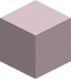
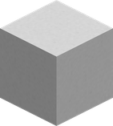
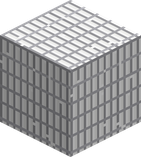
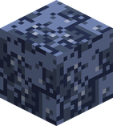
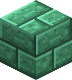
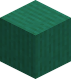
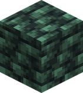

# Blocks

Awaken Awaken no Mi has no block to craft or to find: its nine blocks are **laid by awakened abilities**. Most turn the ground into a trap for a while, then the ground comes back as it was.

Turn a block round (drag), zoom (scroll or pinch), and pick another with the buttons:

## Ground an ability takes over

These replace the ground around the user while the ability lasts. The user of the fruit is spared by their own block, and so is anyone else who ate the same fruit.

| Block | Laid by | What it does |
|---|---|---|
| { .block-icon } **Soft Wax** | [Candle World](fruits/doru-doru-no-mi.md#candle-world) (Doru Doru no Mi), while it charges | Hot wax you **sink into**: it slows you almost to a stop and sets you alight. A Doru Doru user walks on it as on solid ground. |
| { .block-icon } **Hard Wax** | [Candle World](fruits/doru-doru-no-mi.md#candle-world), when the charge ends | The soft wax set hard: a solid block, for 30 seconds. |
| { .block-icon } **String Weave** | [Ever White](fruits/ito-ito-no-mi.md#ever-white) and [Break White](fruits/ito-ito-no-mi.md#break-white) (Ito Ito no Mi) | A ground of taut threads, solid underfoot. Every step on it **cuts**, leaves you bleeding for 4 seconds and slows you. An Ito Ito user walks on it freely. |
| { .block-icon } **Scrap Field** | [Assign World](fruits/jiki-jiki-no-mi.md#assign-world) (Jiki Jiki no Mi) | Magnetised scrap that **drags at whoever walks on it**: a little for everyone, far more for each piece of metal armour worn, up to four. A Jiki Jiki user is not slowed. |

## Blocks without a picture

| Block | Laid by | What it does |
|---|---|---|
| **Beta Mucus** | [Beta Beta Ocean](fruits/beta-beta-no-mi.md#beta-beta-ocean) and [Beta Beta Surge](fruits/beta-beta-no-mi.md#beta-beta-surge) (Beta Beta no Mi) | A thin layer on the ground that looks like the base mod's mucus and **glues** whoever stands in it, except a Beta Beta user. It goes away by itself after 60 to 80 seconds. Fire, lava or a burning creature **sets it alight**: it burns away from one patch to the next, without exploding. |
| **High Frequency Wall** | [High-Frequency Wall](fruits/goe-goe-no-mi.md#high-frequency-wall) (Goe Goe no Mi) | The wall of sound itself: it cannot be seen, only the sound waves drifting in it, and you walk through it. Enemy projectiles are destroyed inside it; an enemy standing in it is hurt every 2 seconds and [Deafened](effects.md#effect-deafened) for 10 seconds. The user's side is spared. |

## The arena of Hide and Seek

[Hide and Seek](fruits/doa-doa-no-mi.md#hide-and-seek) (Doa Doa no Mi) takes its captives to a closed arena in a pocket dimension, built of three blocks that **nothing breaks**, neither a tool nor an explosion, and on which no creature spawns.

| Block | Where |
|---|---|
| { .block-icon } **Indestructible Doa** | The arena's walls. |
| { .block-icon } **Indestructible Doa Pillar** | Its four corner pillars. |
| { .block-icon } **Indestructible Doa Floor** | The floor and ceiling of each of its three storeys. |
