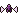
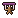
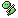

# Status effects

The **35 status effects** Awaken Awaken no Mi adds, and what applies them.

| Effect | Kind | Applied by |
|---|---|---|
| { .effect-icon .pixel-art } **Ability Seal** | Harmful | [Shadow Marionette](fruits/kage-kage-no-mi.md#shadow-marionette), [Spirit Seal](fruits/ori-ori-no-mi.md#spirit-seal) |
| { .effect-icon .pixel-art } **Anesthesia** | Harmful | [Anesthesia](fruits/ope-ope-no-mi.md#anesthesia), [K-Room](fruits/ope-ope-no-mi.md#k-room) |
| { .effect-icon .pixel-art } **Banished** | Harmful | [Dai Hanpatsu](fruits/nikyu-nikyu-no-mi.md#dai-hanpatsu) |
| { .effect-icon .pixel-art } **Battlefield Resonance** | Beneficial | [Battlefield Resonance](fruits/kobu-kobu-no-mi.md#battlefield-resonance) |
| { .effect-icon .pixel-art } **Buddha Seal** | Harmful | [Nyorai Shinshō](fruits/hito-hito-no-mi-model-daibutsu.md#nyorai-shinsho) |
| { .effect-icon .pixel-art } **Cake Transmutation** | Harmful | [Cake Transmutation](fruits/kuku-kuku-no-mi.md#cake-transmutation) |
| { .effect-icon .pixel-art } **Candy Transmutation** | Harmful | [Candy Transmutation](fruits/pero-pero-no-mi.md#candy-transmutation) |
| { .effect-icon .pixel-art } **Cellular Overload** | Beneficial | [Cellular Overload](fruits/sara-sara-no-mi-model-axolotl.md#cellular-overload) |
| { .effect-icon .pixel-art } **Corroded** | Harmful | [Oxidized Plate](fruits/sabi-sabi-no-mi.md#oxidized-plate) |
| { .effect-icon .pixel-art } **Deafened** | Harmful | [High-Frequency Wall](fruits/goe-goe-no-mi.md#high-frequency-wall), [Resonating World](fruits/goe-goe-no-mi.md#resonating-world) |
| { .effect-icon .pixel-art } **Downdraft Pinned** | Harmful | [Downdraft](fruits/ryu-ryu-no-mi-model-pteranodon.md#downdraft) |
| { .effect-icon .pixel-art } **Enthralled** | Harmful | [Enthralling Gaze](fruits/mero-mero-no-mi.md#enthralling-gaze) |
| { .effect-icon .pixel-art } **Friction** | Harmful | [Aura of Friction](fruits/kachi-kachi-no-mi.md#aura-of-friction), [Friction Burn](fruits/kachi-kachi-no-mi.md#friction-burn), [Scalding Steam](fruits/kachi-kachi-no-mi.md#scalding-steam) |
| { .effect-icon .pixel-art } **Ground Drown** | Harmful | [Waterpool Domain](fruits/sui-sui-no-mi.md#waterpool-domain) |
| { .effect-icon .pixel-art } **Gulliver's Shrink** | Harmful | [Gulliver's Nightmare](fruits/mini-mini-no-mi.md#gullivers-nightmare) |
| { .effect-icon .pixel-art } **Heavy Weight** | Harmful | [Assign World](fruits/jiki-jiki-no-mi.md#assign-world), [Gravity Zone](fruits/kilo-kilo-no-mi.md#gravity-zone), [Infinity Kilo Punch](fruits/kilo-kilo-no-mi.md#infinity-kilo-punch) |
| { .effect-icon .pixel-art } **Hollow Despair** | Harmful | [Hollow Shroud](fruits/horo-horo-no-mi.md#hollow-shroud) |
| { .effect-icon .pixel-art } **Inferno** | Harmful | [Netto Jigoku](fruits/netsu-netsu-no-mi.md#netto-jigoku), [Scorching Fist](fruits/netsu-netsu-no-mi.md#scorching-fist) |
| { .effect-icon .pixel-art } **Light Weight** | Beneficial | [Gravity Zone](fruits/kilo-kilo-no-mi.md#gravity-zone) |
| { .effect-icon .pixel-art } **Magma Burn** | Harmful | [Kagutsuchi](fruits/magu-magu-no-mi.md#kagutsuchi), [Meigo no Jidai](fruits/magu-magu-no-mi.md#meigo-no-jidai) |
| { .effect-icon .pixel-art } **Marionette** | Harmful | [Shadow Marionette](fruits/kage-kage-no-mi.md#shadow-marionette) |
| { .effect-icon .pixel-art } **Molten Armor** | Harmful | [Melting Point](fruits/netsu-netsu-no-mi.md#melting-point) |
| { .effect-icon .pixel-art } **Negative Hormonal** | Harmful | [Hormonal Fog](fruits/horu-horu-no-mi.md#hormonal-fog) |
| { .effect-icon .pixel-art } **Noroma Time** | Harmful | [Noroma Field](fruits/noro-noro-no-mi.md#noroma-field) |
| { .effect-icon .pixel-art } **Overgrown** | Harmful | [Cellular Overgrowth](fruits/chiyu-chiyu-no-mi.md#cellular-overgrowth) |
| { .effect-icon .pixel-art } **Positive Hormonal** | Beneficial | [Hormonal Fog](fruits/horu-horu-no-mi.md#hormonal-fog) |
| { .effect-icon .pixel-art } **Rust** | Harmful | [Empire of Decay](fruits/sabi-sabi-no-mi.md#empire-of-decay) |
| { .effect-icon .pixel-art } **Shadow Boost** | Beneficial | [Nightmare Banquet](fruits/kage-kage-no-mi.md#nightmare-banquet) |
| { .effect-icon .pixel-art } **Soul Severed** | Harmful | [Soul Reap](fruits/yomi-yomi-no-mi.md#soul-reap) |
| { .effect-icon .pixel-art } **Soul Unbound** | Beneficial | [Undying Soul](fruits/yomi-yomi-no-mi.md#undying-soul) |
| { .effect-icon .pixel-art } **Sugar Coffin** | Harmful | [Sugar Coffin](fruits/pero-pero-no-mi.md#sugar-coffin) |
| { .effect-icon .pixel-art } **Sugar Shell** | Beneficial | [Sugar Shell](fruits/pero-pero-no-mi.md#sugar-shell) |
| { .effect-icon .pixel-art } **Total Isolation** | Harmful | [Total Isolation](fruits/nagi-nagi-no-mi.md#total-isolation) |
| { .effect-icon .pixel-art } **Undertow Held** | Harmful | [Undertow](fruits/sui-sui-no-mi.md#undertow) |
| { .effect-icon .pixel-art } **Wax Petrify** | Harmful | [Candle World](fruits/doru-doru-no-mi.md#candle-world) |
