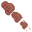

# Bara Bara No Mi

**Paramecia** · 3 awakened abilities

These abilities unlock once the fruit is **awakened**: see [Awakening](../index.md#getting-started).

!!! note "About the values"
    The values are those of the ability's tooltip in game, with the base mod's default settings. Damage is shown on the base mod's scale, as in the ability screen.

## Dislocation Punch { #dislocation-punch }

{ .ability-icon } *Active · Punch*

**Modes**

- **Dislocation Punch : Arm**: Dislocates the target's arm so they can't use it
- **Dislocation Punch : Leg**: Dislocates the target's leg so they can't use it.

## Bara Bara Parade { #bara-bara-parade }

{ .ability-icon } *Active*

The user sends their hands flying at up to eight enemies nearby, each fist hunting down its own target.

Every fist that lands dislocates an arm or a leg.

| Stat | Value |
|---|---|
| Cooldown | 60 s |
| Range | 32 blocks (area) |
| Damage | 40 |

## Severed Grip { #severed-grip }

{ .ability-icon } *Passive*

When a blade fails to cut the user, the arm that swung it gets dislocated.

| Stat | Value |
|---|---|
| Hold | 5 s |
