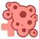

# Chiyu Chiyu no Mi

**Paramecia** · 3 awakened abilities

These abilities unlock once the fruit is **awakened**: see [Awakening](../index.md#getting-started).

!!! note "About the values"
    The values are those of the ability's tooltip in game, with the base mod's default settings. Damage is shown on the base mod's scale, as in the ability screen.

## Word of Recovery { #word-of-recovery }

{ .ability-icon } *Active · Punch*

The user heals a target with a single touch, restoring a huge amount of health.

## Cellular Overgrowth { #cellular-overgrowth }

{ .ability-icon } *Active · Punch*

Punches the target so their cells grow out of control, dealing damage based on their max health

The target can't be healed by anything for a while.

| Stat | Value |
|---|---|
| Damage | 40–75 |

## Overflow { #overflow }

{ .ability-icon } *Passive*

Healing that goes past full health on the user or nearby allies turns into absorption hearts

Stacks up to 10 extra hearts.
