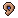

# Goe Goe no Mi

**Paramecia** · 3 awakened abilities

These abilities unlock once the fruit is **awakened**: see [Awakening](../index.md#getting-started).

!!! note "About the values"
    The values are those of the ability's tooltip in game, with the base mod's default settings. Damage is shown on the base mod's scale, as in the ability screen.

## High-Frequency Wall { #high-frequency-wall }

{ .ability-icon } *Active*

Applies { .effect-mini .pixelated }[Deafened](../effects.md#effect-deafened)

Creates a sound wall that destroys enemy projectiles and Deafens enemies who pass through it

| Stat | Value |
|---|---|
| Cooldown | 15–125 s |
| Hold | 30 s |

## Resonating World { #resonating-world }

{ .ability-icon } *Active · Zone*

Applies { .effect-mini .pixelated }[Deafened](../effects.md#effect-deafened)

Turns the area into a resonance chamber that damages moving enemies, sprinting or swimming makes it worse.

Landing from high up sends a shockwave, attacks inside echo back at the attacker and everyone is [Deafened](../effects.md#effect-deafened).

| Stat | Value |
|---|---|
| Cooldown | 120 s |
| Charge | 3–12 s |
| Zone Radius (blocks) | 128 |
| Effect Pulse (s) | 1 |
| Damage | 6–17 |

## Broken Focus { #broken-focus }

{ .ability-icon } *Passive*

Every sound the user makes breaks their enemies' concentration: an ability being charged is cut off and locked for a while.

Todoroki, Dragon's Roar, Resonating World and High-Frequency Wall all count.

| Stat | Value |
|---|---|
| Interrupted Ability Locked For (s) | 10 |
