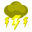

# Goro Goro no Mi

| | |
|---|---|
| **Type** | Logia |
| **Abilities** | 3: 2 active, 1 passive |
| **Zones** | [Godland](#kami-no-kuni) |

These abilities unlock once the fruit is **awakened**: see [Awakening](../index.md#getting-started).

!!! note "About the values"
    The values are those of the ability's tooltip in game, with the base mod's default settings. Damage is shown on the base mod's scale, as in the ability screen.

## Godland { #kami-no-kuni }

{ .ability-icon } *Active · Zone*

Calls a real thunderstorm that lasts as long as the zone stays up.

Lightning inside strikes whoever carries the most metal, hitting harder the better they conduct

Diamond and leather don't conduct at all.

| Stat | Value |
|---|---|
| Cooldown | 90 s |
| Charge | 3–12 s |
| Zone Radius (blocks) | 128 |
| Effect Pulse (s) | 3 |
| Damage | 20–65 |

## Stormstep { #stormstep }

{ .ability-icon } *Active*

Fires a lightning bolt that jumps from enemy to enemy toward whoever conducts best

The metal a target carries sets how far the bolt jumps and how hard it hits, losing power with each jump.

| Stat | Value |
|---|---|
| Cooldown | 25 s |
| Charge | 2 s |
| Damage | 90–144 |

## Storm Sovereign { #storm-sovereign }

{ .ability-icon } *Passive*

During a thunderstorm the user hits harder, moves faster and heals quickly

Hits from conductive weapons pass through the user without hurting them.
