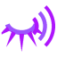

# Horu Horu no Mi

| | |
|---|---|
| **Type** | Paramecia |
| **Abilities** | 3: 2 active, 1 passive |
| **Zones** | [Hormonal Fog](#hormonal-fog) |
| **Effects applied** | { .effect-mini .pixelated }[Negative Hormonal](../effects.md#effect-negative-hormonal), { .effect-mini .pixelated }[Positive Hormonal](../effects.md#effect-positive-hormonal) |

These abilities unlock once the fruit is **awakened**: see [Awakening](../index.md#getting-started).

!!! note "About the values"
    The values are those of the ability's tooltip in game, with the base mod's default settings. Damage is shown on the base mod's scale, as in the ability screen.

## Hormonal Fog { #hormonal-fog }

{ .ability-icon } *Active · Zone*

Applies { .effect-mini .pixelated }[Negative Hormonal](../effects.md#effect-negative-hormonal), { .effect-mini .pixelated }[Positive Hormonal](../effects.md#effect-positive-hormonal)

Releases a thick mist that gives allies good hormones and enemies bad ones.

| Stat | Value |
|---|---|
| Cooldown | 120 s |
| Charge | 3–12 s |
| Zone Radius (blocks) | 128 |
| Effect Pulse (s) | 2.5 |

## Hell Wink { #hell-wink }

{ .ability-icon } *Active*

The user winks so hard a shockwave rips through everything they look at

Every hormone in the user's body makes it hit harder.

| Stat | Value |
|---|---|
| Cooldown | 30 s |
| Range (blocks) | 32 |
| Damage | 60–150 |
| Damage Per Hormone | +30 |

## Iron Constitution { #iron-constitution }

{ .ability-icon } *Passive*

The user and nearby allies don't suffer the side effects of hormones anymore.

| Stat | Value |
|---|---|
| Range (blocks) | 16 |
