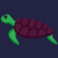
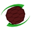
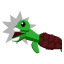

# Kame Kame no Mi

| | |
|---|---|
| **Type** | Zoan |
| **Abilities** | 4: 4 active, 0 passive |
| **Transformations** | [Awaken Kame Walk Point](#awaken-kame-walk-point), [Awaken Kame Guard Point](#awaken-kame-guard-point) |

These abilities unlock once the fruit is **awakened**: see [Awakening](../index.md#getting-started).

!!! note "About the values"
    The values are those of the ability's tooltip in game, with the base mod's default settings. Damage is shown on the base mod's scale, as in the ability screen.

## Awaken Kame Walk Point { #awaken-kame-walk-point }

{ .ability-icon } *Active · Transformation*

Transforms the user into an awakened turtle, which focuses on speed.

| Stat | Value |
|---|---|
| Hold | ∞ s |

**Stats while active**

| Stat | Value |
|---|---|
| Step Height | +1 |
| Armor | +30 |
| Knockback Resistance | +3 |
| Toughness | +20 |
| Jump Height | +2 |
| Swim Speed | +2.5 |
| Punch Damage | +6 |
| Speed | +0.35 |
| Fall Resistance | +2 |

## Awaken Kame Guard Point { #awaken-kame-guard-point }

{ .ability-icon } *Active · Transformation*

Transforms the user into an awakened turtle, which focuses on defense.

Sneaking hides the user in their shell where almost nothing gets through

| Stat | Value |
|---|---|
| Cooldown | 1 s |
| Hold | ∞ s |

**Stats while active**

| Stat | Value |
|---|---|
| Attack Speed | +0.1 |
| Armor | +40 |
| Friction | +1.9 |
| Max Health | x1.2 |
| Knockback Resistance | +6 |
| Toughness | +20 |
| Jump Height | +1 |
| Swim Speed | +2.5 |
| Speed | -0.21 |

## Spin { #spin }

{ .ability-icon } *Active*

The user hides in their shell and spins, knocking back nearby enemies and blocking most of the damage it takes

| Stat | Value |
|---|---|
| Hold | 5 s |
| Cooldown | 30 s |
| Damage | 18 |
| Range | 4 blocks (area) |

**Stats while active**

| Stat | Value |
|---|---|
| Jump Height | x3 |
| Speed | x3 |

## Snapping Jaw { #snapping-jaw }

{ .ability-icon } *Active*

The turtle bites down on whatever is in front of it and drags it along, crushing it every second.

The jaw only opens once the turtle has been hurt badly enough - and a retracted shell barely hurts at all.

| Stat | Value |
|---|---|
| Cooldown | 45 s |
| Damage | 40 |
| Crush Damage per Second | 15 |
| Lets Go After Taking (HP) | 60 |
