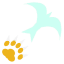

# Neko Neko no Mi, Model: Leopard

| | |
|---|---|
| **Type** | Zoan |
| **Abilities** | 11: 11 active, 0 passive |
| **Transformations** | [Awaken Leopard Heavy Point](#awaken-leopard-heavy-point), [Awaken Leopard Walk Point](#awaken-leopard-walk-point) |

These abilities unlock once the fruit is **awakened**: see [Awakening](../index.md#getting-started).

!!! note "About the values"
    The values are those of the ability's tooltip in game, with the base mod's default settings. Damage is shown on the base mod's scale, as in the ability screen.

## Awaken Leopard Heavy Point { #awaken-leopard-heavy-point }

{ .ability-icon } *Active · Transformation*

Transforms the user into an awakened leopard hybrid, which focuses on strength and speed.

| Stat | Value |
|---|---|
| Cooldown | 1 s |
| Hold | ∞ s |

**Stats while active**

| Stat | Value |
|---|---|
| Punch Damage | +20 |
| Speed | x2.5 |
| Armor | +10 |
| Jump Height | +5 |
| Fall Resistance | +8 |
| Step Height | +1 |
| Attack Speed | 0 |
| Toughness | +4 |

## Awaken Leopard Walk Point { #awaken-leopard-walk-point }

{ .ability-icon } *Active · Transformation*

Transforms the user into an awakened leopard, which focuses on speed.

| Stat | Value |
|---|---|
| Cooldown | 1 s |
| Hold | ∞ s |

**Stats while active**

| Stat | Value |
|---|---|
| Punch Damage | +15 |
| Speed | +1.47 |
| Jump Height | +3.5 |
| Fall Resistance | +9.5 |
| Step Height | +1 |
| Attack Speed | +0.75 |
| Toughness | +2 |

## Shugan { #shugan }

{ .ability-icon } *Active*

The user draws back a hand with all five claws out, throws themselves at the enemy in front and drives the whole hand through them. Armour does not stop it.

Requires the awakened Heavy Point. Shares its cooldown with Shigan.

| Stat | Value |
|---|---|
| Cooldown | 25 s |
| Damage | 55 |
| Range (blocks) | 8 |

## Shugan: Madara { #shugan-madara }

{ .ability-icon } *Active*

The user throws both clawed hands in turn, ten stabs in a second and a half, at every enemy within reach in front. Armour does not stop them, and the last one throws its victims back.

Requires the awakened Heavy Point. Shares its cooldown with Shigan.

| Stat | Value |
|---|---|
| Cooldown | 30 s |
| Damage | 9 |
| Stabs | 10 |
| Range (blocks) | 3.5 |

## Tobu Shigan "Bachi" { #tobu-shigan-bachi }

{ .ability-icon } *Active*

The user flicks three bullets of compressed air off their claws, one after the other, each along the look at the moment it leaves.

Requires the awakened Heavy Point. Shares its cooldown with Shigan.

| Stat | Value |
|---|---|
| Projectile damage | 12 |
| Cooldown | 12 s |
| Shots | 3 |
| Range (blocks) | 32 |

## Rankyaku "Gaicho" { #rankyaku-gaicho }

{ .ability-icon } *Active*

The user kicks out a blade of air shaped like a great bird with its wings spread. It cuts every enemy in its path and bursts against the first wall.

Requires the awakened Heavy Point. Shares its cooldown with Rankyaku.

| Stat | Value |
|---|---|
| Projectile damage | 54 |
| Cooldown | 18 s |
| Range (blocks) | 40 |

## Rankyaku "Hyobi" { #rankyaku-hyobi }

{ .ability-icon } *Active*

The user turns on themselves and their tail throws a blade of air curled like the tail itself. It opens all round the user, cutting every enemy it reaches and throwing them back.

Requires the awakened Heavy Point. Shares its cooldown with Rankyaku.

| Stat | Value |
|---|---|
| Cooldown | 12 s |
| Damage | 36 |
| Range (blocks) | 6.5 |

## Tekkai "Utsugi" { #tekkai-utsugi }

{ .ability-icon } *Active*

The user hardens their body for an instant. Every blow that lands in that time is stopped, and an enemy who struck from close by takes the force of their own blow back and is thrown off.

Requires the awakened Heavy Point. Shares its cooldown with Tekkai.

| Stat | Value |
|---|---|
| Cooldown | 4–15 s |
| Hold | 1 s |
| Damage | 45 |
| Range (blocks) | 5 |

## Sai Dai Rin: Rokuogan { #sai-dai-rin-rokuogan }

{ .ability-icon } *Active*

The user sets both fists against the enemy in front of them, gathers all their strength, and lets it go as one shockwave through the enemy's body. Armour does not stop it. The enemy has to be within reach when it is let go.

Requires the awakened Heavy Point. Shares its cooldown with Rokuogan.

| Stat | Value |
|---|---|
| Cooldown | 40 s |
| Charge | 2 s |
| Damage | 100 |
| Range (blocks) | 2.5 |

## Mauling { #mauling }

{ .ability-icon } *Active*

The leopard leaps on the enemy in front of it, pins it down and tears at it with its fangs, then throws it aside with a last bite. Neither of them moves until it is over.

Requires the awakened Walk Point.

| Stat | Value |
|---|---|
| Cooldown | 3–27 s |
| Damage | 10 |
| Bites | 5 |
| Last Bite | 30 |
| Range (blocks) | 8 |

## Tail Hold { #tail-hold }

{ .ability-icon } *Active*

The user's tail lashes out, wraps round the nearest enemy in front and holds them there, unable to move. The user keeps both hands free, and can walk and strike while the tail holds.

Requires the awakened Heavy Point. Sai Dai Rin: Rokuogan lets go of the enemy as it strikes.

| Stat | Value |
|---|---|
| Cooldown | 3–20 s |
| Hold | 3 s |
| Range (blocks) | 4 |
