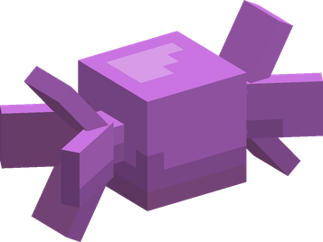

# Pero Pero no Mi

| | |
|---|---|
| **Type** | Paramecia |
| **Abilities** | 3: 3 active, 0 passive |
| **Effects applied** | { .effect-mini .pixelated }[Candy Transmutation](../effects.md#effect-candy-transmutation), { .effect-mini .pixelated }[Sugar Coffin](../effects.md#effect-sugar-coffin), { .effect-mini .pixelated }[Sugar Shell](../effects.md#effect-sugar-shell) |

In 3D: drag to turn, scroll or pinch to zoom.

These abilities unlock once the fruit is **awakened**: see [Awakening](../index.md#getting-started).

!!! note "About the values"
    The values are those of the ability's tooltip in game, with the base mod's default settings. Damage is shown on the base mod's scale, as in the ability screen.

## Candy Transmutation { #candy-transmutation }

{ .ability-icon } *Active*

{ .form-picture }

Applies { .effect-mini .pixelated }[Candy Transmutation](../effects.md#effect-candy-transmutation)

Shoots a candy beam at the target.

Targets hit are turned into candy

| Stat | Value |
|---|---|
| Cooldown | 20 s |
| Projectile damage | 50 |

## Sugar Shell { #sugar-shell }

{ .ability-icon } *Active*

Applies { .effect-mini .pixelated }[Sugar Shell](../effects.md#effect-sugar-shell)

Coats the user and every ally nearby in a shell of hard candy that absorbs damage for a while.

A shell broken by blows shatters and glues the enemies around it in candy.

| Stat | Value |
|---|---|
| Cooldown | 45 s |
| Range | 20 blocks (area) |

## Sugar Coffin { #sugar-coffin }

{ .ability-icon } *Active*

Applies { .effect-mini .pixelated }[Sugar Coffin](../effects.md#effect-sugar-coffin)

Shuts the targeted enemy inside a coffin of hard candy that no blow can break, crushing them every second.

Trapped, they cannot move, turn or attack, and can still be hit by anyone.

| Stat | Value |
|---|---|
| Cooldown | 40 s |
| Range | 32 blocks (line) |
| Damage | 100 |
