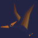

# Ryu Ryu no Mi, Model: Pteranodon

| | |
|---|---|
| **Type** | Ancient Zoan |
| **Abilities** | 4: 4 active, 0 passive |
| **Transformations** | [Awaken Pteranodon Assault Point](#awaken-pteranodon-assault-point), [Awaken Pteranodon Fly Point](#awaken-pteranodon-fly-point) |
| **Effects applied** | { .effect-mini .pixelated }[Downdraft Pinned](../effects.md#effect-downdraft-pinned) |

These abilities unlock once the fruit is **awakened**: see [Awakening](../index.md#getting-started).

!!! note "About the values"
    The values are those of the ability's tooltip in game, with the base mod's default settings. Damage is shown on the base mod's scale, as in the ability screen.

## Awaken Pteranodon Assault Point { #awaken-pteranodon-assault-point }

{ .ability-icon } *Active · Transformation*

Transforms the user into an awakened pteranodon hybrid, which focuses on attacking.

| Stat | Value |
|---|---|
| Cooldown | 1 s |
| Hold | ∞ s |

**Stats while active**

| Stat | Value |
|---|---|
| Attack Speed | +0.3 |
| Step Height | +1 |
| Armor | +6 |
| Toughness | +4 |
| Jump Height | +2 |
| Punch Damage | +6 |
| Speed | +0.7 |
| Fall Resistance | +8 |

## Awaken Pteranodon Fly Point { #awaken-pteranodon-fly-point }

{ .ability-icon } *Active · Transformation*

Transforms the user into an awakened pteranodon, which focuses on flying.

| Stat | Value |
|---|---|
| Cooldown | 1 s |
| Hold | ∞ s |

**Stats while active**

| Stat | Value |
|---|---|
| Attack Speed | +1.5 |
| Armor | +4 |
| Toughness | +4 |
| Punch Damage | +30 |
| Fall Resistance | +8 |

## Tei-Kasané { #tei-kasane }

{ .ability-icon } *Active*

The user vibrates their wings so fast the edges turn jagged and sharp.

| Stat | Value |
|---|---|
| Projectile damage | 50 |
| Cooldown | 50 s |

## Downdraft { #downdraft }

{ .ability-icon } *Active*

Applies { .effect-mini .pixelated }[Downdraft Pinned](../effects.md#effect-downdraft-pinned)

One beat of the awakened wings drives a column of air straight down, slamming everything flying below into the ground.

Whatever it catches in the air cannot fly again for a while; whatever was already standing is blown off its feet.

| Stat | Value |
|---|---|
| Cooldown | 25 s |
| Damage | 25–60 |
| Range | 14 blocks (area) |
| Grounded For (s) | 8 |
