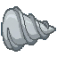

# Sai Sai no Mi

| | |
|---|---|
| **Type** | Zoan |
| **Abilities** | 4: 4 active, 0 passive |
| **Transformations** | [Awaken Sai Heavy Point](#awaken-sai-heavy-point), [Awaken Sai Walk Point](#awaken-sai-walk-point) |

These abilities unlock once the fruit is **awakened**: see [Awakening](../index.md#getting-started).

!!! note "About the values"
    The values are those of the ability's tooltip in game, with the base mod's default settings. Damage is shown on the base mod's scale, as in the ability screen.

## Awaken Sai Heavy Point { #awaken-sai-heavy-point }

{ .ability-icon } *Active · Transformation*

Transforms the user into an awakened rhino hybrid, which focuses on strength and charging.

| Stat | Value |
|---|---|
| Cooldown | 1 s |
| Hold | ∞ s |

**Stats while active**

| Stat | Value |
|---|---|
| Attack Speed | +0.3 |
| Step Height | +1 |
| Armor | +20 |
| Block Reach | +0.75 |
| Toughness | +5 |
| Jump Height | +3 |
| Punch Damage | +14 |
| Entity Reach | +0.75 |
| Speed | +1.4 |
| Fall Resistance | +4 |

## Awaken Sai Walk Point { #awaken-sai-walk-point }

{ .ability-icon } *Active · Transformation*

Transforms the user into an awakened rhino, which focuses on speed

| Stat | Value |
|---|---|
| Cooldown | 1 s |
| Hold | ∞ s |

**Stats while active**

| Stat | Value |
|---|---|
| Attack Speed | +0.3 |
| Step Height | +1 |
| Armor | +30 |
| Toughness | +6 |
| Jump Height | +1.5 |
| Punch Damage | +7.5 |
| Speed | +1.15 |
| Fall Resistance | +2 |

## Horn Drill { #horn-drill }

{ .ability-icon } *Active*

The user spins and charges in a straight line, piercing through every enemy they pass.

| Stat | Value |
|---|---|
| Cooldown | 30 s |
| Hold | 3 s |
| Damage | 50 |

## Juggernaut { #juggernaut }

{ .ability-icon } *Active*

The rhino charges where it looks, faster and faster, and nothing stops it: no hold, no push, no wall it can break.

Enemies in its path are hit harder the faster it goes and thrown aside. An unbreakable wall ends the charge and leaves the rhino staggered.

| Stat | Value |
|---|---|
| Cooldown | 45 s |
| Hold | 6 s |
| Damage | 20–60 |
| Breaks Blocks up to Hardness | 1.5 |
