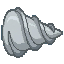

# Sai Sai no Mi

| | |
|---|---|
| **Type** | Zoan |
| **Abilities** | 4: 4 active, 0 passive |
| **Transformations** | [Awaken Sai Heavy Point](#awaken-sai-heavy-point), [Awaken Sai Walk Point](#awaken-sai-walk-point) |

These abilities unlock once the fruit is **awakened**: see [Awakening](../index.md#getting-started).

!!! note "About the values"
    The values are those of the ability's tooltip in game, with the base mod's default settings. Damage is shown on the base mod's scale, as in the ability screen.

## Awaken Sai Heavy Point { #awaken-sai-heavy-point }

{ .ability-icon } *Active · Transformation*

Transforms the user into an awakened rhino hybrid, which focuses on strength and charging.

| Stat | Value |
|---|---|
| Cooldown | 1 s |
| Hold | ∞ s |

**Stats while active**

| Stat | Value |
|---|---|
| Armor | +20 |
| Speed | +1.4 |
| Block Reach | +0.75 |
| Step Height | +1 |
| Punch Damage | +14 |
| Regen Rate | +0.5 |
| Toughness | +5 |
| Fall Resistance | +4 |
| Jump Height | +3 |
| Entity Reach | +0.75 |
| Attack Speed | +0.3 |

## Awaken Sai Walk Point { #awaken-sai-walk-point }

{ .ability-icon } *Active · Transformation*

Transforms the user into an awakened rhino, which focuses on speed

| Stat | Value |
|---|---|
| Cooldown | 1 s |
| Hold | ∞ s |

**Stats while active**

| Stat | Value |
|---|---|
| Armor | +30 |
| Speed | +1.15 |
| Step Height | +1 |
| Punch Damage | +7.5 |
| Regen Rate | +0.5 |
| Toughness | +6 |
| Fall Resistance | +2 |
| Jump Height | +1.5 |
| Attack Speed | +0.3 |

## Horn Drill { #horn-drill }

{ .ability-icon } *Active*

The user spins and charges in a straight line, piercing through every enemy they pass.

| Stat | Value |
|---|---|
| Cooldown | 30 s |
| Hold | 3 s |
| Damage | 50 |

## Juggernaut { #juggernaut }

{ .ability-icon } *Active*

The rhino charges where it looks and gets faster and faster, nothing stops it, not holds, not pushes and not walls it can break.

Enemies in its way get hit harder the faster it goes and are thrown aside. A wall it can't break ends the charge and leaves the rhino staggered.

| Stat | Value |
|---|---|
| Cooldown | 45 s |
| Hold | 6 s |
| Damage | 40–120 |
| Breaks Blocks up to Hardness | 1.5 |
