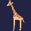
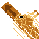

# Ushi Ushi no Mi, Model: Giraffe

| | |
|---|---|
| **Type** | Zoan |
| **Abilities** | 4: 4 active, 0 passive |
| **Transformations** | [Awaken Giraffe Heavy Point](#awaken-giraffe-heavy-point), [Awaken Giraffe Walk Point](#awaken-giraffe-walk-point) |

These abilities unlock once the fruit is **awakened**: see [Awakening](../index.md#getting-started).

!!! note "About the values"
    The values are those of the ability's tooltip in game, with the base mod's default settings. Damage is shown on the base mod's scale, as in the ability screen.

## Awaken Giraffe Heavy Point { #awaken-giraffe-heavy-point }

{ .ability-icon } *Active · Transformation*

Transforms the user into an awakened giraffe hybrid, which focuses on strength and reach.

| Stat | Value |
|---|---|
| Cooldown | 1 s |
| Hold | ∞ s |

**Stats while active**

| Stat | Value |
|---|---|
| Attack Speed | +0.3 |
| Step Height | +1 |
| Armor | +15 |
| Block Reach | +2.5 |
| Toughness | +7.5 |
| Jump Height | +5 |
| Punch Damage | +8 |
| Entity Reach | +2.5 |
| Speed | +0.7 |
| Fall Resistance | +4 |

## Awaken Giraffe Walk Point { #awaken-giraffe-walk-point }

{ .ability-icon } *Active · Transformation*

Transforms the user into an awakened giraffe, which focuses on speed and reach.

| Stat | Value |
|---|---|
| Cooldown | 1 s |
| Hold | ∞ s |

**Stats while active**

| Stat | Value |
|---|---|
| Step Height | +1 |
| Attack Speed | +0.25 |
| Armor | +14 |
| Block Reach | +1.65 |
| Toughness | +4 |
| Jump Height | +0.75 |
| Punch Damage | +2.5 |
| Entity Reach | +1.65 |
| Speed | +0.84 |
| Fall Resistance | +0.5 |

## Longneck Ram { #longneck-ram }

{ .ability-icon } *Active*

**Normal Mode**: Squeezes the neck and shoots the head forward, hitting enemies with a powerful nose strike.

| Stat | Value |
|---|---|
| Cooldown | 8 s |
| Damage | 20 |

**Awaken Mode**: While awakened the head shoots out faster and hits harder.

| Stat | Value |
|---|---|
| Cooldown | 15 s |
| Damage | 80 |

## Neck Hammer { #neck-hammer }

{ .ability-icon } *Active*

Rears the long neck back and brings the head down on the enemy in front, from high above.

A guard it lands on breaks: it drops, and every guard the target holds stays locked for a while. Shields are knocked aside too.

| Stat | Value |
|---|---|
| Cooldown | 18 s |
| Charge | 1 s |
| Damage | 60 |
| Range (blocks) | 12 |
| Guards Locked (s) | 8 |
