# Blocks

Cruise's blocks, drawn from the game's own models: the benches of the trades, the lockers, the stone and the nine woods, the grand pianos, the traps and the villages' own blocks. Each viewer turns (drag), zooms (scroll or pinch) and changes block with its buttons.

## Workstations

Each maker works at a bench of their own, and three gatherers have one too. Each trade's page tells what its bench makes.

| Bench | What it is for | See |
|---|---|---|
| 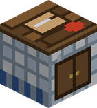{ .block-icon } **Kitchen** | the Cook's bench: every dish | [Cook](trades/cook.md) |
| 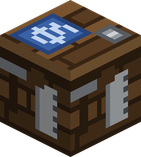{ .block-icon } **Workshop** | the Inventor's bench: tools, parts and gadgets | [Inventor](trades/inventor.md) |
| { .block-icon } **Laboratory** | the Chemist's bench: remedies, potions and powders | [Chemist](trades/chemist.md) |
| 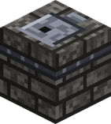{ .block-icon } **Forge** | the Blacksmith's bench: weapons and armour | [Blacksmith](trades/blacksmith.md) |
| 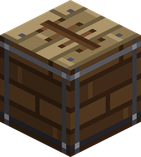{ .block-icon } **Shipyard** | the Carpenter's bench: boats, lockers and the Auction House | [Carpenter](trades/carpenter.md) |
| 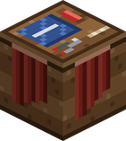{ .block-icon } **Sewing Table** | the Tailor's bench: clothes, capes and sails | [Tailor](trades/tailor.md) |
| 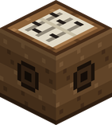{ .block-icon } **Music Stand** | the Musician's bench: scores | [Musician](trades/musician.md) |
| 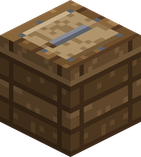{ .block-icon } **Tannery** | the Hunter's bench: hides and leather | [Hunter](trades/hunter.md) |
| 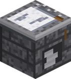{ .block-icon } **Masonry** | the Miner's bench: marble, pure ore and fragments | [Miner](trades/miner.md) |
| 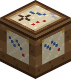{ .block-icon } **Chart Table** | the Navigator's bench: Sea Charts and poses | [Navigator](trades/navigator.md) |
| 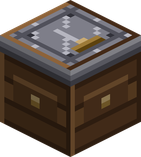{ .block-icon } **Upgrade Bench** | fits a part on a tool, a rod, a net or a boat | [Inventor](trades/inventor.md) |
| 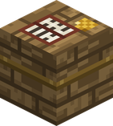{ .block-icon } **Auction House** | sells to and buys from other players | [Auction House](auction-house.md) |

## Lockers

Storage built by the [Carpenter](trades/carpenter.md), each bigger than a chest and than the one before.

| Locker | What it is |
|---|---|
| 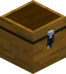{ .block-icon } **Ship's Locker** | 36 slots |
| 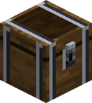{ .block-icon } **Reinforced Locker** | 55 slots |
| 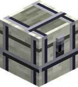{ .block-icon } **Kuuigosu Locker** | 78 slots |
| 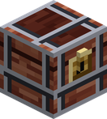{ .block-icon } **Adam Strongbox** | 105 slots; broken, it drops as one item with everything inside |

## Stone

The [Miner](trades/miner.md) turns Marble into building blocks at the Masonry; all of them need at least a stone pickaxe to drop.

| Block | Where it comes from |
|---|---|
| 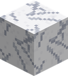{ .block-icon } **Marble Block** | Masonry, from Marble |
| 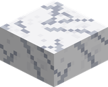{ .block-icon } **Marble Slab** | Masonry, from Marble |
| 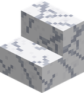{ .block-icon } **Marble Stairs** | Masonry, from Marble |
| 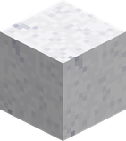{ .block-icon } **Polished Marble** | Masonry, from Marble |
| 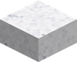{ .block-icon } **Polished Marble Slab** | Masonry, from Marble |
| 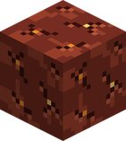{ .block-icon } **Explosive Rock** | found by the Miner; it goes off in the hands of anyone else |

## Village blocks

Two blocks of the [villages](villages.md) can be taken and put down elsewhere.

| Block | What it is |
|---|---|
| 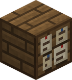{ .block-icon } **Notice Board** | the board of a village's market square: a right click shows the day's five orders of the village it stands in, and the news of what is happening nearby. Carried out of a village, it shows none. |
| **Chimney Cap** | the cap of a chimney, a brick slab to the eye, from which smoke rises: steady by day, thin in the dead of night. Every chimney of a village has one, of brick, stone, sandstone or terracotta by the land it stands in; take it and your own house smokes too. |

## Out in the world

What a [falling star](events-at-sea.md#a-falling-star) leaves behind.

| Block | What it is |
|---|---|
| 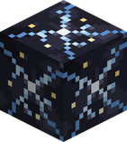{ .block-icon } **Star Core** | the heart of a fallen star: a Miner of level 50 breaks it, with a diamond pickaxe or better, for its Star Fragment. Nobody else can break it. |

## Grand pianos

Built by the [Inventor](trades/inventor.md) for the [Musician](trades/musician.md#the-grand-piano): eight blocks, the stool in front. Sit on the stool to play.

| Piano | How far and how long its tunes carry |
|---|---|
| 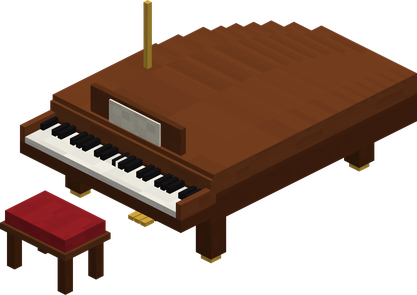{ .block-icon } **Grand Piano** | 20 blocks, 35 minutes |
| 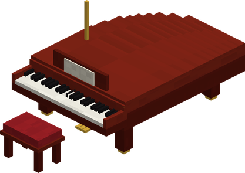{ .block-icon } **Fine Grand Piano** | 30 blocks, 45 minutes |
| 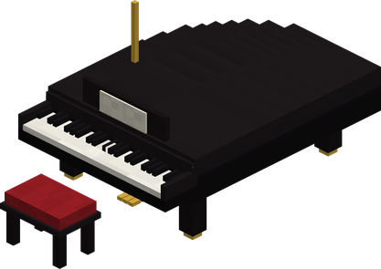{ .block-icon } **Master's Grand Piano** | 40 blocks, 60 minutes |

## Traps

The [Hunter](trades/hunter.md#traps)'s traps, made by the Inventor: set one down and come back.

| Trap | When it springs |
|---|---|
| 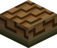{ .block-icon } **Traps** | springs after 2 to 5 minutes |
| 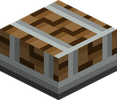{ .block-icon } **Enhanced Traps** | springs after 1 to 2.5 minutes |

## The nine woods

Six fruit-tree woods and the [Lumberjack](trades/lumberjack.md)'s three great trees. Every wood also makes a fence, a fence gate, a door, a trapdoor, a button and a pressure plate, with the usual recipes.

The leaves are shown in the colour the inventory gives them; in the world, the four fruit trees of the forests and swamps take their biome's green.

| Wood | Log | Stripped log | Planks | Stairs | Slab | Leaves |
|---|---|---|---|---|---|---|
| **Red Fruit** | 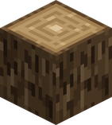{ .block-icon } | 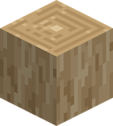{ .block-icon } | 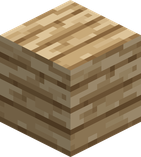{ .block-icon } | 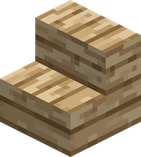{ .block-icon } | 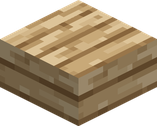{ .block-icon } | 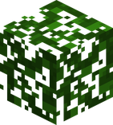{ .block-icon } |
| **Blue Fruit** | 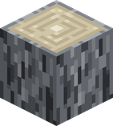{ .block-icon } | 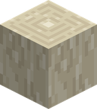{ .block-icon } | 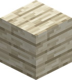{ .block-icon } | 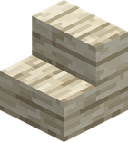{ .block-icon } | 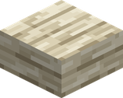{ .block-icon } | 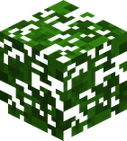{ .block-icon } |
| **Brown Fruit** | 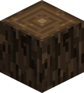{ .block-icon } | 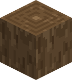{ .block-icon } | 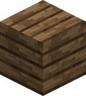{ .block-icon } | 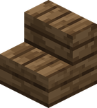{ .block-icon } | 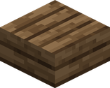{ .block-icon } | 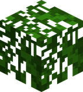{ .block-icon } |
| **Horrific Pear** | 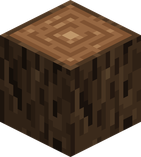{ .block-icon } | 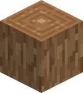{ .block-icon } | 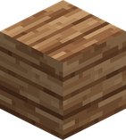{ .block-icon } | 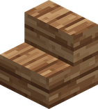{ .block-icon } | { .block-icon } | { .block-icon } |
| **Golden Fruit** | { .block-icon } | { .block-icon } | { .block-icon } | { .block-icon } | { .block-icon } | { .block-icon } |
| **Palm** | { .block-icon } | { .block-icon } | { .block-icon } | { .block-icon } | { .block-icon } | { .block-icon } |
| **Kuuigosu** | { .block-icon } | { .block-icon } | { .block-icon } | { .block-icon } | { .block-icon } | { .block-icon } |
| **Burning Tree** | { .block-icon } | { .block-icon } | { .block-icon } | { .block-icon } | { .block-icon } | { .block-icon } |
| **Adam** | { .block-icon } | { .block-icon } | { .block-icon } | { .block-icon } | { .block-icon } | { .block-icon } |

