# Boats

The [Carpenter](trades/carpenter.md)'s boats look and steer like vanilla boats. The difference is the **hull**: it is counted in **blows** (timbers) and takes several hits before it gives, instead of breaking at the first one. There are **sixteen boats**: four hulls, each in four shapes. Anyone can ride them; only a Carpenter builds and mends them.

<figure markdown>
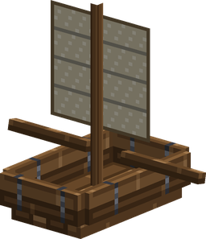
<figcaption>Reinforced, with a Boat Sail</figcaption>
</figure>

<figure markdown>
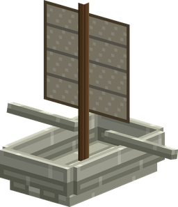
<figcaption>Kuuigosu, with a Boat Sail</figcaption>
</figure>

<figure markdown>
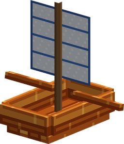
<figcaption>Burning Tree, with a Fine Sail</figcaption>
</figure>

<figure markdown>
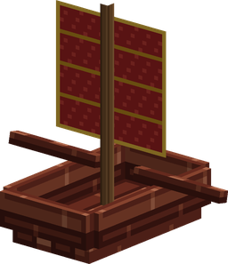
<figcaption>Adam, with a Master's Sail</figcaption>
</figure>

In 3D: the four shapes, each in its four hulls and with or without a sail (drag to turn, scroll or pinch to zoom):

## Hulls

The hull is what the boat is built of.

| Hull | Blows it takes | Speed | Mended with | Special |
|---|---|---|---|---|
| { .item-icon }Reinforced | 3 | normal | any planks | — |
| { .item-icon }Kuuigosu | 4 | faster: "Buoyant: it rides a quarter faster" | Kuuigosu Planks | — |
| { .item-icon }Burning Tree | 6 | normal | Burning Tree Planks | **Fireproof**: fire and lava do not hurt it |
| { .item-icon }Adam | 10 | normal | Adam Planks | — |

The Kuuigosu, Burning Tree and Adam woods come from the [Lumberjack](trades/lumberjack.md)'s great trees.

## Shapes

The shape is what the boat was built as, and gives it its name ("Kuuigosu Longboat", "Adam Cargo Boat"…).

<figure markdown>
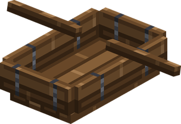
<figcaption>Boat</figcaption>
</figure>

<figure markdown>
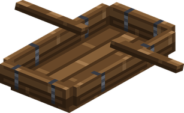
<figcaption>Longboat</figcaption>
</figure>

<figure markdown>
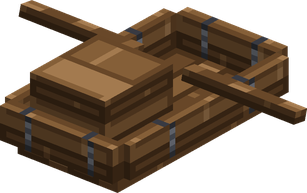
<figcaption>Cargo Boat</figcaption>
</figure>

<figure markdown>
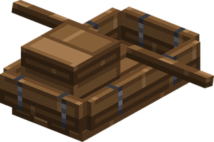
<figcaption>Fishing Boat</figcaption>
</figure>

| Shape | Seats | Hold | Notes |
|---|---|---|---|
| … Boat | 2 | none | the smallest and quickest shape |
| … Longboat | 4 | none | the widest (2 blocks); heavier, so slower |
| … Cargo Boat | 2 | 54 slots (like a double chest) | heavy and slow |
| … Fishing Boat | 2 | 27 slots | "This addon's fish bite 25% more often from it" when you fish from it (see the [Fisher](trades/fisher.md)) |

The item's tooltip lists its blows, seats and hold, the fishing bonus, "Buoyant" for a Kuuigosu hull, and every part fitted ("Fitted: …"). Boat items do not stack.

## Placing and riding

- Use the boat item on water (or on a block) to place it, as with a vanilla boat. Any parts fitted on the item go onto the boat.
- If the player who places it is a **Carpenter of level 10** or more, the hull gets one more blow than normal. Iron Plating adds 2 more on top.
- Right-click to board.
- A **Cargo** or **Fishing** boat opens its hold if you right-click while sneaking, or when all its seats are taken.

!!! note "Fit parts before you place"
    Once a boat is on the water, it cannot be turned back into an item: hitting it only costs timbers, and the end of a boat is the wreck. The Upgrade Bench only takes the boat item, so fit every part first.

## Taking damage

- Every hit costs **one timber**, whatever dealt it: a fist, an arrow or a Sea King's charge.
- Passengers see "Hull X/Y" after each hit or repair. It turns red at one third or less.
- A fall of more than 3 blocks onto land costs one timber, with the crew still aboard (a vanilla boat is destroyed by that). Falling into water costs nothing.
- A Creative player's direct hit removes the boat at once.

## Wrecks and salvage

- When the last timber goes, everyone is thrown into the water and the boat becomes a **wreck**: it floats tilted on its side, seats no one, and keeps its hold.
- Right-click the wreck to **salvage** it. You get everything in the hold, 3 planks of its wood (Oak Planks for a Reinforced hull), and every part that was fitted, returned whole.
- If the wreck is hit again, or left for **5 minutes**, it sinks and its hold spills into the water.

## Mending

Only a [Carpenter](trades/carpenter.md) can mend a hull on the water. Anyone else reads "Only a Carpenter can mend a hull afloat."

- Hold a plank of the hull's wood (any planks for a Reinforced hull) and right-click a damaged boat.
- Each plank restores one timber, or **two** from Carpenter 25. A hull never goes above its full count.

## Parts

Parts are fitted at the { .item-icon }**Upgrade Bench**, which anyone can use: the boat item in the left slot, the part in the middle, the fitted boat on the right. Each boat takes one of each part and **only one sail**: fitting a new sail takes the old one down, and it comes back to you. How to build the bench is on the [Carpenter](trades/carpenter.md) page.

| Part | Made by | Level | From | What it does |
|---|---|---|---|---|
| 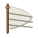{ .item-icon }Boat Sail | [Tailor](trades/tailor.md) (Sewing Table) | 12 | 4 White Wool, 2 String, 2 Stick, 1 planks | "Faster, but only in open water" |
| { .item-icon }Iron Plating | [Inventor](trades/inventor.md) (Workshop) | 16 | 4 Iron Ingot, 4 Iron Scrap, 1 planks | "The hull carries 2 blows more" |
| { .item-icon }Hull Ram | Inventor (Workshop) | 26 | 3 Iron Ingot, 2 Pure Iron Ore, 2 Mysterious Parts, 2 planks | "A boat under way hurts what it runs down" |
| 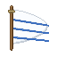{ .item-icon }Fine Sail | Tailor (Sewing Table) | 28 | 1 Boat Sail, 3 White Wool, 2 wings, 2 String | "Faster than a plain sail, in open water" |
| { .item-icon }Burst Dial | Inventor (Workshop) | 42 | 1 Jet Dial, 3 Mysterious Parts, 3 Iron Ingot, 2 Iron Scrap | "Right-click a Cola at the tiller: she leaps the way you look" |
| 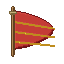{ .item-icon }Master's Sail | Tailor (Sewing Table) | 44 | 1 Fine Sail, 2 White Wool, 2 Sea King Scale, 1 Gold Ingot, 2 String | "The fastest sail, in open water" |

"Wings" means any of the butterflies and moths the [Hunter](trades/hunter.md) catches: Swallowtail Butterfly, Invisible Swallowtail, Crossbone Butterfly, Doze Evil Eye Butterfly, Giant Devil Hand Moth, or the Flying Penguin.

- **Sails** make the boat faster, **only in open water**. About every two seconds the boat looks for water on most sides of it, 5 blocks out: on a river or in a narrow channel, the sail does nothing. A fitted sail shows on the boat as a mast with canvas across the beam: cream for the Boat Sail, white seamed with blue for the Fine Sail, red and gold for the Master's Sail.
- **Iron Plating**: two more blows.
- **Hull Ram**: while the boat is moving fast enough, it hurts living things it runs into (6 damage, at most once a second) and knocks them away. It never hurts its own passengers and does nothing to other boats.
- **Burst Dial**: the pilot right-clicks a **Cola** (Mine Mine no Mi's) while steering. The Cola is used up instead of drunk, and the boat leaps the way the pilot is looking. The dial then needs 5 seconds before it takes more ("The dial needs a moment before it will take more cola.").

## Speed

The hull, the shape, the sail and a [Navigator](trades/navigator.md) at the tiller all multiply a boat's speed. A Navigator of level 10 makes the boats they steer 1 % faster on any water, 2 % from level 40. The total is capped, so these bonuses do not stack without limit.
