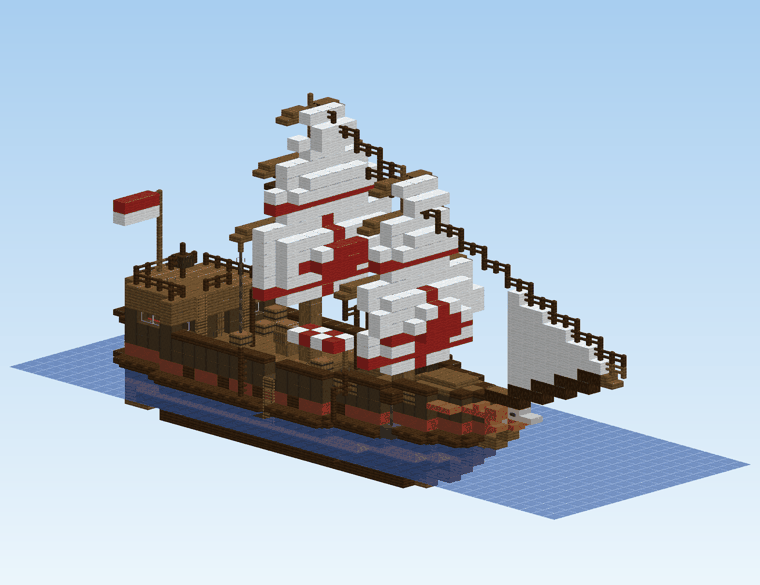
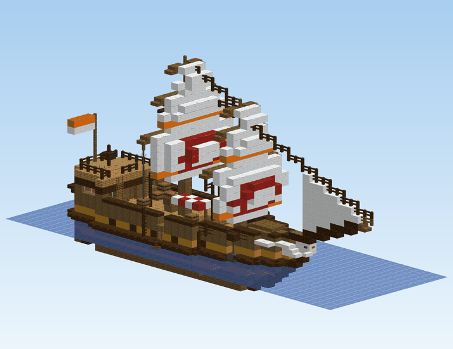
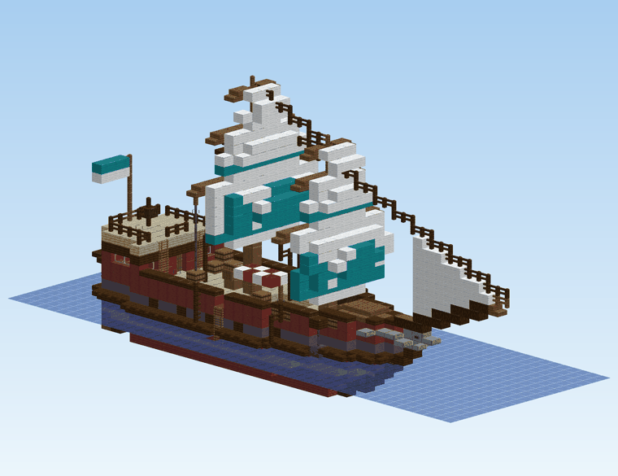
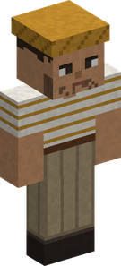
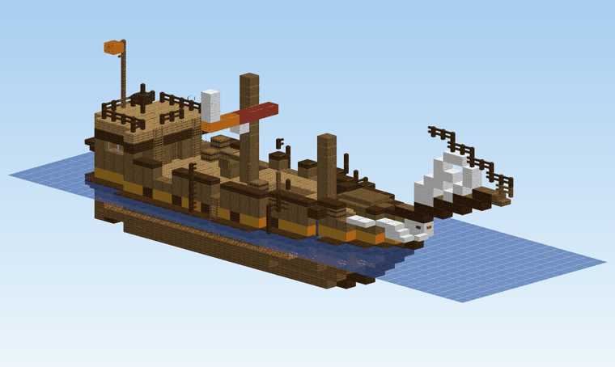

# Events out in the world

Now and then, the world comes to you. **Events** turn up near a player, stay for a while and go. Eight of them are [at sea](#at-sea), two are [on land](#on-land), and four more come to the [villages](village-events.md):

| Event | How often | How long | Where it is announced |
|---|---|---|---|
| [The merchant ship](#the-merchant-ship) | every 4 to 7 days | 1 day | chat, to everyone, with its coordinates |
| [A Sea King surfaces](#a-sea-king-surfaces) | every 7 to 10 days | 2 days | chat, to everyone, with its coordinates |
| [A wreck adrift](#a-wreck-adrift) | every 5 to 8 days | 1 day, then it sinks | chat, to everyone, with its coordinates |
| [The floating restaurant](#the-floating-restaurant) | every 9 to 13 days | 1 day | chat, to everyone, with its coordinates and the chef's dish |
| [The fog of the Florian Triangle](#the-fog-of-the-florian-triangle) | every 7 to 10 days, at nightfall | until dawn | chat, to players within 1 000 blocks: a way and a distance |
| [A storm at sea](#a-storm-at-sea) | every 4 to 7 days | 4 to 6 in-game hours | the Barometer half a day ahead; chat when it breaks, to players within 1 000 blocks: a way and a distance |
| [A ship in distress](#a-ship-in-distress) | every 8 to 12 days | 1 day, then she sinks | chat, to everyone, with her coordinates |
| [A school of fish](#a-school-of-fish) | every 3 to 5 days | half a day | chat, to players within 1 000 blocks: the fish, a way and a distance |
| [A creature migration](#a-creature-migration) | every 5 to 8 days | 1 day | chat, to players within 1 000 blocks: the creature, a way and a distance |
| [A falling star](#a-falling-star) | every 15 to 20 days, in the night | 1 day | chat, to everyone: a way and a distance |
| [A concert on the square](village-events.md#a-concert-on-the-square) | every 5 to 8 days | 1 day | chat, with the village's name and its coordinates |
| [A fever in the village](village-events.md#a-fever-in-the-village) | every 7 to 10 days | 1 day | chat, with the village's name and its coordinates |
| [A swordsmith from Wano](village-events.md#a-swordsmith-from-wano) | every 8 to 12 days | 2 days | chat, with the village's name and its coordinates |
| [A fishing tournament](village-events.md#a-fishing-tournament) | every 6 to 9 days | 1 day | chat, with the village's name, its coordinates and the catch of the day |

Every one of them is also told by the barkeepers' rumours and on the villages' notice boards: see [How you hear of them](#how-you-hear-of-them).

Days are in-game days (one day = 20 real minutes, one in-game hour = 50 real seconds), and the wait between two events of a kind is drawn anew each time. Each event can be turned off, or made to come more or less often, in the [configuration](configuration.md#events-at-sea).

## How you hear of them

- **In the chat.** Everyone is told when an event starts, with its coordinates, and again when it is about to end. The fog, the storm, the school of fish, the migration and the falling star give no coordinates: each player is told **which way and about how far** from where he stands, and has to look for it. The fog, the storm, the school and the migration are told only to the players within 1 000 blocks.
- **From the barkeepers.** Mine Mine no Mi's barkeepers sell rumours (1 000 Belly). While an event runs within 2 000 blocks of the barkeeper, the rumour is about it: the nearest one. Every player hears it, Marine, Bounty Hunter or not.
- **On the notice board.** The board of a [village](villages.md) has a **news** note beside the day's orders: every event running within 2 000 blocks, with how long it still lasts. It costs nothing: see [The news on the notice board](village-events.md#the-news-on-the-notice-board).

## Where they turn up

The three ships that drop anchor (the merchant ship, the floating restaurant, the ship in distress), the Sea King and the wreck come as follows; the other events say where they come in their own section.

Always **at sea**, between **100 and 500 blocks** from a player, on open water deep enough to float a ship. Never on frozen seas, and never on top of a player: the spot is kept clear of anyone within 16 blocks. By order of preference:

1. **off a village**, when one of the two nearest villages has sea close by;
2. **off the coast**, with land within 24 blocks;
3. **out at sea**, anywhere else.

The **merchant ship** goes first to the port of one of Cruise's own [villages](villages.md), when there is one near: it anchors off it, and its arrival names the village. A port on a river is too shallow for it, and it stays away from a dead village.

The chat says which. An event is placed once a player gets near enough for its water to be loaded; until then, only its coordinates exist.

## At sea

Eight events come at sea: [the merchant ship](#the-merchant-ship), [a Sea King](#a-sea-king-surfaces), [a wreck](#a-wreck-adrift), [the floating restaurant](#the-floating-restaurant), [the fog of the Florian Triangle](#the-fog-of-the-florian-triangle), [a storm](#a-storm-at-sea), [a ship in distress](#a-ship-in-distress) and [a school of fish](#a-school-of-fish).

## The merchant ship

A three-masted merchant ship drops anchor for **one day**. Row out and climb one of the **rope ladders** down its sides.

> *A merchant ship of the Crimson Compass Guild has dropped anchor off the coast, near 1200, -340. It sails again tomorrow.*

An hour before it goes, everyone is told it "weighs anchor within the hour". When it sails, it takes **everything aboard** with it, whatever is left in its chests included, and the sea closes over where it lay.

### The five houses

Every ship belongs to one of five merchant houses, drawn at random. Each has its own ship: its woods, the colour of its hull band, the mark on its main sail and its figurehead. Its crew is dressed in its colour.

| House | Woods | Colour | Mark | Figurehead |
|---|---|---|---|---|
| **Sunward Company** | spruce | ochre | Cruise's life ring | a gull |
| **Verdant Isles Company** | oak and birch | green | a leaf | a sea turtle |
| **Crimson Compass Guild** | dark oak | red | a compass star | a lion |
| **Lagoon Traders** | mangrove | teal | a fish | a dolphin |
| **Amethyst Pearl House** | cherry | purple | a crescent and its pearl | a swan |

The house is named in the chat, in the rumours and over its merchant's head. What the merchant sells does not depend on it.

<figure markdown>

<figcaption>Sunward Company</figcaption>
</figure>

<figure markdown>

<figcaption>Verdant Isles Company</figcaption>
</figure>

<figure markdown>

<figcaption>Crimson Compass Guild</figcaption>
</figure>

<figure markdown>

<figcaption>Lagoon Traders</figcaption>
</figure>

<figure markdown>

<figcaption>Amethyst Pearl House</figcaption>
</figure>

### The Ship Merchant

<figure markdown>

<figcaption>Ship Merchant</figcaption>
</figure>

<figure markdown>

<figcaption>Deckhand</figcaption>
</figure>

<figure markdown>

<figcaption>Boatswain</figcaption>
</figure>

On deck, under the stall's awning, stands the **Ship Merchant of the &lt;house&gt;**, spyglass in hand. He trades like the [travelling merchants](merchants-and-contracts.md), with more of everything:

- **His stall: the best of every stall.** He draws from the Fishmonger's, the Hunting Merchant's, the Prospector's and the Materials Trader's goods, and the Travelling Cook's simple dishes, but only from the upper part of each list: the rarer goods. Each of those is on his stall 30 % of the time, however rare, 1 to 3 of it, up to 24 goods. Prices are the usual ones.
- **Maps and score recipes, more often than ashore:**

    | On his stall | Ship Merchant | A travelling merchant |
    |---|---|---|
    | Torn map (Rumor) | 80 % | 35 % |
    | Torn map (Old) | 40 % | 12 % |
    | Torn map (Legendary) | 12 % | 3 % |
    | A lost tune's [score recipe](trades/musician.md#the-lost-tunes) | 35 % | 8 % |

- **He buys everything** any of Cruise's merchants buys, at the best of their prices, and his purse is deep: 50 000 to 300 000 Belly.
- **Big orders.** He posts **three contracts**, each from a different trade, for one of the trade's better goods: 3 to 5 of it, or 5 to 8 for the last one, which only a [Merchant](trades/merchant.md) can take. They pay **1.8 times** the goods' worth (more for a Merchant), and every one comes with **something extra**: a score recipe now and then, otherwise a torn map (an Old one on the Merchant's order).

### The crew

A **Boatswain** keeps the quarterdeck by the helm, and **three or four Deckhands** watch the hold and the stall. They are armed with cutlasses and leave you alone while you trade and look around.

**Take anything** from one of the ship's chests or barrels, or **break** one, and you are a thief: "The crew saw you steal from the ship!" Every sailor aboard comes for you at once, and knows where you are without seeing you. They **never calm down** until the ship sails, and the Ship Merchant won't deal with you any more ("I don't deal with thieves."). Opening a chest to look, or putting something in, is not theft. Jump overboard and they stay aboard; come back, and they are waiting.

Hitting a sailor without stealing only makes that sailor and the ones nearby fight back.

| | Deckhand | Boatswain |
|---|---|---|
| Doriki | 3 700 to 4 900 | 4 300 to 5 700 |
| Health | about 90 to 120 | about 110 to 140 |
| Busoshoku / Kenbunshoku | 35-44 / 26-34 | 57-65 / 55-65 |
| Fights with | haki hardening, future sight, a tackle | the same, plus imbued blows and a Punch Rush |

As with Mine Mine no Mi's own fighters, defeating one gives you 1 % of its Doriki.

### The cargo

Every chest and barrel aboard holds a little of the merchants' goods:

- **1 or 2 goods** of the fish, hunting, mining or materials trades, **mostly common ones**; never a dish;
- a **pouch of Belly** 25 % of the time (200 to 1 500 Belly);
- a **torn map** (Rumor) 10 % of the time.

Somewhere in the hold, one chest holds a little more: an extra good, an **Old torn map** 25 % of the time, and sometimes a **Devil Fruit box**:

| Box | Chance |
|---|---|
| Wooden Box | 4 % |
| Iron Box | 1.5 % |
| Golden Box | 0.5 % |

That is some 6 % in all. The fruit inside is drawn by Mine Mine no Mi when the box is opened, as for any box. Taking any of it, of course, sets the crew on you.

## A Sea King surfaces

A Sea King is sighted off a coast and stays for **two days**, circling slowly over its patch of deep water, then sinks back to the deep.

> *A Sea King has been sighted off the coast, near 1200, -340. Keep out of its water!*

| Sea King | Chance | Health | Damage | Fisher XP for the kill |
|---|---|---|---|---|
| Sea King | 50 % | 140 | 8 | 900 |
| Extra-Large Sea King | 35 % | 200 | 11 | 1 400 |
| Goldfish Sea King | 15 % | 260 | 14 | 2 000 |

It is the same beast a [Fisher](trades/fisher.md) pulls up on a line, with the same attacks. It **only goes for whoever is on its water**: swimming or in a boat within 32 blocks of where it lies. The beach is safe.

Killed, it gives its **parts only**, as a hooked one does:

| Sea King | Scales | Fins | Head crest |
|---|---|---|---|
| Sea King | 4 to 8 | 1 to 2 | - |
| Extra-Large Sea King | 8 to 14 | 2 to 4 | 1, half the time |
| Goldfish Sea King | 12 to 20 | 3 to 6 | 1 to 2 |

When its two days are up, it dives and is gone, whether or not anyone fought it.

## A wreck adrift

The wreck of a merchant house's ship drifts in, masts snapped, sails in rags, riding low with its hold flooded. **It sinks a day later**, with whatever is still aboard.

> *A wreck of the Sunward Company has been sighted adrift off the coast, near 1200, -340. It will sink by tomorrow.*

### Guarded wrecks

**One wreck in four has a Sea King circling it** (a Sea King or an Extra-Large one, never the Goldfish). For it, anyone **aboard** the wreck is on its water: it cannot reach the deck with its body, so it hits whoever stands there with its **water jet**, from up to 30 blocks. Swimmers get its whole set of attacks.

That wreck is worth the fight: its cargo is still aboard.

- Every chest and barrel holds **1 or 2 goods**, a **pouch of Belly** 25 % of the time, a **torn map** (Rumor) **25 %** of the time and an **Old** one **8 %** of the time: the best odds for maps anywhere.
- Its hidden chest holds a **Devil Fruit box twice as often** as a merchant ship's: Wooden 8 %, Iron 3 %, Golden 1 %, some 12 % in all.

### Wrecks nothing guards

They have been picked over. **Half their chests and barrels are empty**; the others hold a single good, a pouch of Belly 10 % of the time, a torn map 12 % (Rumor) or 3 % (Old) of the time. **Never a Devil Fruit box.**

## The floating restaurant

A restaurant ship in the shape of a fish drops anchor for **one day**. It anchors where the merchant ship does: off a village's port when there is one near, else off a village, off a coast or out at sea. The chat says where, and names the dish its chef cooks that day; an hour before it goes, everyone is told it "weighs anchor within the hour". When it sails, its people go with it.

| | |
|---|---|
| How often | every 9 to 13 days |
| How long | 1 day |
| How far | 100 to 500 blocks from a player |
| Settings | [`restaurant`](configuration.md#events-at-sea) |

### The ship

Climb aboard by its **ladders**. There is a **terrace**, a **lounge** under the fish's head with its mouth open on the sea, a **dining room**, and upstairs a **kitchen you may cook in**.

The house comes with its people:

- about **ten guests**, nobles and well-off townsfolk in their best and a few ordinary folk: seven or eight seated at the tables of the dining room, the lounge and the terrace, two or three strolling on the terrace;
- a **pianist** at a Grand Piano in the dining room, playing the [Musician](trades/musician.md)'s tunes for the pleasure of it. The piano is the house's: it cannot be taken;
- **waiters** going from the counter to the tables with the dish of the day;
- **kitchen hands** at work upstairs about the chef.

Right click any of them for a word.

### The chef's cooking contest

Each visit the **Head Chef** cooks a dish of his own, named when the ship comes: a recipe of level 20 to 50, and **its recipe's level is the score to beat**. Right click him with your best dish in hand; his window says what that dish would take.

A dish scores **its recipe's level**, **5 more if it is Fine**, **10 more if it is Superb**.

| Medal | Your score | Belly | Cook XP | Rare ingredients |
|---|---|---|---|---|
| Gold | the chef's score or more | 2.5 times the dish's price | 3 times the recipe's XP | 4 |
| Silver | within 10 of it | 2 times | 2 times | 2 |
| Bronze | within 20 of it | 1.5 times | 1.5 times | 1 |
| No medal | lower | the dish's price | the recipe's XP | - |

- The chef **keeps the dish** and pays at once. A dish that takes no medal is simply paid for.
- **One dish each visit** for each player.
- **Only a [Cook](trades/cook.md) may enter**, with a dish of a level he could cook himself.
- The rare ingredients are drawn among those the Head Waiter sells, different ones each.
- The gold gives a title: **Golden Ladle**.

### The Head Waiter

Behind the dining room's counter stands the **Head Waiter**. He trades like the [travelling merchants](merchants-and-contracts.md):

- **He buys your dishes a fifth dearer** than the Travelling Cook does, from a purse of 20 000 to 250 000 Belly.
- **He sells rare ingredients**: what a Cook has trouble finding, rare fish, creatures and produce. Each of them is on his stall 40 % of the time, 1 or 2 of it.
- **He sells the house's own dishes**, ready to eat: the dishes above the Travelling Cook's simple ones, up to those of level 40.
- **He posts orders**, all of them for dishes.

His stall holds up to 24 goods, and is dear, as any stall. He sells no torn map and no score recipe.

## The fog of the Florian Triangle

At **nightfall**, a thick fog falls over a stretch of sea, out at sea. Those within 1 000 blocks are told which way and about how far:

> *A fog has fallen over the sea to the north-east, about 400 blocks from here. They say a ship drifts in it.*

| | |
|---|---|
| How often | every 7 to 10 days, at nightfall |
| How long | until dawn |
| How far | 100 to 500 blocks from a player |
| How wide | 80 blocks around the ship |
| Settings | [`ghostShip`](configuration.md#events-at-sea) |

From outside nothing shows: you find the fog **by sailing into it**. It thickens over its first 24 blocks; in the thick of it the world closes in, grey, until you see **no farther than some fifteen blocks**. It keeps away from the villages and from the other ships.

Somewhere in the thick of it a **ghost ship** drifts: grey timbers, black sails in rags, pale lights. **Her bell tolls** every six seconds and carries 64 blocks: follow it.

**Pirates guard her**: Mine Mine no Mi's own, two brutes and five grunts unless the [configuration](configuration.md#events-at-sea) says otherwise.

### Her chests

| | Every chest and barrel | The captain's chest, in her cabin | The chest hidden at the bow end of her hold |
|---|---|---|---|
| Old cargo of a merchant's hold | yes | yes | yes, a little more |
| Torn map (Rumor) | 25 % | 25 % | 25 % |
| Torn map (Old) | 10 % | 10 % | 10 % |
| Torn map (Legendary) | - | 15 % | 35 % |
| A lost tune's [score recipe](trades/musician.md#the-lost-tunes) | - | 25 % | 25 % |

A torn **legendary** map is found there more often than anywhere. The hidden chest also has a merchant ship's chance of a [Devil Fruit box](#the-cargo).

**At dawn the fog lifts**, and the ship is gone with whatever was left aboard, her pirates with her.

## A storm at sea

A storm breaks over a stretch of open sea. It is **local**: it rains and thunders only for those who are in it, and its lightning shows from afar. Players within 1 000 blocks are told when it breaks, and again when it has blown itself out:

> *A storm has broken at sea to the north-east, about 400 blocks from here. A weak hull had better keep out of it.*

| | |
|---|---|
| How often | every 4 to 7 days |
| How long | 4 to 6 in-game hours |
| How far | 150 to 450 blocks from a player |
| How wide | about 100 blocks from its middle in every direction |
| Foretold | half a day ahead, by the Barometer |
| Settings | [`seaStorm`](configuration.md#events-at-sea) |

It breaks over the open sea, at least 100 blocks from any village.

**The Barometer foretells it.** Half a day before the storm breaks, the [Navigator](trades/navigator.md#level-20-the-barometer)'s Barometer says which way it is brewing, about how far, and in how many minutes it breaks, to anyone within 1 000 blocks of it. While the storm rages, the Barometer says when it will pass.

In the storm:

| | |
|---|---|
| A [Carpenter](trades/carpenter.md)'s boat | about a quarter slower |
| The Burning Tree's and the Adam's hulls | take no blow |
| Any other hull with **Iron Plating** | takes no blow |
| Any other hull | a blow from the waves every half minute or so |
| A plain boat | not slowed, but the third blow breaks it |
| Lightning | may strike whoever is in the open on the water, once in forty seconds or so, for 5 damage |
| Rare fish | bite three times as often |

- Only a boat **with somebody aboard** takes blows: one moored in a storm's path is not broken while you are away.
- Lightning strikes whoever is in a boat or swimming under the open sky. **Not ashore, not under a roof, not under water.** It sets nothing on fire.
- A fish is rare when it bites 15 % of the time or less in those waters: see the [Fisher](trades/fisher.md).

## A ship in distress

A merchant house's ship, wrecked, runs aground near a player, where a wreck would. Everyone is told where:

> *A ship of the Sunward Company is in distress off the coast, near 1200, -340. Her captain asks for planks, wool and iron to repair her: she will sink by tomorrow.*

| | |
|---|---|
| How often | every 8 to 12 days |
| How long | 1 day, then she sinks |
| How far | 100 to 500 blocks from a player |
| Settings | [`shipInDistress`](configuration.md#events-at-sea) |

Her **Ship Captain** stands on what is left of her deck. Right click him to see what she needs, and to deliver what you carry:

| She needs | How many | Each one pays |
|---|---|---|
| Planks of any wood (a log counts as four) | 192 | 2 Belly |
| Wool of any colour | 48 | 6 Belly |
| Iron ingots | 32 | 20 Belly |

- **Anyone can help**, whatever his trade, and several players can fill the list together.
- **Each delivery is paid at once**: 1 312 Belly for the whole list.
- The woods of the Carpenter's hulls (Kuuigosu, Burning Tree, Adam) are not taken: the captain wants ordinary timber.
- Her hold is empty and nothing guards her: there is nothing to salvage.

**When all of it is there she is whole again** before your eyes, masts, sails and all, and her captain thanks those who delivered, **each in proportion to what he brought**:

| The thanks | For the whole repair | Who has it |
|---|---|---|
| A bonus in Belly | 656 Belly, half of what the list pays | shared by what each brought |
| A share of his hold | goods of the trades worth 1 640 Belly | shared by what each brought |
| A torn map (Rumor) | certain for whoever did half of the repair or more | by your share |
| A torn map (Old) | 3 times in 10 for whoever did all of it | by your share |
| A part of the ship: Iron Plating, a Hull Ram or a Fine Sail; a Master's Sail one time in ten | one | the one who brought most |
| A Devil Fruit box | rarely, as in a merchant ship's [hidden chest](#the-cargo) | the one who brought most |

A share is counted in the Belly your deliveries were paid, not in pieces: an iron ingot weighs more in the repair than a plank.

It is handed to you **wherever you are**, at your next coming if you are away. Then she sails away, within the minute.

**If she is not repaired within the day she sinks.** What was delivered stays paid; there is no bonus and no part.

## A school of fish

A school of one fish passes **off a wild coast or out at sea**, away from the villages. Those within 1 000 blocks are told which fish, which way and about how far:

> *A school of &lt;fish&gt; is passing off the coast to the north-east, about 400 blocks from here. Look for the gulls diving over it: it will not stay long.*

| | |
|---|---|
| How often | every 3 to 5 days |
| How long | half a day (10 real minutes) |
| How far | 150 to 450 blocks from a player |
| How wide | 10 blocks around its middle |
| It holds | 40 fish, for everyone |
| Settings | [`schoolOfFish`](configuration.md#events-at-sea) |

No coordinates: look for the **sea gulls diving over it**, seven of them, and the water stirring under them.

Cast your line in it:

- **nearly every catch is that fish**: nine catches in ten;
- it is **bigger than usual**: a good place to beat a record;
- **the bite comes about twice as fast**.

It is a fish of those waters that your [Fisher](trades/fisher.md)'s level can land, and the level a fish asks still holds in the school. It is never the catch of the day of a [fishing tournament](village-events.md#a-fishing-tournament) being held.

The school holds **forty fish for everyone**: each catch says how many are left. It scatters when the last one is landed, or moves on when its time is up.

## On land

Two events come on land, in the wild: [a creature migration](#a-creature-migration) and [a falling star](#a-falling-star). Neither is told with coordinates: each player hears which way and about how far.

## A creature migration

For one day, one of the creatures that have a rare variant settles in numbers **where it lives**, away from the villages. Those within 1 000 blocks are told which creature, which way and about how far, and told again as they walk into it:

> *The Hercules Beetle is migrating: a swarm has settled to the north-east, about 400 blocks from here, with rare ones among them. It will move on before long.*

| | |
|---|---|
| How often | every 5 to 8 days |
| How long | 1 day |
| How far | 150 to 450 blocks from a player |
| How wide | 20 blocks around its middle |
| It holds | 30 creatures, for everyone; a dozen are there at a time |
| The rare one | one in five, instead of one in twenty |
| Settings | [`creatureMigration`](configuration.md#events-on-land) |

Six creatures migrate:

- the Hercules Beetle,
- the Atlas Beetle,
- the Ice Stag Beetle,
- the Lightning Beetle,
- the Fire Hercules,
- the Swallowtail Butterfly, which is otherwise only ever met in a trap.

**One in five is the rare one**, a Golden Hercules or an Invisible Swallowtail for instance, instead of one in twenty: the day to fill those pages of the [Bestiary](bestiary-and-logbook.md#the-bestiary). The [Hunter](trades/hunter.md)'s level does not count in which creature comes: everyone sees it, and those who have the level catch it.

The migration holds **thirty creatures for everyone**. It is over when the last one is caught, or moves on when its time is up. One that takes fright and flies off is not lost: another settles in its place.

## A falling star

In the night, a star falls somewhere **in the wild, on dry land**, away from the players and the villages. If you are within 700 blocks you see it streak across the sky and hear it strike. Everyone is told which way it fell and about how far:

> *A star has fallen to the north-east, about 400 blocks from here. Look for its smoke: by tomorrow night nothing will be left of it.*

| | |
|---|---|
| How often | every 15 to 20 days, in the night |
| How long | 1 day |
| How far | 150 to 500 blocks from a player |
| Settings | [`fallingStar`](configuration.md#events-on-land) |

No coordinates: look for its **column of smoke**.

### The meteorite

The meteorite lies on the ground, half buried, five blocks across:

- a **shell of dark rock**;
- a core of **Kairoseki ore**;
- a few **diamond, gold and emerald ores**, two of each at most;
- a **Star Core** at its heart.

Dig it out while it lasts; a [Miner](trades/miner.md) gets his usual XP and finds from it. A day after it fell, what is left of it crumbles to dust and the place is as it was: **the star digs nothing and breaks nothing**.

### The Star Fragment

The Star Core holds one **Star Fragment**, and it is found nowhere else.

| | |
|---|---|
| Who can take it | a Miner of level 50 |
| With | a diamond pickaxe or better |
| The Prospector buys it | 15 000 Belly |

Nobody else can break the Star Core, so nobody can waste it. The fragment is kept for the master crafts of the highest levels, which are still to come; until then the Prospector buys it, for more than anything else he takes.
