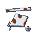
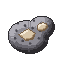

# Blacksmith

The Blacksmith makes, at the **Forge**, the weapons and gear of Mine Mine no Mi that the base mod ships but never let players craft, from the Blue Sword to the Soul Solid, and takes over a few that it did, such as bullets, cannons and handcuffs.

| | |
|---|---|
| Workstation | { .item-icon }**Forge** |
| How it is made | 3 Iron Ingots on top; Stone Bricks, Anvil, Stone Bricks in the middle; 3 Stone Bricks at the bottom |
| Materials | iron, and the [Miner](miner.md)'s Kairoseki, Dense Kairoseki, Pure Iron Ore and Marble |
| Levels | 1 to 100; new recipes up to level 50 |

The Forge glows (light level 10) and needs a pickaxe to be picked back up. Every recipe asks for a Blacksmith level and pays Blacksmith XP.

## What the Forge makes

- **From level 1**, the plain weapons and ammunition: Axe, Broadsword, Katana, Spear and Bullets, then the Pipe (5), the Mace and Scissors (10) and Handcuffs (14).
- **Levels 17 to 28**, gear that needs other trades' goods: the Kabuto (Iron Scrap and Mysterious Parts), Pop Greens (Gunpowder), Cannon Balls, the Kairoseki Net and the Cannon.
- **Levels 29 to 41**, sea-stone and fine blades: the Blue Sword, Kairoseki Bullets, the Warabide Sword, then Dense Kairoseki for the Jitte, the 5t Hammer and Kairoseki Handcuffs.
- **The top of the trade**: the Kuro Kabuto (45), forged from a Kabuto and Adam Planks, and the **Soul Solid** (50).

The item names are Mine Mine no Mi's own, and so are their combat stats.

These are all the Forge's recipes ("planks" means any planks):

| Makes | Level | XP | Ingredients |
|---|---|---|---|
| Axe | 1 | 12 | 3 × Iron Ingot, 2 × Stick |
| Broadsword | 1 | 12 | 5 × Iron Ingot, Stick, Leather |
| Bullet ×8 | 1 | 12 | 2 × Iron Ingot, 2 × Cobblestone |
| Katana | 1 | 12 | 4 × Iron Ingot, Stick, Leather |
| Spear | 1 | 12 | 2 × Iron Ingot, 3 × Stick |
| Pipe | 5 | 20 | 3 × Iron Ingot |
| Mace | 10 | 30 | Block of Iron, Iron Ingot, Stick |
| Scissors | 10 | 30 | 3 × Iron Ingot, 3 × Cobblestone |
| Handcuffs | 14 | 38 | Iron Ingot, 2 × Chain |
| Kabuto | 17 | 44 | 4 × any planks, 3 × String, 2 × { .item-icon }Iron Scrap, { .item-icon }Mysterious Parts |
| Pop Green ×8 | 21 | 52 | 2 × any small flowers, 3 × Wheat Seeds, 2 × Bone Meal, Gunpowder |
| Cannon Ball ×4 | 24 | 58 | 4 × Cobblestone |
| Kairoseki Net | 25 | 60 | 4 × Kairoseki, 5 × String |
| Cannon | 28 | 66 | 3 × Block of Iron, 3 × Cobblestone, String |
| Blue Sword | 29 | 68 | 4 × Iron Ingot, 2 × Kairoseki, 3 × Lapis Lazuli, Diamond |
| Kairoseki Bullet ×8 | 32 | 74 | 2 × Kairoseki, 2 × Cobblestone |
| Warabide Sword | 33 | 76 | 4 × Iron Ingot, 2 × { .item-icon }Pure Iron Ore, 2 × { .item-icon }Marble, Diamond |
| Jitte | 36 | 82 | Dense Kairoseki, 2 × Iron Ingot |
| 5t Hammer | 37 | 84 | 5 × Block of Iron, 2 × Dense Kairoseki, 2 × Stick |
| Kairoseki Handcuffs | 41 | 92 | 2 × Dense Kairoseki, Chain |
| Kuro Kabuto | 45 | 100 | Kabuto, 4 × { .item-icon }Adam Planks, 2 × { .item-icon }Mysterious Parts, 3 × String |
| Soul Solid | 50 | 110 | 4 × Iron Ingot, 3 × Dense Kairoseki, 6 × { .item-icon }Diamond Fragment, Bone, Note Block, Diamond |

## Taking over the base mod's recipes

By default, Cruise removes some of Mine Mine no Mi's crafting-table recipes, so those items are made only by the trade that owns them:

- **Blacksmith** (Forge): Jitte, Mace, Pipe, Scissors, Cannon, Cannon Ball, Bullet, Kairoseki Bullet, Handcuffs, Kairoseki Handcuffs.
- **[Tailor](tailor.md)** (Sewing Table): Umbrella, Medic Bag, Flag.
- **[Inventor](inventor.md)** (Workshop): Clima Tact, Perfect Clima Tact, Sorcery Clima Tact.

The server setting **takeOverBaseRecipes** switches this off: all sixteen recipes go back to the crafting table, exactly as the base mod shipped them, and the trades still make these items too. A second setting keeps chosen items on the crafting table while the takeover stays on. Changes apply at the next `/reload` or world load; on a server, the server's settings decide. The recipe-book unlocks follow the same setting. See [Configuration](../configuration.md).

## Level perks

| Level | Perk | What it does |
|---|---|---|
| 10 | "Tempering: what you forge comes with Unbreaking I" | added if the item can take it and does not have it already |
| 25 | "Keen edge: a forged weapon comes with Sharpness I, armour with Protection I" | same rule; items with no durability (bullets, cannon balls…) get nothing |
| 40 | "Scrap: a quarter of your forgings give an ingredient back" | 25 % chance one ingredient (never a tool) comes back: "Saved from the scrap: …" |

## Advancements

The **Smithing** tab opens when you become a Blacksmith: Apprentice Blacksmith (level 5), Forged Steel (forge a Katana), Sea-Stone Shot (forge Kairoseki Bullets) and the challenge **Yohohoho!** (forge the Soul Solid).
