# Carpenter

The Carpenter builds **boats** and heavy **storage** at the Shipyard: sixteen boats whose hulls take several blows before they give, four lockers bigger than a chest, and the Auction House. Out on the water, only a Carpenter can mend a damaged hull.

| | |
|---|---|
| Workstation | { .item-icon }**Shipyard** |
| How it is made | 3 planks on top; log, Crafting Table, log in the middle; 3 logs at the bottom (any planks, any logs) |
| Materials | Kuuigosu, Burning Tree and Adam Planks from the [Lumberjack](lumberjack.md)'s trees |
| Levels | 1 to 100; new recipes up to level 50 |

Every Shipyard recipe asks for a Carpenter level and pays Carpenter XP.

## Boats

There are **16 boats**: four hulls (Reinforced, Kuuigosu, Burning Tree, Adam) in four shapes (Boat, Longboat, Cargo Boat, Fishing Boat).

- **Reinforced** hulls (Carpenter 5 to 15) are built from any planks and iron.
- **Kuuigosu** hulls (Carpenter 20 to 30) are the quick ones.
- **Burning Tree** hulls (Carpenter 36 to 40) are fireproof.
- **Adam** hulls (Carpenter 50) take the most blows.

How the hulls and shapes behave, and how to ride, mend and salvage the boats: see [Boats](../boats.md).

## Lockers

Four chests of the Carpenter's own. Each is one block and **never pairs** into a double chest.

| Locker | Carpenter | Slots (grid) | Blast resistance | Special |
|---|---|---|---|---|
| { .item-icon }Ship's Locker | 10 | 36 (9×4) | 6 | — |
| { .item-icon }Reinforced Locker | 22 | 55 (11×5) | 25 | — |
| { .item-icon }Kuuigosu Locker | 34 | 78 (13×6) | 60 | — |
| { .item-icon }Adam Strongbox | 45 | 105 (15×7) | 1 200 | **keeps its contents when broken** |

- The Adam Strongbox drops as one item with everything inside (its tooltip: "Keeps what is in it when you break it"), and placing it puts it all back. The other three spill their contents when broken, like a chest.
- Lockers keep a name given with an anvil and work with comparators.

## The Auction House

The { .item-icon }**Auction House** (Carpenter 15) is a block anyone can use. Every Auction House opens the same server-wide market, with Buy, Sell and My lots tabs. See [Auction House](../auction-house.md).

## Shipyard recipes

These are all the Shipyard's recipes ("planks" means any planks):

| Makes | Level | XP | Ingredients |
|---|---|---|---|
| 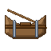{ .item-icon }Reinforced Boat | 5 | 20 | 5 × any planks, 2 × Iron Ingot, 2 × { .item-icon }Iron Scrap |
| 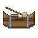{ .item-icon }Reinforced Fishing Boat | 8 | 26 | 5 × any planks, 2 × Iron Ingot, { .item-icon }Iron Scrap, Chest |
| { .item-icon }Ship's Locker | 10 | 30 | 6 × any planks, Chest, 2 × Iron Ingot |
| 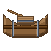{ .item-icon }Reinforced Cargo Boat | 12 | 34 | 5 × any planks, 2 × Iron Ingot, 2 × Chest |
| { .item-icon }Auction House | 15 | 36 | 6 × any planks, Book, 2 × Gold Ingot |
| 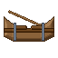{ .item-icon }Reinforced Longboat | 15 | 40 | 7 × any planks, 2 × Iron Ingot |
| 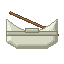{ .item-icon }Kuuigosu Boat | 20 | 50 | 6 × { .item-icon }Kuuigosu Planks, 3 × Iron Ingot |
| { .item-icon }Reinforced Locker | 22 | 54 | 6 × any planks, Chest, 4 × Iron Ingot, 2 × { .item-icon }Iron Scrap |
| 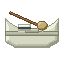{ .item-icon }Kuuigosu Fishing Boat | 23 | 56 | 6 × { .item-icon }Kuuigosu Planks, 2 × Iron Ingot, Chest |
| 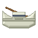{ .item-icon }Kuuigosu Cargo Boat | 27 | 64 | 6 × { .item-icon }Kuuigosu Planks, Iron Ingot, 2 × Chest |
| 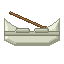{ .item-icon }Kuuigosu Longboat | 30 | 70 | 6 × { .item-icon }Kuuigosu Planks, Iron Ingot, 2 × any planks |
| { .item-icon }Kuuigosu Locker | 34 | 78 | 6 × { .item-icon }Kuuigosu Planks, Chest, 2 × Block of Iron |
| { .item-icon }Burning Tree Boat | 36 | 82 | 5 × { .item-icon }Burning Tree Planks |
| 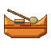{ .item-icon }Burning Tree Fishing Boat | 37 | 84 | 6 × { .item-icon }Burning Tree Planks, String, { .item-icon }Reel |
| { .item-icon }Burning Tree Cargo Boat | 38 | 86 | 6 × { .item-icon }Burning Tree Planks, Chest, { .item-icon }Iron Scrap |
| 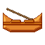{ .item-icon }Burning Tree Longboat | 40 | 90 | 7 × { .item-icon }Burning Tree Planks, 2 × { .item-icon }Iron Scrap |
| { .item-icon }Adam Strongbox | 45 | 100 | 6 × { .item-icon }Adam Planks, Chest, 4 × Block of Iron, 2 × { .item-icon }Mysterious Parts |
| 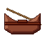{ .item-icon }Adam Boat | 50 | 110 | 6 × { .item-icon }Adam Planks, 2 × { .item-icon }Pure Iron Ore, Iron Ingot |
| 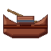{ .item-icon }Adam Cargo Boat | 50 | 110 | 6 × { .item-icon }Adam Planks, { .item-icon }Pure Iron Ore, 2 × Chest |
| 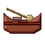{ .item-icon }Adam Fishing Boat | 50 | 110 | 6 × { .item-icon }Adam Planks, 2 × { .item-icon }Pure Iron Ore, Chest |
| 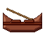{ .item-icon }Adam Longboat | 50 | 110 | 6 × { .item-icon }Adam Planks, { .item-icon }Pure Iron Ore, 2 × any planks |

## The Upgrade Bench

Boats are fitted with sails, plating, a ram or a Burst Dial at the { .item-icon }**Upgrade Bench**.

- It is crafted with 3 Iron Ingots on top, plank / Smithing Table / plank in the middle, and 3 planks at the bottom.
- **Anyone** can use it; it asks for no trade and no level.
- Put the **boat item** in the left slot and a part in the middle slot, then take the fitted boat from the right slot. Between the slots, the bench shows what the part will do.
- Parts go on the boat **before** it is placed: the bench only takes the boat item.
- Each boat takes one of each part and **only one sail**: fitting a new sail takes the old one down, and it comes back to you.

The sails are sewn by the [Tailor](tailor.md); the other parts are made by the [Inventor](inventor.md). The full list is on the [Boats](../boats.md) page. The same bench also fits the Inventor's fishing-rod parts and the [Hunter](hunter.md)'s net and trap gear.

## Level perks

| Level | Perk | What it does |
|---|---|---|
| 10 | "The hulls you launch carry one more blow" | +1 blow on any hull boat **you** place on the water, whoever built it |
| 25 | "One plank mends two timbers" | each plank you use to mend a hull restores two blows instead of one |
| 40 | "25% chance an ingredient is saved" | after a Shipyard craft, one ingredient (never a tool) may come back to you |

## Advancements

The **Carpenter** tab opens at Carpenter level 1: Apprentice Carpenter (level 5), A Hull That Holds (build a Reinforced Boat), and the challenge **SUPER!** (build a boat of Adam Wood: an Adam Boat), which rewards 100 experience points.
