# Chemist

The Chemist compounds the islands' remedies at the **Laboratory**: candies and tonics that heal and restore, powders the other trades need, balls to throw in a fight, and at the top of the trade the Revival Elixir, the Rumble Ball and the Potion of Forgetting.

| | |
|---|---|
| Workstation | 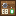{ .item-icon }**Laboratory** |
| How it is made | crafting table, no level: a Brewing Stand, a Glass Bottle and planks |
| Levels | 1 to 100; recipes up to level 50 |
| XP | every recipe compounded: 10 + 2 × its level |

## The Laboratory

You build the Laboratory at an ordinary crafting table. Anyone can build one:

| Top | Middle | Bottom |
|---|---|---|
| —, Brewing Stand, — | Planks, Glass Bottle, Planks | Planks, Planks, Planks |

It faces you when you place it.

Most of the Chemist's ingredients come from the other trades: the [Farmer](farmer.md)'s herbs and fruit, the [Hunter](hunter.md)'s creatures, the [Fisher](fisher.md)'s fish and the [Miner](miner.md)'s fragments. The Sleep Honey for the Sleep Ball comes with a captured Hidden Forest Bee, 35 % of the time.

## Remedies

You take a remedy like food, but **at any time, even when you are not hungry**: a tonic is drunk, a candy is eaten in half the usual time, a powder is swallowed. Remedies heal, restore hunger, clear effects and sometimes give a short boost. Their tooltips list what each one does, with hearts shown as ❤ ("Heals 5 ❤").

| Remedy | Chemist level | Heals | Hunger | Cures | Boost |
|---|---|---|---|---|---|
| Mix Candy | 1 | 1 ❤ | — | Poison | — |
| Healing Candy | 2 | 2 ❤ | — | — | — |
| Dual Action Tonic | 4 | 3 ❤ | — | Poison, Nausea | — |
| Healing Tonic | 5 | 5 ❤ | — | — | — |
| Stamina Candy | 7 | — | 3 | Hunger, Mining Fatigue | Speed I for 0:30 |
| Stamina Tonic | 10 | — | 6 | Slowness, Mining Fatigue, Weakness, Hunger | Speed II for 0:45 |
| Antidote Powder | 14 | — | — | Poison, Wither, Nausea, Hunger | — |
| Restorative Drug | 30 | 10 ❤ | — | Poison, Wither, Nausea, Blindness, Weakness, Slowness, Mining Fatigue, Hunger | Regeneration II for 0:10 |
| Revival Elixir | 36 | 20 ❤ | — | the Restorative Drug's list, and Darkness | — (carried, it saves your life: see below) |
| 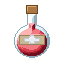{ .item-icon }Medicine | 46 | 15 ❤ | — | the same as the Revival Elixir | Regeneration III for 0:20 |

The [Cook](cook.md) also needs the Antidote Powder, for the Fried Scorpion. The Medicine is rare and takes 2 of each powder (Thunder Powder, Flame Powder, Gunpowder, Ice Powder).

### 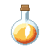{ .item-icon }The Revival Elixir

Made from a Hydramandrake, a Rainbow Phoenix, a Crossbone Butterfly and a Spirit Firefly; it stacks to 16.

- **Drunk**, it works like the other remedies: it heals **20 ❤** and cures the effects listed in the table above.
- **Carried**, it saves your life: if you would die with one anywhere in your inventory, one is used up instead. You come back at **half your max health**, cleared of every effect, with **Regeneration II for 0:30** and **Absorption II for 0:05**.
    - A Totem of Undying held in your hand is used first.
    - It does not save you from damage that nothing can block, such as falling into the void or /kill.

## Powders

Each powder recipe gives **two** powders.

| Powder | Chemist level | Made from |
|---|---|---|
| Thunder Powder | 12 | a Lightning Beetle |
| Flame Powder | 18 | a Fire Hercules |
| Ice Powder | 20 | an Ice Sunfish |
| Gunpowder (the ordinary Minecraft item) | 26 | 3 Explosive Rock Fragments and a log |

Where the powders go:

- the Medicine and the Experiment Equipment;
- the Instant Freeze Ball (Ice Powder);
- the [Inventor](inventor.md)'s Enhanced Bombs (Gunpowder);
- the [Musician](musician.md)'s Battle March scores (Flame Powder);
- some of the [Tailor](tailor.md)'s garments (Flame Powder, Thunder Powder, Gunpowder);
- the [Blacksmith](blacksmith.md)'s Pop Green (Gunpowder).

## Battle balls

You throw a ball like a snowball, and it bursts where it lands. Every living thing within **2.5 blocks** of the burst is caught, except the thrower. Throws have a 0.5 second cooldown, and balls stack to 16. Each recipe gives **two balls**.

| Ball | Chemist level | Made from | What it does |
|---|---|---|---|
| 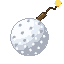{ .item-icon }Salt Ball | 14 | 1 Crystallised Salt, 1 Cobweb | **Slowness II for 0:04** to everything caught; **12 damage** (6 ❤) to what a Kage Kage no Mi shadow animates (Mine Mine no Mi's Nightmare Soldier, Doppelman, Tsuno Tokage); **6 damage** (3 ❤) to undead and water creatures |
| Poison Ball | 24 | 1 Clawed Scorpion, 1 Clay Ball | **Poison II for 0:06** |
| Sleep Ball | 28 | 2 Sleep Honey, 2 Clay Ball | **Slowness IV, Blindness and Weakness II**, all for 0:08 |
| 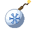{ .item-icon }Instant Freeze Ball | 32 | 6 Ice Powder, 1 Crystallised Salt, 2 Clay Ball | **Slowness IV for 0:05**, and targets freeze solid as in powder snow and stay frozen a little longer; still water around the burst turns to **thin ice** that melts again a few seconds later |

## 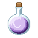{ .item-icon }The Potion of Forgetting (level 30, Crew mode only)

Made from a Golden Matsutake, a Mystery Mushroom, Bitter Grass, a Medicinal Herb and a Glass Bottle; it is rare, stacks to 16, and is found nowhere else.

- Drinking it opens the choice of a new trade (not the one you already have). It is used up **only when you confirm** a choice, so closing the book keeps the potion.
- On a confirmed choice, **all your trade XP is wiped**, in every trade, and you take up the new trade from the start.
- In **Solo** mode the recipe does not exist, the potion is left out of the creative tab, and a stray potion cannot be drunk.

See [Trades and levels](../trades-and-levels.md) for how the choice works.

## { .item-icon }The Rumble Ball (level 42)

Made from a Golden Egg, a Golden Fruit and a Golden Hercules; it is rare. It is eaten quickly, at any time.

- **A Zoan user** gets **Rumble for 3:00**, and **all their ability cooldowns end at once**. While Rumble lasts, they are stronger whenever they are transformed: **+4 attack damage, +6 armour, +50 % knockback resistance, +25 % speed**.
    - The Hito Hito no Mi (Chopper's fruit), which has no forms in Mine Mine no Mi, gets the boost without transforming.
    - The boost switches on when the user transforms and off when they change back (checked twice a second), and it ends with the effect.
- **A second Rumble Ball while Rumble is still on is an overdose.** The Rumble is lost, and the user gets Nausea (0:15), Weakness II (0:30) and Slowness II (0:15).
- **Anyone who is not a Zoan user** only gets Nausea for 0:10: "Nothing happens: only a Zoan's body answers a Rumble Ball."

## 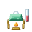{ .item-icon }The Experiment Equipment (level 50)

Made from 2 of each powder and an Instant Freeze Ball; it is rare and does not stack. This is the Chemist's apparatus: **kept in your inventory**, it gives each brew at the Laboratory a **15 % chance to yield one extra**. That chance is rolled only when the level 10 perk has not already given one.

## Level perks

| Level | Perk | What it does |
|---|---|---|
| 10 | "10% chance a brew yields one more" | at the Laboratory, a brew yields one more 10 % of the time ("One more: ...") |
| 25 | "Your remedies are potent: they heal and feed 50% more" | your remedies come out **Potent** (tooltip "Potent: brewed by a skilled Chemist"): they heal **50 % more**, feed 50 % more, and their boost lasts 50 % longer. This covers every remedy, the Revival Elixir included, but not the balls, the powders or the Rumble Ball |
| 40 | "25% chance to save an ingredient" | one ingredient comes back 25 % of the time |

## The recipes

Every Laboratory recipe, with the Chemist level that unlocks it and the XP it pays:

| Makes | Level | XP | Ingredients |
|---|---|---|---|
| { .item-icon }Mix Candy | 1 | 12 | 2 × { .item-icon }Mystery Mushroom, 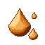{ .item-icon }Sweet Sap |
| { .item-icon }Healing Candy | 2 | 14 | 4 × { .item-icon }Medicinal Herb, { .item-icon }Sweet Sap |
| 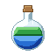{ .item-icon }Dual Action Tonic | 4 | 18 | 2 × { .item-icon }Mystery Mushroom, { .item-icon }Bitter Grass, { .item-icon }Coconut |
| { .item-icon }Healing Tonic | 5 | 20 | 4 × { .item-icon }Medicinal Herb, { .item-icon }Coconut |
| { .item-icon }Stamina Candy | 7 | 24 | 2 × { .item-icon }Wilted Carrot, { .item-icon }Sweet Sap |
| 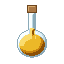{ .item-icon }Stamina Tonic | 10 | 30 | 2 × { .item-icon }Wilted Carrot, { .item-icon }Coconut |
| { .item-icon }Thunder Powder ×2 | 12 | 34 | { .item-icon }Lightning Beetle |
| { .item-icon }Antidote Powder | 14 | 38 | { .item-icon }Doctor Hornet, 3 × { .item-icon }Bitter Grass |
| { .item-icon }Salt Ball ×2 | 14 | 38 | { .item-icon }Crystallised Salt, Cobweb |
| { .item-icon }Flame Powder ×2 | 18 | 46 | { .item-icon }Fire Hercules |
| { .item-icon }Ice Powder ×2 | 20 | 50 | { .item-icon }Ice Sunfish |
| 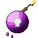{ .item-icon }Poison Ball ×2 | 24 | 58 | { .item-icon }Clawed Scorpion, Clay Ball |
| Gunpowder ×2 | 26 | 62 | 3 × 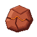{ .item-icon }Explosive Rock Fragment, any logs |
| 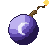{ .item-icon }Sleep Ball ×2 | 28 | 66 | 2 × 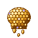{ .item-icon }Sleep Honey, 2 × Clay Ball |
| { .item-icon }Potion of Forgetting | 30 | 70 | { .item-icon }Golden Matsutake, { .item-icon }Mystery Mushroom, { .item-icon }Bitter Grass, { .item-icon }Medicinal Herb, Glass Bottle |
| { .item-icon }Restorative Drug | 30 | 70 | { .item-icon }Salamandrake, 3 × { .item-icon }Lotus Seed, { .item-icon }Giant Devil Hand Moth |
| { .item-icon }Instant Freeze Ball ×2 | 32 | 74 | 6 × { .item-icon }Ice Powder, { .item-icon }Crystallised Salt, 2 × Clay Ball |
| { .item-icon }Revival Elixir | 36 | 82 | { .item-icon }Hydramandrake, { .item-icon }Rainbow Phoenix, { .item-icon }Crossbone Butterfly, { .item-icon }Spirit Firefly |
| { .item-icon }Rumble Ball | 42 | 94 | 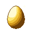{ .item-icon }Golden Egg, { .item-icon }Golden Fruit, { .item-icon }Golden Hercules |
| { .item-icon }Medicine | 46 | 102 | 2 × { .item-icon }Thunder Powder, 2 × { .item-icon }Flame Powder, 2 × Gunpowder, 2 × { .item-icon }Ice Powder |
| { .item-icon }Experiment Equipment | 50 | 110 | 2 × { .item-icon }Thunder Powder, 2 × { .item-icon }Flame Powder, 2 × Gunpowder, 2 × { .item-icon }Ice Powder, { .item-icon }Instant Freeze Ball |

## Advancements

The **Chemist** tab ("Compound the islands' remedies at the Laboratory") holds:

- **Lab Coat** (build a Laboratory) and **Apprentice Chemist** (reach Chemist level 5);
- one advancement per notable item: Sweet Relief (Mix Candy), First Aid (Healing Tonic), Second Wind (Stamina Tonic), The Doctor Is In (Antidote Powder), Bottled Storm (Thunder Powder), Black Powder (Gunpowder), A Pinch of Salt (Salt Ball), Poison Pill (Poison Ball), Sweet Dreams (Sleep Ball) and Cold Snap (Instant Freeze Ball);
- four challenges: **Back on Your Feet** (compound a Restorative Drug), **Second Life** (a Revival Elixir), **Rumble!** (a Rumble Ball) and **The Last Flask** (both the Medicine and the Experiment Equipment).
