# Cook

The Cook turns the other trades' harvest into the islands' dishes at the **Kitchen**. A dish feeds you, and it also gives buffs: extra XP in one trade, more Doriki from fights, slower hunger, and a little Doriki of its own. The fish in a dish decide its **quality**, and a skilled Cook makes every meal last longer.

| | |
|---|---|
| Workstation | { .item-icon }**Kitchen** |
| How it is made | crafting table, no level: a Cauldron, a Furnace and planks |
| Levels | 1 to 100; recipes up to level 50 |
| XP | every dish cooked: 10 + 2 × the recipe's level |

## The Kitchen

You build the Kitchen at an ordinary crafting table. Anyone can build one:

| Top | Middle | Bottom |
|---|---|---|
| —, Cauldron, — | Planks, Furnace, Planks | Planks, Planks, Planks |

It faces you when you place it. Building one earns the **Galley** advancement.

## Cooking

Put the ingredients into the Kitchen and take out the dish. Each recipe has a Cook level: below it the recipe stays locked. Each dish you cook pays Cook XP.

The ingredients come from the whole crew: the [Fisher](fisher.md)'s catch, the [Hunter](hunter.md)'s creatures, the [Farmer](farmer.md)'s crops and fruit, Crystallised Salt from the [Inventor](inventor.md)'s Sieve, and even the [Chemist](chemist.md)'s Antidote Powder for the Fried Scorpion.

The Kitchen has the game's 28 dishes and one extra, the { .item-icon }**Hardtack Ration** (2 Flour and 1 Crystallised Salt, Cook 1). It is an ingredient of the Sandwich, and it feeds a little on its own (4 hunger). **Flour** comes from two Wheat at an ordinary crafting table, open to everyone.

## Dish quality: Normal, Fine, Superb

The fish in a dish decide its quality at the moment you cook it:

- Each fish you caught has a size. That size sits somewhere in its species' size range, from the smallest (0 %) to the biggest (100 %). The dish takes the average over all the fish in it.
- An average of **50 % or more** makes a **Fine** dish (green in the tooltip). **80 % or more** makes a **Superb** dish (gold). Anything lower is Normal.
- A dish with no measured fish in it (fruit, eggs, crops, creatures) is always **Normal**, unless a Cook perk upgrades it (see [Level perks](#level-perks)).

What quality changes when the dish is eaten:

| Quality | Extra hunger | Meal buffs last | Doriki from the dish |
|---|---|---|---|
| Normal | +0 | ×1 (10 minutes) | ×1 |
| Fine | +2 | ×1.25 (12:30) | ×1.5 |
| Superb | +4 | ×1.5 (15 minutes) | ×2 |

Quality also raises the price at the Travelling Cook: a Fine dish is worth 25 % more, a Superb one 50 % more.

## What a dish gives

A dish's tooltip lists its hunger, its saturation, any Cola, its Doriki, and each buff with its duration. Quality is already counted in.

- **Hunger and saturation** grow with the recipe's Cook level. Hunger runs from 6 at level 1 to a full bar (20) at level 50, and saturation rises with it. The two drinks feed 70 % as much as a dish of the same level.
- **Appetite** (10 minutes): more XP in one trade. The trade depends on the dish: Fisher's, Hunter's, Farmer's, Cook's or Inventor's Appetite. It gives **+15 %** (I), **+30 %** (II) or **+45 %** (III). Only **one Appetite at a time**: the next dish's Appetite replaces the last. It raises the XP you earn; it never grants XP by itself.
- **Fighting Spirit** (10 minutes): **+5 % Doriki from fights per level of the buff**, from I (+5 %) to V (+25 %). Almost every dish gives it. It stays alongside an Appetite. A stronger Fighting Spirit replaces a weaker one.
- **Well Fed** (10 minutes), from the hearty dishes only: hunger drains **25 % slower** for dishes of Cook level 25 to 39 (Well Fed I), and **50 % slower** from Cook level 40 (Well Fed II).
- **Doriki**: most dishes give a little Doriki, but only while your Doriki is **below the dish's cap**, and never past it. Food gets you started; fighting takes you further. A Fine dish gives ×1.5 and a Superb dish ×2, still capped. Past the cap, the tooltip reads "No more Doriki past N".

    | Doriki tier | Per dish | Only while your Doriki is below | First taste |
    |---|---|---|---|
    | 1 | +5 | 250 | +25 |
    | 2 | +10 | 750 | +50 |
    | 3 | +15 | 1,500 | +75 |
    | 4 | +20 | 2,500 | +100 |
    | 5 | +25 | 4,000 | +125 |

- **First taste**: the first time you eat each dish, you get **five times its tier's Doriki**. This ignores the cap, happens once per dish, and a gold chat message counts how many dishes you have tasted (out of 23).
- The **Special Pirate Soda** also refills **75 Cola** for cyborgs.

### Eating rules

- Dishes are ordinary food: you eat them when you are hungry. The two drinks (Special Drink, Special Pirate Soda) are drunk.
- One Appetite at a time. Fighting Spirit and Well Fed stay alongside it, and so does a [Musician](musician.md)'s tune.
- Quality and Chef's touch lengthen every buff the meal gave, Well Fed and the Cotton Candy's Speed included.

## Every dish

Durations are for a Normal dish without Chef's touch; every buff lasts 10 minutes unless noted. Hunger is at Normal quality. Doriki reads "per dish / cap / first taste".

| Dish | Cook level | Hunger | Appetite | Fighting Spirit | Also | Doriki |
|---|---|---|---|---|---|---|
| Broiled Killifish | 1 | 6 | Fisher's I (+15 %) | I (+5 %) | — | +5 / 250 / +25 |
| { .item-icon }Hardtack Ration | 1 | 4 | — | — | — | none |
| Angel Omelette | 3 | 7 | Farmer's I (+15 %) | I (+5 %) | — | +5 / 250 / +25 |
| Rice Cracker | 6 | 8 | Inventor's I (+15 %) | II (+10 %) | — | +5 / 250 / +25 |
| Wild Grass Pasta | 8 | 8 | Farmer's I (+15 %) | II (+10 %) | — | +10 / 750 / +50 |
| Special Drink (drink) | 10 | 6 | Hunter's I (+15 %) | II (+10 %) | — | +10 / 750 / +50 |
| Seagull Bone Soup | 12 | 9 | Fisher's II (+30 %) | II (+10 %) | — | +10 / 750 / +50 |
| Mock Cherry Pie | 15 | 10 | Cook's I (+15 %) | III (+15 %) | — | +10 / 750 / +50 |
| Special Pirate Soda (drink) | 15 | 7 | Inventor's I (+15 %) | III (+15 %) | refills 75 Cola | +10 / 750 / +50 |
| Fried Scorpion | 16 | 10 | Hunter's I (+15 %) | I (+5 %) | — | none |
| Simmered Ecrevisse | 18 | 11 | Fisher's II (+30 %) | III (+15 %) | — | +15 / 1,500 / +75 |
| Sandwich | 20 | 12 | Hunter's II (+30 %) | III (+15 %) | — | +15 / 1,500 / +75 |
| Cotton Candy | 22 | 12 | Hunter's I (+15 %) | — | Speed I for 0:30 | none |
| Horrific Pear Tart | 25 | 13 | Cook's II (+30 %) | IV (+20 %) | Well Fed I | +15 / 1,500 / +75 |
| Cactus Steak | 25 | 13 | Inventor's II (+30 %) | IV (+20 %) | Well Fed I | +15 / 1,500 / +75 |
| Fruit Macadonia | 30 | 14 | Farmer's II (+30 %) | II (+10 %) | Well Fed I | +20 / 2,500 / +100 |
| Shark Sushi | 32 | 15 | Fisher's II (+30 %) | IV (+20 %) | Well Fed I | +20 / 2,500 / +100 |
| Large Mushroom Salad | 35 | 16 | Cook's II (+30 %) | IV (+20 %) | Well Fed I | +20 / 2,500 / +100 |
| Spicy Miso Shark's Fin | 36 | 16 | Cook's II (+30 %) | IV (+20 %) | Well Fed I | +20 / 2,500 / +100 |
| Stamina Stew | 38 | 17 | Farmer's II (+30 %) | IV (+20 %) | Well Fed I | +20 / 2,500 / +100 |
| Sashimi Assortment | 40 | 17 | Fisher's III (+45 %) | V (+25 %) | Well Fed II | +25 / 4,000 / +125 |
| Sky Fish Sautee | 40 | 17 | Fisher's III (+45 %) | V (+25 %) | Well Fed II | +25 / 4,000 / +125 |
| Lover's Lunch | 44 | 18 | Cook's III (+45 %) | V (+25 %) | Well Fed II | +25 / 4,000 / +125 |
| 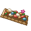{ .item-icon }Delicacy Assortment | 45 | 19 | Fisher's III (+45 %) | V (+25 %) | Well Fed II | none |
| Sky Island Lunch | 46 | 19 | Hunter's III (+45 %) | V (+25 %) | Well Fed II | +25 / 4,000 / +125 |
| Meat-Lover's Delight | 47 | 19 | Hunter's III (+45 %) | V (+25 %) | Well Fed II | none |
| Dinosaur Steak | 48 | 19 | Fisher's III (+45 %) | V (+25 %) | Well Fed II | +25 / 4,000 / +125 |
| Roasted Meat Festival | 49 | 20 | Farmer's III (+45 %) | V (+25 %) | Well Fed II | none |
| { .item-icon }Pirate's Lunch | 50 | 20 | Hunter's III (+45 %) | V (+25 %) | Well Fed II | +25 / 4,000 / +125 |

!!! note "Five dishes without Doriki"
    The Fried Scorpion, the Cotton Candy, the Delicacy Assortment, the Meat-Lover's Delight and the Roasted Meat Festival give no Doriki and no first-taste bonus, which is why the first-taste counter stops at 23. The **Cotton Candy** and the **Fried Scorpion** also do not show the Cook's lines (hunger, Doriki, buffs) in their tooltip, and they do not count toward the Gourmet advancement.

## Level perks

| Level | Perk | What it does |
|---|---|---|
| 10 | "10% chance a dish comes out one quality higher" | at the Kitchen, a dish comes out **one quality higher** 10 % of the time (Normal becomes Fine, Fine becomes Superb); this works on dishes with no fish too |
| 25 | "Your dishes' buffs last 25% longer" | every dish you cook at the Kitchen keeps its buffs **25 % longer**; its tooltip says "Chef's touch: buffs last 25% longer". This stacks with quality: a Superb Chef's dish gives buffs for 10 min × 1.5 × 1.25 = 18:45 |
| 40 | "25% chance a dish comes out one quality higher" | the quality upgrade chance becomes **25 %** (it replaces the level 10 perk's 10 %) |

## The recipes

Every Kitchen recipe, with the Cook level that unlocks it and the XP it pays:

| Makes | Level | XP | Ingredients |
|---|---|---|---|
| { .item-icon }Broiled Killifish | 1 | 12 | { .item-icon }Forked-Tail Killifish, Bamboo or Stick, { .item-icon }Crystallised Salt |
| { .item-icon }Hardtack Ration | 1 | 12 | 2 × { .item-icon }Flour, { .item-icon }Crystallised Salt |
| { .item-icon }Angel Omelette | 3 | 16 | 2 × { .item-icon }Mystery Egg, 2 × { .item-icon }Red Fruit |
| 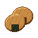{ .item-icon }Rice Cracker | 6 | 22 | 2 × { .item-icon }Ancient Rice, { .item-icon }Brown Fruit |
| 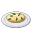{ .item-icon }Wild Grass Pasta | 8 | 26 | 2 × any small flowers, 3 × { .item-icon }Bitter Grass |
| { .item-icon }Special Drink | 10 | 30 | 2 × { .item-icon }Coconut, { .item-icon }Sweet Sap, 3 × { .item-icon }Blue Fruit |
| { .item-icon }Seagull Bone Soup | 12 | 34 | { .item-icon }Seagull, { .item-icon }Bone Fish, { .item-icon }Striped Clam |
| { .item-icon }Mock Cherry Pie | 15 | 40 | 3 × { .item-icon }Red Fruit, { .item-icon }Flour, 2 × { .item-icon }Mystery Egg |
| 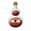{ .item-icon }Special Pirate Soda | 15 | 40 | { .item-icon }Brown Fruit, 2 × { .item-icon }Blue Fruit, 3 × { .item-icon }Coconut |
| { .item-icon }Fried Scorpion | 16 | 42 | 2 × { .item-icon }Clawed Scorpion, { .item-icon }Antidote Powder |
| 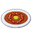{ .item-icon }Simmered Ecrevisse | 18 | 46 | 3 × { .item-icon }Fist Crayfish, 3 × { .item-icon }Bitter Grass |
| { .item-icon }Sandwich | 20 | 50 | 2 × { .item-icon }Flour, 3 × { .item-icon }Mystery Egg, { .item-icon }Hardtack Ration |
| { .item-icon }Cotton Candy | 22 | 54 | { .item-icon }Sweet Sap, { .item-icon }Sleep Honey, 3 × { .item-icon }Nectar, Bamboo |
| 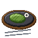{ .item-icon }Cactus Steak | 25 | 60 | 3 × { .item-icon }Cactus Pulp, { .item-icon }Cactus Flower, { .item-icon }Red Fruit |
| { .item-icon }Horrific Pear Tart | 25 | 60 | 3 × { .item-icon }Horrific Pear, { .item-icon }Flour, 3 × { .item-icon }Nectar |
| { .item-icon }Fruit Macadonia | 30 | 70 | { .item-icon }Golden Fruit, { .item-icon }Blue Fruit, { .item-icon }Red Fruit, { .item-icon }Brown Fruit |
| 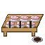{ .item-icon }Shark Sushi | 32 | 74 | { .item-icon }Shark, 2 × { .item-icon }Ancient Rice |
| 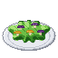{ .item-icon }Large Mushroom Salad | 35 | 80 | 5 × { .item-icon }Mystery Mushroom, { .item-icon }Golden Matsutake, 3 × { .item-icon }Horrific Pear |
| 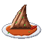{ .item-icon }Spicy Miso Shark's Fin | 36 | 82 | { .item-icon }Shark, 3 × { .item-icon }Golden Fruit |
| 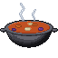{ .item-icon }Stamina Stew | 38 | 86 | { .item-icon }Salamandrake, 3 × { .item-icon }Wilted Carrot, 3 × { .item-icon }Mystery Mushroom |
| { .item-icon }Sashimi Assortment | 40 | 90 | 2 × { .item-icon }Missile Manta Ray, 2 × { .item-icon }Ice Sunfish, { .item-icon }Caltrop Starfish, { .item-icon }Bone Fish |
| { .item-icon }Sky Fish Sautee | 40 | 90 | { .item-icon }Sky Fish, 4 × { .item-icon }Cactus Pulp |
| { .item-icon }Lover's Lunch | 44 | 98 | { .item-icon }Lovely Angel, { .item-icon }Golden Fruit, 2 × { .item-icon }Golden Egg, 3 × { .item-icon }Golden Matsutake |
| { .item-icon }Delicacy Assortment | 45 | 100 | 3 × { .item-icon }Sea King Scale, { .item-icon }Great Terigius, { .item-icon }Rock Lizard, 3 × { .item-icon }Cactus Flower |
| 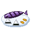{ .item-icon }Sky Island Lunch | 46 | 102 | { .item-icon }Giant Sky Fish, 2 × { .item-icon }Sky Fish, 2 × { .item-icon }Golden Fruit, 2 × { .item-icon }Ancient Rice |
| 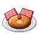{ .item-icon }Meat-Lover's Delight | 47 | 104 | 2 × { .item-icon }Sea King Fin, { .item-icon }Seagull, 3 × { .item-icon }Horrific Pear, 2 × { .item-icon }Golden Egg |
| 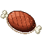{ .item-icon }Dinosaur Steak | 48 | 106 | 2 × { .item-icon }Great Terigius, 2 × { .item-icon }Crystallised Salt |
| 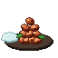{ .item-icon }Roasted Meat Festival | 49 | 108 | 2 × { .item-icon }Sea King Head Crest, { .item-icon }Red-Eyed Spotted Frog, { .item-icon }Beat Alligator, 3 × { .item-icon }Golden Matsutake |
| { .item-icon }Pirate's Lunch | 50 | 110 | { .item-icon }Beat Alligator, 2 × { .item-icon }Rock Lizard, 2 × { .item-icon }Tempest Mouse, { .item-icon }Ancient Rice |

## Selling

The **Travelling Cook** buys every cooked dish and sells the basic ones (Cook levels up to 15). Fine and Superb dishes fetch more (see [Dish quality](#dish-quality-normal-fine-superb)). See [Merchants and contracts](../merchants-and-contracts.md).

## Advancements

The **Cook** tab ("Cook the islands' dishes at the Kitchen") holds **Galley** (build a Kitchen), **Apprentice Cook** (Cook level 5), one advancement per notable dish (Broiled Killifish, Angel Omelette, Seagull Bone Soup, Bottoms Up, Candy Floss, Crunch, Horrifically Good, Made with Love, Sashimi Boat, Stamina to Spare), **Superb!** for a dish of Superb quality, and three challenges: **The Captain's Table** (cook a Pirate's Lunch), **Gourmet** (eat each of the 26 dishes the Cook's tooltips cover) and **The Sea King's Table** (cook the Delicacy Assortment, the Meat-Lover's Delight and the Roasted Meat Festival).
