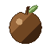
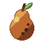
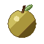
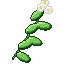
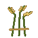
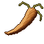

# Farmer

The Farmer plants Cruise's **fruit trees**, from the Red Fruit of the plains to the Golden Fruit of the sky islands, and sows its **crops**, from Bitter Grass to the Cactus Flower. Only a Farmer picks and reaps them cleanly.

| | |
|---|---|
| Workstation | none: the fields and the orchards |
| Plants | 7 fruit trees and 7 crops, found wild in the world; 2 rare harvests that can be sown |
| Levels | 1 to 100; new trees and crops up to level 45 |

Farmer XP comes from every clean pick and every clean ripe harvest:

- **Fruit**: half of (4 + the tree's planting level), per fruit.
- **Crops**: half of (5 + the crop's level), per harvest.

The tables below give what is paid. A harvest of quality pays more, and a plant far under your level pays less: see [Harvests of quality](#harvests-of-quality) and [Old plants pay less](#old-plants-pay-less).

## Fruit trees

There are seven fruit trees. Each has its own wood, leaves and sapling, and its fruit hangs under the leaves.

| Tree | Fruit | Grows naturally in | Farmer level to plant | Farmer XP per fruit |
|---|---|---|---|---|
| Red Fruit | { .item-icon }Red Fruit | plains, sunflower plains, forests, flower forests | 1 | 3 |
| Blue Fruit | { .item-icon }Blue Fruit | birch forests, old-growth birch forests, meadows | 1 | 3 |
| Brown Fruit | { .item-icon }Brown Fruit | swamps, mangrove swamps | 5 | 5 |
| Palm | { .item-icon }Coconut | beaches (common), deserts (rarer) | 8 | 6 |
| Rubber Fruit | Rubber Fruit | jungles, sparse jungles, bamboo jungles | 12 | 8 |
| Horrific Pear | { .item-icon }Horrific Pear | swamps, mangrove swamps | 20 | 12 |
| Golden Fruit | { .item-icon }Golden Fruit | golden orchards on the sky islands; rarely on windswept hills and in mountain biomes, at height 130 or more; with Sky Island, the heights of the Upper Yard instead of the mountains | 30 | 17 |

### Saplings

**Getting them.** Break the leaves of a fruit tree. As with an oak, each leaf block has an 8 % chance to drop a sapling, up to 15 % with Fortune. Shears or Silk Touch take the leaves themselves instead. A [Lumberjack](lumberjack.md) of level 40 gets saplings from leaves twice as often.

**Planting them.** A **Farmer or a Lumberjack** can plant a fruit sapling, at the level in the table. Anyone else is told "Only a Farmer or a Lumberjack can plant this." Saplings grow on dirt like vanilla ones, and bone meal works on them. Two of them take other ground too:

- the Palm also takes root in **sand**;
- the Golden Fruit also takes root in Mine Mine no Mi's **sky blocks**, the ground of the sky islands.

**The Rubber Fruit** grows on a bush, not a tree: a thin stem 3 or 4 blocks tall, with one leaf on top and one at its side. Exactly one fruit hangs under the side leaf. It isn't food: the [Inventor](inventor.md) works it.

### Picking fruit

A fruit goes through three stages before it is ripe, and is back about ten minutes after being picked. Bone meal hurries it along one stage per use. **Right-click** a ripe fruit to pick it; an unripe one says "Not ripe yet." Picking puts a new bud in its place, so a tree keeps giving.

- A **Farmer** always picks cleanly and earns Farmer XP. Sometimes a Farmer picks **two** fruits, and earns the XP for both: see [Level perks](#level-perks).
- **Anyone else** bruises the fruit half the time: nothing drops and the bud starts again, with "The fruit bruised in your hands: only a Farmer picks it cleanly."
- In Solo mode everyone is a Farmer.

A fruit needs leaves directly above it, and drops if the leaves go. A newly generated tree, or one grown from a sapling, already carries fruit at mixed stages.

The fruits are food, except the Rubber Fruit:

| Fruit | Hunger |
|---|---|
| Red, Blue and Brown Fruit, Horrific Pear | 4 |
| Golden Fruit | 6, with high saturation |
| Coconut | 3 |

### Golden orchards in the sky

The Golden Fruit belongs to the sky. Cruise adds a **golden orchard** to Mine Mine no Mi's sky islands: a lone island planted with golden fruit trees.

- In a sky-island **town**, it can be one of the islands a bridge leads to.
- A **lone** sky island is plain half the time, an orchard a quarter of the time and a sky lake the other quarter.

For worlds without the sky islands, Golden Fruit trees also grow, rarely, on windswept hills and in mountain biomes, but only at height 130 or above.

If you also play with *Mine Mine no Mi: Sky Island*, the Golden Fruit tree grows on the heights of the **Upper Yard**, among the giant trees, and no longer on the mountains of the Overworld. The trees already there stay, and a sapling can still be planted anywhere.

## Crops

Seven crops are sown from their own produce: you plant Bitter Grass with Bitter Grass, as you plant potatoes with potatoes.

**First seeds come from the wild.** Each crop also grows wild. Anyone can break a wild plant for its produce, but it gives no XP. The higher the crop's level, the scarcer its wild patches: one patch every (6 + the crop's level) chunks of its biomes, so Bitter Grass every 7, the Wilted Carrot every 26 and the Wild Lotus every 34.

**Sowing.** Only a Farmer can sow, at the crop's level. Anyone else is told "Only a Farmer can plant this", or "Requires Farmer level N."

| Crop | Farmer level | Soil | Wild in | Ripe harvest | Farmer XP per ripe harvest |
|---|---|---|---|---|---|
| { .item-icon }Bitter Grass | 1 | farmland | plains, sunflower plains, meadows, savannas, forests | 1–3 | 3 |
| { .item-icon }Medicinal Herb | 3 | farmland | forests, flower forests, birch forests, jungles, sparse jungles, taigas | 1–3 | 4 |
| { .item-icon }Ancient Rice | 5 | farmland with water right beside it | swamps, mangrove swamps, rivers | 2–4 | 5 |
| { .item-icon }Mystery Mushroom | 18 | dirt in the shade (light 12 or less) | dark forests, old-growth spruce and pine taigas, swamps, mushroom fields | 1–2, plus a Golden Matsutake 5 % of the time | 12 |
| { .item-icon }Wilted Carrot | 20 | farmland | savannas, savanna plateaus, windswept savannas, wooded badlands, forests, birch forests | 1–3 | 13 |
| { .item-icon }Cactus Pulp | 22 | sand | deserts, badlands, eroded and wooded badlands | 1–2, plus a Cactus Flower 15 % of the time | 14 |
| { .item-icon }Lotus Seed | 28 | farmland with water right beside it | swamps, mangrove swamps, rivers, jungles, sparse jungles | 1–2 | 17 |

Two crops have their own names in the wild: the wild Cactus Pulp is the **Wild Cactus**, and the wild Lotus Seed the **Wild Lotus**. Wild cacti drop a Cactus Flower 25 % of the time, and wild mushrooms a Golden Matsutake 5 % of the time.

### Sowing the rare harvests

A seasoned Farmer can sow the two rare harvests as crops of their own: plant the one you found.

| Crop | Farmer level | Soil | Ripe harvest | Farmer XP per ripe harvest |
|---|---|---|---|---|
| Golden Matsutake | 35 | dirt in the shade, like the Mystery Mushroom | 1–2 | 20 |
| Cactus Flower | 45 | sand, like the Cactus Pulp | 1–2 | 25 |

They have no wild plant, and they grow **half as fast** as the other crops. You still find them now and then when reaping mushrooms and cactus. Their tooltip says "A Farmer of level N can sow it".

### Harvesting

Crops grow like wheat and take bone meal. When you break a **ripe** crop:

- a **Farmer** reaps it cleanly and earns XP, and sometimes gets one extra produce (see [Level perks](#level-perks));
- **anyone else** spoils the harvest half the time and gets only one produce back to replant: "The harvest spoiled in your hands: only a Farmer reaps it cleanly."

An unripe crop, or one broken by water or a piston, just drops its normal loot.

## Harvests of quality

From **Farmer 30**, a ripe harvest comes out **Fine** one time in four. From **Farmer 40**, it comes out **Superb** one time in ten, and still Fine one time in four. This goes for crops and fruit alike, and everything that harvest gives of its plant carries the quality: the bonus harvest and the second fruit too.

| Quality | Farmer XP | Price at the Materials Trader | In a dish |
|---|---|---|---|
| Normal | ×1 | ×1 | counts as a fish a quarter of the way up its size range |
| Fine | ×1.25 | ×1.25 | counts as a fish 65 % of the way up |
| Superb | ×1.5 | ×1.5 | counts as a fish 90 % of the way up |

A dish counts the quality of its produce as it counts the size of its fish: see the [Cook](cook.md#dish-quality-normal-fine-superb). Produce of different qualities does not stack together.

## Old plants pay less

A plant far under your level pays less XP. It pays in full up to **ten levels** above the level it asks for, then **5 % less for each level**, down to a **quarter**. Bitter Grass (level 1) pays in full up to Farmer 11, half at 21 and a quarter from 26; the Golden Fruit (level 30) still pays half at 50.

What you sow tells you so in its tooltip: "Old to a Farmer of your level: N% of its XP". Grow what your level opens.

## What opens when

| Farmer level | Trees | Crops |
|---|---|---|
| 1 | Red Fruit, Blue Fruit | Bitter Grass |
| 3 | | Medicinal Herb |
| 5 | Brown Fruit | Ancient Rice |
| 8 | Palm | |
| 12 | Rubber Fruit bush | |
| 18 | | Mystery Mushroom |
| 20 | Horrific Pear | Wilted Carrot |
| 22 | | Cactus Pulp |
| 28 | | Lotus Seed |
| 30 | Golden Fruit | |
| 35 | | Golden Matsutake |
| 45 | | Cactus Flower |

Three plants came later in 0.4.0: Cactus Pulp (level 22, it was 12), the Lotus Seed (28, it was 15) and the Horrific Pear's sapling (20, it was 5). What you had already planted stays, and reaping needs no level.

The [Lumberjack](lumberjack.md)'s own three trees (the Kuuigosu at Lumberjack 15, the Burning Tree at 25 and the Adam at 50) are covered on the Lumberjack's page; a Farmer can't plant those.

## Level perks

| Level | Perk | What it does |
|---|---|---|
| 1 | "Bonus harvest" | a chance to pick a second fruit, or to reap one more produce from a ripe crop: 20 % at level 1, +1 % per level, up to 75 %. The Farmer's page shows your current chance |
| 10 | "Rare harvests half again as common" | the Cactus Flower and the Golden Matsutake come half again as often from the crops you reap |
| 30 | "A harvest in four comes out Fine: more XP, a better price, better dishes" | see [Harvests of quality](#harvests-of-quality) |
| 40 | "Rare harvests twice as common" | the Cactus Flower and the Golden Matsutake come twice as often (replaces the level-10 perk) |
| 40 | "A harvest in ten comes out Superb" | see [Harvests of quality](#harvests-of-quality) |

## Advancements

The **Farmer** tab opens at Farmer level 1 and holds 12 advancements, among them **Apprentice Farmer** at level 5.
