# Fisher

The Fisher lands the islands' own catches (fish, shellfish, crustaceans, even a whale) with an ordinary fishing rod, measures each one in centimetres, and at the top of the trade hooks the **Sea Kings** of the deep sea and fights them.

| | |
|---|---|
| Workstation | none: any fishing rod |
| Rods | made by the [Inventor](inventor.md) at the Workshop |
| Levels | 1 to 100; new catches up to level 50 |

Fisher XP comes **only** from Cruise's catches, from Sea Kings and from the Bestiary (see [Bestiary and Log Book](../bestiary-and-logbook.md)). A vanilla cod, salmon or pufferfish, and any junk or treasure, gives none.

## How a catch is decided

There is **no fishing minigame**: you cast, wait for the bite and pull in exactly as in vanilla. Cruise decides only *what* comes up.

1. When vanilla's roll gives you **a fish**, Cruise may swap it for one of its own catches. Junk and treasure are never swapped.
2. Each possible catch is checked against where your bobber is:
    - **Biome**: the biome the bobber is in. The sky fish and the lava fish ignore it.
    - **Depth**: how many blocks of water (or lava, for the lava fish) lie straight down from the bobber, up to 256. A bobber on a one-block puddle fishes at depth 1: deep-sea catches need a real column of water under the hook, not just a deep-ocean biome.
    - **Height**: a few catches need the bobber above or below a height (the sky fish want y 150 and up; some cave fish want low water).
    - **Your Fisher level**: a catch above your level stays in the water.
3. Every catch that passes gets its **chance**. If the chances of everything that bites there add up to less than 100 %, each comes up with its own chance and the rest of the time you keep vanilla's fish. If they add up to more, they share the catch in proportion and you never get a vanilla fish there.
4. Anything that raises chances (see [Better odds](#better-odds)) multiplies all of Cruise's chances in that spot at once, so it pushes out vanilla fish, not other Cruise fish.

In Crew mode, a player of another trade still lands the level-1 catches (Forked-Tail Killifish, Striped Clam) but earns no Fisher XP; their catches still fill their Bestiary.

## Size

Every Cruise catch comes up with a **size in centimetres**, shown in its tooltip ("Size: 12.3 cm"). Sizes are drawn between the catch's minimum and maximum, **most often near the middle**. Two fish of different sizes don't stack.

- **Fisher XP**: a catch pays 75 % of its XP at the smallest size, up to 125 % at the biggest.
- **Price**: the Fishmonger pays 75 % of the average price for the smallest, up to 150 % for the biggest (see [Merchants and contracts](../merchants-and-contracts.md)).
- **Cooking**: a dish's quality depends on where its fish sit in their size ranges, on average: halfway up or more gives a **Fine** dish, four fifths up or more a **Superb** one. A fish with no size (bought, or given by command) counts for nothing.

The bigger-catch bonuses (rods, rod parts, the level-10 perk) pull each catch toward the top of its range: a bonus of 0.35 closes 35 % of the gap between the rolled size and the maximum. Once the bonuses add up to 1, every catch comes up at the maximum size.

## The rods

Any fishing rod works, the vanilla one included. The two Cruise rods are made by the **[Inventor](inventor.md)** at the Workshop, so in Crew mode a Fisher gets them from an Inventor.

| Rod | Made from (Workshop) | Inventor level | Durability | Bigger catches | Special |
|---|---|---|---|---|---|
| Fishing Rod (vanilla) | crafting table | — | 64 | — | — |
| 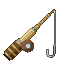{ .item-icon }**Whopper Fishing Rod** | Reel, Raw Iron | 5 | 128 | +0.35 | turns steel-coloured with a Whopper Rod Upgrade |
| 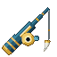{ .item-icon }**Sea King Fishing Rod** | Ultimate Reel, Cola | 32 | 320 | +0.50 | the only rod that fishes in **lava** |

No special rod is needed to hook a Sea King: any rod brings one up once your level and the water are right.

### Rod parts

Rod parts are made at the Workshop and fitted at the **Upgrade Bench**: the rod goes in the left slot, the part in the middle, and the fitted rod comes out on the right. The rod keeps its wear, its enchantments and its other parts, and its tooltip lists what is fitted. **Each part fits only once per rod.** Before you take the rod, the bench shows what the part does on *that* rod.

Every part fits every rod, but works best on the rod it was made for ("bigger" adds to the bigger-catch bonus, "chance" multiplies every Cruise catch's chance):

| Part (Inventor level) | on the Fishing Rod | on the Whopper | on the Sea King rod |
|---|---|---|---|
| **Fishing Rod Upgrade** (8) | bigger +0.20 | bigger +0.10 | bigger +0.05 |
| **Fishing Line Upgrade** (8) | chance ×1.50 | chance ×1.35 | chance ×1.25 |
| **Whopper Rod Upgrade** (18) | bigger +0.10 | bigger +0.25 | bigger +0.15 |
| **Sea King Rod Upgrade** (40) | bigger +0.10, chance ×1.10 | bigger +0.20, chance ×1.15 | bigger +0.30, chance ×1.25 |

With all four parts, the Whopper reaches bigger +0.90, and +1.00 with the level-10 perk. The Sea King rod reaches +1.00 on its own. At +1.00, **every catch comes up at its maximum size**.

## Better odds

All of these multiply together and apply to every Cruise catch at once:

| Source | Effect |
|---|---|
| Fishing Line Upgrade, Sea King Rod Upgrade | see the parts table |
| **Fisher level 25** | ×1.20 |
| **Bait** (made by the [Hunter](hunter.md) at the Tannery) | ×1.35 for 2 minutes |
| Riding a **Fishing Boat** (made by the [Carpenter](carpenter.md)) | ×1.25 |

Luck of the Sea and the Musician's Lucky Tune still work on vanilla's own fish, junk and treasure, but do not change Cruise's catch chances.

## Level perks

| Level | Perk | What it does |
|---|---|---|
| 10 | "Catches run 10% bigger" | adds 0.10 to the bigger-catch bonus: each catch moves 10 % of the way from its rolled size toward the maximum (it does not make every catch 10 % bigger) |
| 25 | "Rare fish bite 20% more often" | every Cruise catch's chance ×1.20, common ones included |
| 40 | "10% chance of a second fish on the line" | one catch in ten brings up a second fish of the same kind, with its own size (XP paid once; never a Sea King) |

## The catches

The catches open level by level, water by water: rivers and swamps, jungles and the lush caves, forests and seas, then warm seas, taigas, cherry groves, caves, the frozen north, the deep oceans, the sky and the lava.

How to read the table:

- **Level**: the Fisher level from which it can bite.
- **Where**: the biomes (or groups: all rivers, all oceans…) where it bites; "anywhere" means it ignores the biome.
- **Depth**: the blocks of water under the bobber it needs, and a height when there is one.
- **Chance**: its share of the bites vanilla would have turned into a fish, before any bonus.
- **Size**: the range in centimetres it is drawn from.
- **XP (first catch)**: the Fisher XP for an average-sized catch, and the one-time bonus the first time you land it. A catch that lives in two places (the Lovely Angel: forest waters and the sky) has two rows, and pays its bonus once for each.

| Catch | Level | Where | Depth | Chance | Size (cm) | XP (first catch) |
|---|---|---|---|---|---|---|
| { .item-icon }Forked-Tail Killifish | 1 | rivers, beaches, oceans, swamps | 1–64 | 35 % | 4–8 | 10 (50) |
| { .item-icon }Striped Clam | 1 | beaches, oceans | 1–8 | 30 % | 4–9 | 10 (50) |
| 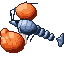{ .item-icon }Fist Crayfish | 6 | rivers, swamps | 2–64 | 30 % | 8–16 | 20 (100) |
| 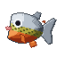{ .item-icon }Cutie Piranha | 8 | jungle, sparse jungle, bamboo jungle, lush caves | 1–32 | 28 % | 15–35 | 24 (120) |
| 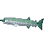{ .item-icon }Glistening Saury | 9 | forests, oceans | 2–64 | 30 % | 25–45 | 26 (130) |
| 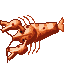{ .item-icon }Scissor Shrimp | 10 | rivers, beaches, stony shore, windswept hills | 1–24 | 25 % | 10–30 | 28 (140) |
| 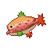{ .item-icon }Autumn Leaves Salmon | 11 | river, frozen river, taigas, cherry grove | 2–32 | 18 % | 45–80 | 30 (150) |
| 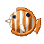{ .item-icon }Butterflyfish | 12 | warm ocean, lukewarm ocean, deep lukewarm ocean | 3–48 | 22 % | 10–20 | 32 (160) |
| 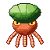{ .item-icon }Pumpkin Octopus | 14 | beaches, warm ocean, lukewarm ocean | 4–32 | 16 % | 35–70 | 36 (180) |
| 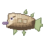{ .item-icon }Adventure Fish | 16 | rivers, beaches, oceans, lush caves, dripstone caves, mountains | 1–64 | 20 % | 40–90 | 40 (200) |
| { .item-icon }Treasure Pargai | 18 | beaches, forests, warm ocean, lukewarm ocean | 2–48 | 14 % | 12–30 | 44 (220) |
| 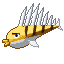{ .item-icon }Bone Fish | 20 | desert, warm ocean, lukewarm ocean, deep lukewarm ocean | 1–64 | 12 % | 20–40 | 48 (240) |
| 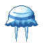{ .item-icon }Smiley Jellyfish | 20 | oceans | 8–256 | 10 % | 20–40 | 48 (240) |
| 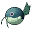{ .item-icon }Balloon Catfish | 22 | warm ocean, lukewarm ocean, deep lukewarm ocean, swamp, mangrove swamp | 6–20 | 8 % | 30–60 | 52 (260) |
| 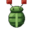{ .item-icon }Lantern Trilobite | 22 | lush caves, dripstone caves | 1–32 (below y 45) | 35 % | 8–18 | 52 (260) |
| 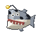{ .item-icon }Guidance Monkfish | 24 | lush caves, dripstone caves, deep dark | 2–64 (below y 30) | 18 % | 40–90 | 56 (280) |
| 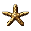{ .item-icon }Caltrop Starfish | 25 | warm ocean, lukewarm ocean, beach, desert | 2–256 | 6 % | 15–30 | 58 (290) |
| 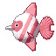{ .item-icon }Lovely Angel | 26 | forests, cherry grove, river | 2+ | 8 % | 15–30 | 60 (300) |
| { .item-icon }Lovely Angel | 26 | anywhere | 1+ (above y 150) | 10 % | 15–30 | 60 (300) |
| 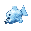{ .item-icon }Icefish | 27 | frozen river, frozen ocean, deep frozen ocean, snowy plains, snowy taiga, snowy slopes, jagged peaks, frozen peaks, ice spikes | 1–64 | 20 % | 25–50 | 62 (310) |
| 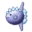{ .item-icon }Ice Sunfish | 28 | cold ocean, deep cold ocean, frozen ocean, deep frozen ocean | 10–256 | 8 % | 80–180 | 64 (320) |
| 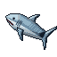{ .item-icon }Shark | 30 | deep oceans | 16–256 | 5 % | 150–400 | 68 (340) |
| 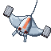{ .item-icon }Missile Manta Ray | 32 | deep oceans | 20–256 | 6 % | 150–400 | 72 (360) |
| 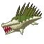{ .item-icon }Hydramandrake | 34 | swamp, mangrove swamp | 2–256 | 4 % | 80–200 | 76 (380) |
| 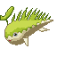{ .item-icon }Salamandrake | 36 | desert, badlands, warm ocean, deep lukewarm ocean | 3–256 | 4 % | 40–90 | 80 (400) |
| 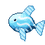{ .item-icon }Sky Fish | 38 | anywhere | 3+ (above y 150) | 8 % | 30–70 | 84 (420) |
| 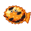{ .item-icon }Lava Flounder | 40 | lava | 1–64 | 35 % | 30–70 | 88 (440) |
| 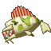{ .item-icon }Great Terigius | 42 | deep cold ocean, deep frozen ocean, deep ocean | 24+ | 3 % | 200–500 | 92 (460) |
| 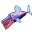{ .item-icon }Giant Sky Fish | 44 | anywhere | 5+ (above y 150) | 3 % | 150–350 | 96 (480) |
| { .item-icon }Sea King Scale — **summons a Sea King** | 44 | deep oceans | 20–256 | 1 % | — | 200 (1000) |
| 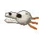{ .item-icon }Skull Knight | 45 | stony shore, windswept hills, windswept gravelly hills, river, dripstone caves | 6–64 (below y 60) | 3.5 % | 20–45 | 98 (490) |
| 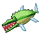{ .item-icon }Beat Alligator | 46 | swamp, mangrove swamp | 3+ | 2.5 % | 250–600 | 100 (500) |
| 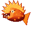{ .item-icon }Burning Dragon | 47 | lava | 2–64 | 12 % | 200–420 | 102 (510) |
| { .item-icon }Sea King Scale — **summons a Sea King** | 47 | deep oceans | 24–256 | 0.7 % | — | 300 (1500) |
| 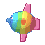{ .item-icon }Aurora Sunfish | 49 | deep frozen ocean, frozen ocean, deep cold ocean | 12–256 | 2.5 % | 180–330 | 106 (530) |
| 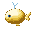{ .item-icon }Golden Whale | 50 | deep oceans | 24–256 | 1.5 % | 800–1400 | 108 (540) |
| { .item-icon }Sea King Scale — **summons a Sea King** | 50 | deep oceans | 28–256 | 0.4 % | — | 450 (2250) |

Every catch is food, like a raw cod, except two you **open**:

- **Adventure Fish** (level 16), "Use it to empty its pocket": one random item, from bone and string to, rarely, a Heart of the Sea.
- **Treasure Pargai** (level 18), "Use it to take the pearl out": one random item, from a nautilus shell and prismarine to, rarely, a Heart of the Sea.

The **sky** catches (the Lovely Angel's second home, the Sky Fish, the Giant Sky Fish) bite in **any water at y 150 or higher**, whatever the biome. The natural place is the **sky lakes**: some of Mine Mine no Mi's sky islands now carry a lake, up to seven blocks deep, dug into their cloud ground.

Fishing junk can also bring up **Iron Scrap** (1–2, half the time, on top of the vanilla junk) and now and then a **Torn Rumor Map** for a treasure hunt (see [Treasure hunts](../treasure-hunts.md)). This works for everyone, with any rod.

## Lava fishing (level 40)

With the **Sea King Fishing Rod** in either hand, the bobber floats on **lava**, with smoke and flames instead of spray.

- Lava has its own loot instead of vanilla's: charcoal, blackstone, gravel, iron nuggets, Iron Scrap, gold nuggets, magma cream, obsidian, now and then a gold ingot, and magma blocks.
- The two lava fish replace that loot when they bite: the **Lava Flounder** (level 40, 1+ block of lava) and the **Burning Dragon** (level 47, 2+ blocks), in any lava, Nether included. Each pull gives a lava fish **or** a piece of lava loot, never both. Below Fisher level 40, the rod only pulls lava loot.
- Nothing burns on its way out, and the lava fish are fireproof items.

## The Sea Kings (level 44)

Sea Kings are **hooked**, never found. In a **deep-ocean** biome, with enough water straight under the bobber, a bite can bring up a Sea King instead of a fish: the line comes up empty and the beast surfaces where the hook was, with a roar. Hooking one pays Fisher XP on the spot, and much more the first time you hook each kind.

| Sea King | Level | Water under the hook | Chance | Health | Blow (damage) |
|---|---|---|---|---|---|
| **Sea King** | 44 | 20+ blocks | 1 % | 140 (70 hearts) | 8 |
| **Extra-Large Sea King** | 47 | 24+ | 0.7 % | 200 (100 hearts) | 11 |
| **Goldfish Sea King** (a giant carp) | 50 | 28+ | 0.4 % | 260 (130 hearts) | 14 |

<figure markdown>
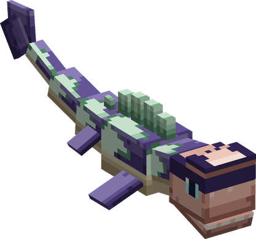
<figcaption>The Sea King (and the Extra-Large one, bigger)</figcaption>
</figure>

<figure markdown>
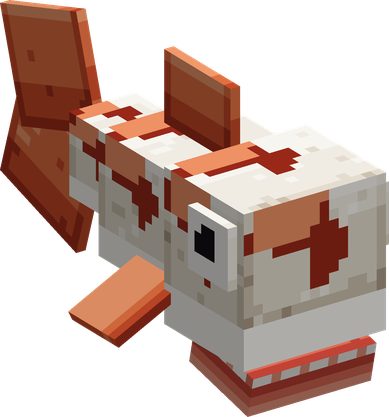
<figcaption>The Goldfish Sea King</figcaption>
</figure>

| Sea King | Fisher XP on the hook | First hook bonus | On the kill |
|---|---|---|---|
| Sea King | 200 | +1 000 | 900 |
| Extra-Large Sea King | 300 | +1 500 | 1 400 |
| Goldfish Sea King | 450 | +2 250 | 2 000 |

The kill XP goes to the player who lands the killing blow (arrows count), if they practise Fisher. The kill also drops 60 vanilla experience.

### The fight

A boss bar shows its name and health. It never strays more than 32 blocks from the spot where it was hooked, never comes ashore, and fights the nearest player within 32 blocks (in survival or adventure mode).

It fights in a loop:

1. **Circling**: it circles you about 9 blocks out, its back above the water.
2. **Rearing**: for about 2.25 seconds, with a bellow; the water foams along the 14-block line it will take. Halfway through it **stops turning**: step off the line.
3. **Charge**: it runs the line. Anyone it touches takes its full blow and is thrown. A boat in its way takes 100 damage: a vanilla boat breaks and throws its crew into the water; a Carpenter hull that holds keeps its crew aboard.
4. **Winded**: after the charge it lies at the surface, **3 seconds** if it hit someone, **5 seconds** if it missed. Every blow lands in full, and its body is **solid**: climb on its back and fight standing. When it comes to, it dives out from under you.

It also has two answers to where you stand:

- **Tail sweep**: against anyone within about 4.5 blocks. It winds its tail up for 1.2 seconds while the water whitens along the arc (from one flank round the back to the other), then strikes for 60 % of its blow. **Stand at its head** and the tail goes past you. It can sweep again 3 seconds later.
- **Water jet**: below **60 % health**, against a target more than 8 blocks away (up to 30). It aims for 1.25 seconds along a line of bubbles, then fires down it for 50 % of its blow. Step off the line.

Below **30 % health** it charges twice as often.

**Where to hit**: the head takes ×1.4, the chest ×1, the tail ×0.8 and the tail tip ×0.6. While it is **not** winded it takes only **half** of a melee blow and a **quarter** of an arrow's: the fight is won in the winded windows, not from the shore.

**If you leave**: with nobody within 32 blocks it waits at the surface for a minute, then dives and is gone.

### What it drops

| Sea King | Sea King Scale | Sea King Fin | Sea King Head Crest |
|---|---|---|---|
| Sea King | 4–8 | 1–2 | — |
| Extra-Large Sea King | 8–14 | 2–4 | 1 (half the time) |
| Goldfish Sea King | 12–20 | 3–6 | 1–2 |

The [Cook](cook.md) makes feasts of them (Delicacy Assortment, Meat-Lover's Delight, Roasted Meat Festival), the [Tailor](tailor.md) Arlong's Shoes, the Master's Sail and the Bastille Mask, and the [Musician](musician.md) the Hymn of Resolve scores. The Fishmonger buys a Scale for 1 500 Belly, a Fin for 4 000 and a Head Crest for 15 000 (see [Merchants and contracts](../merchants-and-contracts.md)).

## Selling your catch

The **Fishmonger**, a travelling merchant, buys Cruise's fish at prices set by how rare they are (about 30 Belly for the commonest, 20 000 for a Golden Whale of average size), times the size factor. See [Merchants and contracts](../merchants-and-contracts.md).

## Advancements

The **Fisher** tab opens at Fisher level 1: one advancement per notable catch (Clam Up, Pack a Punch, Cute but Deadly, Jaws, Head in the Clouds…), challenges for the rarest (Living Fossil, See You Later, Giant of the Skies, Where the Fire Swims, Colours of the Aurora, All That Is Gold), and **King of the Sea** for killing a Sea King. The catch advancements trigger as soon as the fish is in your inventory, however you got it.
