# Hunter

The Hunter catches the islands' small creatures (beetles, butterflies, frogs, lizards, fireflies, even a phoenix) with a bug net or a trap, keeps them as items along with whatever they carry, and turns them into leather, bait, lures and trophies at the **Tannery**.

| | |
|---|---|
| Workstation | { .item-icon }**Tannery** |
| Tools | { .item-icon }**Bug Catcher Net** (anyone crafts it); the Enhanced net and the traps are made by the [Inventor](inventor.md) |
| Levels | 1 to 100; new creatures up to level 40, Tannery recipes up to level 46 |

Hunter XP comes from every creature caught, a bonus for the first of each species, the Tannery's recipes and the [Bestiary](../bestiary-and-logbook.md).

## Your first net

The **Bug Catcher Net** is made at a crafting table from **three String and two Sticks**, laid out like an axe with the string where the head would be. The Hunting Merchant also sells them (see [Merchants and contracts](../merchants-and-contracts.md)).

Anyone can craft and use a net. Hold it and **right-click** a small creature to catch it. Each catch uses up one of the net's **64 uses**.

The creature goes into your inventory as an item, along with anything it carries: Sweet Sap from a beetle, Nectar from a hornet, sometimes a Mystery Egg. Now and then that egg is a Golden Egg.

### Sneak

A creature reacts to any player who comes close **without sneaking** (players in creative or spectator mode don't scare them). What it does depends on the species:

- **Flee.** It keeps its distance and calms down once you leave. Lizards, frogs, the Mole, the Clawed Scorpion, the Tempest Mouse and the Antlion Lacewing flee on foot. The flyers that flee (the Seagull, the Flying Penguin and the Swallowtail Butterfly) fly up into the air instead. A creature notices you at 6 blocks; the Tempest Mouse at 8, the Seagull and the Flying Penguin at 10.
- **Take off.** It runs off fast for 2 to 3 seconds, then takes off and **vanishes for good**. If you miss, it is gone. The beetles, the Doctor Hornet, the moths and butterflies of the swamps and caves, the fireflies and the Rainbow Phoenix do this. The Rainbow Phoenix takes fright from 12 blocks away.
- **Attack.** It comes at you and strikes, then escapes like a take-off creature. Only two do this:
    - the **Hidden Forest Bee** stings twice, each sting giving a short Poison;
    - the **Thunder Spider** bites twice for a heart each, with a shock that slows you down.

Some creatures have a nasty surprise even when you do get close:

- The **Giant Devil Hand Moth** shakes its scales over everyone within 4 blocks as it takes off: 3 seconds of Blindness.
- The **Doze Evil Eye Butterfly** does the same: 6 seconds of Slowness II and 3 seconds of Nausea.
- Touching a **Purple Poison Frog** poisons you.
- Touching a **Spirit Firefly** drains you (Hunger II).

### Perches

Many creatures sit still on a **perch** and wait there until you disturb them:

- beetles cling to tree trunks;
- the Doctor Hornet and the Hidden Forest Bee sit on flowers and grass;
- lizards bask on rocks, snow or jungle leaves;
- swamp butterflies rest on flowers, lily pads and ferns;
- the Fire Hercules sits on dead bushes.

**Breaking a creature's perch scares it off**, even if you are sneaking.

### Harder creatures

Every creature has a **Hunter level**. If yours is too low, it slips out of the net: "It slips away: catching it takes a Hunter of level N." Six creatures can be caught at level 1, even by a player who isn't a Hunter: the **Hercules Beetle**, the **Doctor Hornet**, the **Mole**, the **Seagull**, the **Swallowtail Butterfly** and the **Tempest Mouse**.

Three creatures only go into the 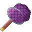{ .item-icon }**Enhanced Bug Catcher Net**; any other net lets them slip through: the **Lightning Beetle**, the **Thunder Spider** and the **Spirit Firefly**.

The Enhanced net is made by the [Inventor](inventor.md) at the Workshop (level 28) from 3 Raw Iron, 5 Mysterious Parts and 1 Bamboo. It has **256 uses**, four times the plain net, and reaches **1.5 blocks further** when held in your main hand.

## Hunter XP and first captures

Only a Hunter earns Hunter XP (in Solo mode, that is everyone). Each species pays a fixed amount of XP per catch, and **the first time you catch a species you get a bonus of four times its XP**. A first Hercules Beetle gives 14 + 56 XP; after that, 14 per catch.

In Crew mode, a player of another trade can still catch the level-1 creatures. They earn no XP, and their first-capture bonus is kept for the day they take up the trade. Their catches still fill the Bestiary.

## Rare variants

Two creatures have a rare look, and each comes as its own item:

- 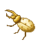{ .item-icon }**Golden Hercules**: 1 Hercules Beetle in 20 is born golden; near a Hunter of level 25 or more, 1 in 10. It also carries more Sweet Sap (2 to 3 instead of 1 to 2).
- **Invisible Swallowtail**: 1 Swallowtail Butterfly in 20. The Hunter's level-25 perk does **not** change this chance.

A rare variant pays **three times** its species' XP. It shares the first-capture bonus with its normal form, and has its own page in the Bestiary.

## Releasing a creature

A caught creature can be put back: right-click the ground with it and it comes out, facing you. A released creature:

- is calm (it doesn't flee, take off or attack);
- never despawns;
- only gives itself if caught again: no XP, no Sweet Sap or Nectar, and no new line in the Bestiary.

You can release a creature bought from the Hunting Merchant, but catching it again earns nothing.

## Traps

There are two traps, both made by the [Inventor](inventor.md) at the Workshop:

| Trap | Inventor level | Ingredients | Springs after |
|---|---|---|---|
| 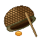{ .item-icon }**Traps** | 1 | 3 Nectar, 1 Bamboo, 1 log | 2 to 5 minutes |
| 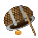{ .item-icon }**Enhanced Traps** | 22 | 1 Sweet Sap, 2 Nectar, 3 Iron Scrap | 1 to 2.5 minutes |

**Setting it.** Place the trap on solid ground. In Crew mode only a Hunter can set a trap or collect its catch; anyone else is told "Only a Hunter can use this trap." A trap only catches in the Overworld.

**The catch.** When the wait is over, the trap picks a creature that lives where it stands; if nothing can be caught there, it waits another round. When it closes on something it snaps shut with a wooden clack. Right-click it to collect the creature; before then it says "Nothing in the trap yet."

- The catch follows the same rules as the net: if your Hunter level is too low, "It got away from the trap."
- Rare variants come out of traps too: 1 Swallowtail in 20 is an Invisible Swallowtail.

**Single use.** A trap is spent once you collect its catch, unless something spares it: the Hunter's level-10 perk spares it half the time, and a fitted Reinforced Frame spares it half the time as well.

**Moving a trap.** Break it to pick it up again. It comes back as the same item, with any parts still fitted.

**What traps catch.** Four creatures come from traps, and three of them (the Tempest Mouse, the Swallowtail Butterfly and the Antlion Lacewing) are found nowhere else:

| Creature | Where the trap must be | Outside? | Which trap |
|---|---|---|---|
| **Tempest Mouse** | plains, sunflower plains, meadows, forests, taigas, savannas | no, works indoors too | either |
| **Swallowtail Butterfly** (or the Invisible Swallowtail) | plains, sunflower plains, meadows, flower forests, cherry groves, forests, birch forests | yes | either |
| **Seagull** | beaches, oceans, rivers, stony shores | yes | either |
| **Antlion Lacewing** | desert, badlands | yes | **Enhanced Traps only** |

"Outside" means nothing solid above the trap; leaves don't count. Where several of them can be caught, each is as likely as the others. The Antlion Lacewing needs a Hunter of level 24.

## Parts for nets and traps

The [Inventor](inventor.md) makes four parts at the Workshop. Anyone fits them at the **Upgrade Bench**, one of each part per net or trap. A trap keeps its parts once set down.

| Part | Inventor level | On a net | On a trap |
|---|---|---|---|
| 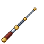{ .item-icon }**Extension Pole** | 24 | reaches 2.5 blocks further | springs 35 % sooner |
| 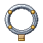{ .item-icon }**Reinforced Frame** | 31 | wears half as often | survives its catch half the time |
| 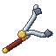{ .item-icon }**Steady Grip** | 39 | holds a creature up to 5 Hunter levels above you | same |
| 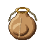{ .item-icon }**Catch Bag** | 46 | 1 catch in 4 gives its by-products twice (never the creature itself) | same |

## The creatures

Creatures appear around you, 16 to 48 blocks away. Every 5 seconds each kind rolls its chance to appear, up to a cap on how many of it may be nearby. Hunter levels are in brackets.

Every creature in 3D (drag to turn, scroll or pinch to zoom); the Hercules Beetle and the Swallowtail Butterfly show their rare variant under their buttons:

**The sky.** Three creatures live on Mine Mine no Mi's sky islands, from height 150 up. Each also has a home on the ground, for worlds without sky islands.

- **Lightning Beetle** (25, Enhanced net only). It clings to the quartz trees' trunks and crackles with sparks; rarer on forest trunks. It takes off when disturbed and carries Thunder Powder.
- **Thunder Spider** (22, Enhanced net only). It clings to the islands' cliffs and quartz trees, or to mountain rock from height 130. It bites twice with a numbing shock, then scurries off. It gives String.
- **Rainbow Phoenix** (40, the highest). A stained-glass butterfly on the quartz crowns, the flowers and the Golden Fruit leaves; also, very rarely, in meadows and cherry groves. The shyest creature of all. It gives Nectar.

**The swamps** (swamps and mangrove swamps):

- **Red-Eyed Spotted Frog** (12). It hops away from you. Half the time it carries a Mystery Egg.
- **Crossbone Butterfly** (18). It waits on the swamp's flowers, lily pads, ferns and grass.
- **Giant Devil Hand Moth** (20). Same perches; its scales blind you as it flees.
- **Spirit Firefly** (30, Enhanced net only). It drifts over the swamp at night, 1 to 3 blocks up, and drains you if you touch it.
- The Lantern Firefly also comes to the swamps at night.

**Forests, plains, deserts and coasts:**

- The starters, all level 1:
    - **Hercules Beetle**, on jungle and forest trunks;
    - **Doctor Hornet**, on flowers and grass in plains, sunflower plains, meadows, flower forests, cherry groves, forests and birch forests;
    - **Seagull**, flying 6 to 12 blocks over beaches, the sea and stony shores, or landed on the beach;
    - the trap-only **Tempest Mouse** and **Swallowtail Butterfly**.
- **Tree Frog** (6). Forests and riversides; it croaks more when it rains.
- Deserts and badlands:
    - **Clawed Scorpion** (8);
    - **Rock Lizard** (8), basking on sandstone and terracotta. A [Miner](miner.md) who breaks an Explosive Rock safely finds one hiding inside 12 % of the time;
    - **Fire Hercules** (15), only near a dead bush, which it sits on. It gives Flame Powder.
- **Lantern Firefly** (10). Over rivers, swamps and forests at night, 1 to 2 blocks up.
- **Atlas Beetle** (16). On forest trunks. It gives Sweet Sap.
- **Antlion Lacewing** (24). Only from Enhanced Traps set outside in the desert or badlands.

**The jungles:**

- **Mole** (1). Jungles, plus stony shores, stony peaks and the windswept hills. It carries Raw Iron and, 1 time in 10, an egg.
- **Umbrella Frog** (8). Jungles and rivers; it wears a leaf hat against the rain.
- **Jungle Lizard** (10). Basks on the jungle's trunks, leaves and moss.
- **Hidden Forest Bee** (14). Waits on a flower and stings twice. It gives Nectar, half the time a Medicinal Herb, and sometimes Sleep Honey.
- The Hercules Beetle lives here too.

**The caves.** These live underground below height 45, out of the sky, in any Overworld biome:

- **Oil Stain Frog** (12). Half the time it gives Gunpowder.
- **Lightbulb Firefly** (14). Half the time it gives Glowstone Dust.
- **Purple Poison Frog** (16). Poisonous to touch.
- **Doze Evil Eye Butterfly** (18). Its scales make you slow and dizzy.

**The frozen lands:**

- **Horned Icicle Lizard** (14). Snowy biomes, frozen and jagged peaks, snowy slopes; it basks on snow, ice and stone. Half the time it gives Ice.
- **Ice Miyama Stag Beetle** (16). On the trunks of snowy taigas, groves and old-growth pine taigas. Half the time it gives Ice Powder.
- **Flying Penguin** (20). Glides 4 to 10 blocks over frozen and deep frozen oceans, snowy beaches and ice spikes. It gives 1 to 2 Feathers.
- **A Class Toad** (22). Snowy lands and peaks, one at a time. Half the time it carries a Mystery Egg.

How to read the table:

- **Level**: the Hunter level you need to catch it, by net or by trap. The Hunter's page in the professions book lists each creature under "Catch" at that level.
- **Where**: the biome groups it lives in (all swamps, all forests…), with any condition such as outside, at night, underground or a height. For a creature that comes from traps, a "(traps)" part says where the trap must stand.
- **How**: net, trap or both. Remember that the Lightning Beetle, the Thunder Spider and the Spirit Firefly need the Enhanced Bug Catcher Net.
- **XP (first catch)**: the Hunter XP per catch, and the one-time bonus the first time you catch the species (always four times the XP). A rare variant pays three times the XP.

| Creature | Level | Where | How | XP (first catch) |
|---|---|---|---|---|
| 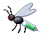{ .item-icon }Doctor Hornet | 1 | flowery biomes | net | 14 (56) |
| 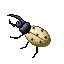{ .item-icon }Hercules Beetle | 1 | jungles, forests | net | 14 (56) |
| 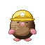{ .item-icon }Mole | 1 | burrowing grounds | net | 14 (56) |
| 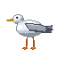{ .item-icon }Seagull | 1 | beaches, stony shore (below y 100); beaches, oceans, rivers, stony shore (traps) | net, trap | 14 (56) |
| { .item-icon }Swallowtail Butterfly | 1 | plains, sunflower plains, meadow, flower forest, cherry grove, forest, birch forest (traps) | trap | 14 (56) |
| 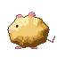{ .item-icon }Tempest Mouse | 1 | plains, sunflower plains, meadow, forests, taigas, savannas (traps) | trap | 14 (56) |
| { .item-icon }Tree Frog | 6 | forests, rivers | net | 24 (96) |
| 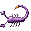{ .item-icon }Clawed Scorpion | 8 | desert, badlands | net | 28 (112) |
| 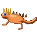{ .item-icon }Rock Lizard | 8 | desert, badlands | net | 28 (112) |
| 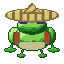{ .item-icon }Umbrella Frog | 8 | jungles, rivers | net | 28 (112) |
| 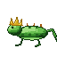{ .item-icon }Jungle Lizard | 10 | jungles | net | 32 (128) |
| { .item-icon }Lantern Firefly | 10 | rivers, swamps, forests (at night) | net | 32 (128) |
| 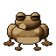{ .item-icon }Oil Stain Frog | 12 | anywhere (underground, below y 45) | net | 36 (144) |
| 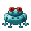{ .item-icon }Red-Eyed Spotted Frog | 12 | swamps | net | 36 (144) |
| 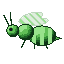{ .item-icon }Hidden Forest Bee | 14 | jungles | net | 40 (160) |
| 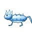{ .item-icon }Horned Icicle Lizard | 14 | snowy biomes, frozen peaks, jagged peaks, snowy slopes | net | 40 (160) |
| 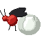{ .item-icon }Lightbulb Firefly | 14 | anywhere (underground, below y 45) | net | 40 (160) |
| 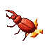{ .item-icon }Fire Hercules | 15 | desert, badlands | net | 42 (168) |
| 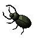{ .item-icon }Atlas Beetle | 16 | forests | net | 44 (176) |
| 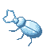{ .item-icon }Ice Miyama Stag Beetle | 16 | snowy taiga, grove, old growth pine taiga | net | 44 (176) |
| { .item-icon }Purple Poison Frog | 16 | anywhere (underground, below y 45) | net | 44 (176) |
| { .item-icon }Crossbone Butterfly | 18 | swamps | net | 48 (192) |
| { .item-icon }Doze Evil Eye Butterfly | 18 | anywhere (underground, below y 45) | net | 48 (192) |
| { .item-icon }Flying Penguin | 20 | frozen ocean, deep frozen ocean, snowy beach, ice spikes (below y 120) | net | 52 (208) |
| 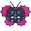{ .item-icon }Giant Devil Hand Moth | 20 | swamps | net | 52 (208) |
| 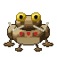{ .item-icon }A Class Toad | 22 | snowy biomes, frozen peaks, jagged peaks, snowy slopes | net | 56 (224) |
| 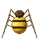{ .item-icon }Thunder Spider | 22 | mountains (above y 130) | Enhanced Bug Catcher Net | 56 (224) |
| 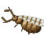{ .item-icon }Antlion Lacewing | 24 | desert, badlands (traps) | trap (enhanced) | 60 (240) |
| 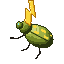{ .item-icon }Lightning Beetle | 25 | forests | Enhanced Bug Catcher Net | 62 (248) |
| 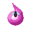{ .item-icon }Spirit Firefly | 30 | swamps (at night) | Enhanced Bug Catcher Net | 72 (288) |
| { .item-icon }Rainbow Phoenix | 40 | meadow, cherry grove | net | 92 (368) |

## The Tannery

The **Tannery** is the Hunter's workstation. It is made at a crafting table: a Crafting Table in the middle, Leather in the other five squares of the top two rows, and three Planks along the bottom row.

Only a Hunter can make its recipes. "Hides" are the lizards, the frogs, the A Class Toad and the Mole; "wings" are the butterflies, the moths and the Flying Penguin. Only four count as frogs for Slime Balls: the Tree Frog, the Umbrella Frog, the Red-Eyed Spotted Frog and the Oil Stain Frog. The Firefly Lantern takes Lantern or Lightbulb Fireflies (the Spirit Firefly doesn't count).

| Makes | Level | XP | Ingredients |
|---|---|---|---|
| Leather ×3 | 5 | 20 | 2 × any hides |
| { .item-icon }Firefly Lantern | 12 | 34 | 3 × any fireflies, Glass, Iron Nugget |
| Slimeball ×2 | 16 | 42 | 2 × any frogs |
| 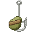{ .item-icon }Bait ×4 | 22 | 54 | 2 × any wings, any hides, { .item-icon }Nectar |
| 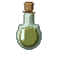{ .item-icon }Scent Lure ×2 | 38 | 86 | 2 × any hides, 2 × { .item-icon }Nectar, any wings, Glass Bottle |
| { .item-icon }Specimen Case | 46 | 102 | 5 × Glass, 2 × any planks, Iron Nugget, { .item-icon }Marble |

What the Tannery's own items do:

- { .item-icon }**Firefly Lantern**: a jar of fireflies that gives light level 14.
- { .item-icon }**Bait**: *used* (right-click), not eaten. For 2 minutes you are Baited, and Cruise's fish bite 35 % more often (see the [Fisher](fisher.md)).
- { .item-icon }**Scent Lure**: right-click to uncork it. It runs a minute's worth of creature spawning at once, but only brings creatures that would have come to that place anyway (same biome, time of day, height and nearby limits). In the wrong place it says "Nothing here answers it"; when it works, "Something moves nearby." You must wait 10 seconds before opening another.
- { .item-icon }**Specimen Case**: a glass trophy case. Right-click it with any caught creature and the creature stands inside, turning slowly. An empty hand takes it back out, and breaking the case drops it. The creature is kept, never used up.

## Level perks

| Level | Perk | What it does |
|---|---|---|
| 10 | "Nets and traps wear half as fast" | each net use has a 50 % chance to cost no durability, and half of all single-use traps survive their catch |
| 25 | "Rare variants twice as common around you" | the Golden Hercules comes 1 in 10 instead of 1 in 20 near you; the Invisible Swallowtail stays at 1 in 20 |
| 40 | "20% chance a catch's drops come twice" | 20 % of the time, a caught creature's drops come twice (never the creature itself) |

## Advancements

The **Hunter** tab opens at Hunter level 1 and is the largest in the mod, with 42 advancements: **Apprentice** at level 5, and the rest for creatures caught and things made. Its challenges include **Golden Hercules** and **Naturalist**, for catching every creature.
