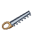
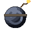
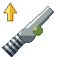

# Inventor

The Inventor builds the crew's gear at the **Workshop**: the Fisher's rods and parts, the Hunter's traps and nets, the Miner's and Lumberjack's tools, the Musician's instruments, hull parts for the Carpenter's boats, dials, and weapons and bombs for a fight. A second bench, the **Upgrade Bench**, fits their parts onto tools.

| | |
|---|---|
| Workstation | { .item-icon }**Workshop** |
| How it is made | crafting table, no level: Iron Ingots, a Crafting Table and planks |
| Second bench | { .item-icon }**Upgrade Bench**, to fit parts |
| Levels | 1 to 100; recipes up to level 50 |
| XP | every recipe built: 10 + 2 × its level |

## The benches

Both are built at an ordinary crafting table, and anyone can build them. They face you when you place them.

| Bench | Top | Middle | Bottom |
|---|---|---|---|
| Workshop | Iron Ingot, Iron Ingot, Iron Ingot | Planks, Crafting Table, Planks | Planks, Planks, Planks |
| Upgrade Bench | Iron Ingot, Iron Ingot, Iron Ingot | Planks, Smithing Table, Planks | Planks, Planks, Planks |

### The Upgrade Bench

This is where a part is **fitted** onto a tool.

- Put a tool in one slot and a part in the other, and take out the **same tool** with the part on it. It keeps its wear, its enchantments and the parts already fitted.
- The bench shows what the part will do **on that tool** before you fit it.
- Each part fits once per tool: the bench refuses a part that is already on it.
- It takes fishing rods (rod parts), bug nets and traps (hunting parts), and the [Carpenter](carpenter.md)'s boats (hull parts and sails).
- Anyone can use it: it asks for no trade and no level.

## Materials

- **Iron Scrap** is found in chests of shipwrecks, mineshafts, dungeons, ruined portals, pillager outposts, underwater ruins and village smiths, and comes up with fishing junk.
- **Mysterious Parts** are found in chests of shipwrecks, buried treasure, desert pyramids, jungle temples, mineshafts, dungeons, strongholds, ancient cities, underwater ruins and woodland mansions.
- **Dial Fragments** come from a [Miner](miner.md) who shatters one of Mine Mine no Mi's dials.
- **Pure Iron Ore** and **Diamond Fragments** come from the [Miner](miner.md).

## For the Fisher

- **Reel** (Inventor 1; Iron Ingot, Stick, 2 String): the base of the Whopper Fishing Rod and the Ultimate Reel. The Carpenter's Burning Tree Fishing Boat also takes one.
- **Whopper Fishing Rod** (Inventor 5; Reel, Raw Iron): catches run bigger. 128 uses, twice as many as an ordinary fishing rod.
- **Ultimate Reel** (Inventor 30; Reel, 2 Mysterious Parts, Raw Iron): the base of the next rod.
- { .item-icon }**Sea King Fishing Rod** (Inventor 32; Ultimate Reel, Cola): the biggest catches of any rod, 320 uses, and its **hook floats on lava**. It is the only way to fish the Lava Flounder and the Burning Dragon.

### Rod parts

Fitted at the Upgrade Bench. **Every part fits every rod**, but it does most on the rod it was made for:

| Part (level; recipe) | Plain rod | Whopper | Sea King |
|---|---|---|---|
| Fishing Rod Upgrade (8; 1 Bamboo) | catches +0.20 bigger | +0.10 | +0.05 |
| Fishing Line Upgrade (8; 9 String) | rare fish ×1.50 as often | ×1.35 | ×1.25 |
| Whopper Rod Upgrade (18; Raw Iron, 2 Iron Scrap) | +0.10 bigger | +0.25 | +0.15 |
| Sea King Rod Upgrade (40; Mysterious Dial) | +0.10 bigger, ×1.10 | +0.20, ×1.15 | +0.30, ×1.25 |

"Bigger" is how far the catch's size is pulled toward the top of its species' range; the bench shows +0.20 as "Catches bigger by 20%", and the rare-fish factor as "Rare fish x1.5 as often". See the [Fisher](fisher.md) for how they add up.

## Salt: for the Fisher, the Cook and the Chemist

| Sieve | Inventor level | Made from | Salt chance | Rest | Uses |
|---|---|---|---|---|---|
| { .item-icon }Sieve | 1 | planks, Stick, 2 String | 60 % | 60 seconds | 48 |
| { .item-icon }Fine Sieve | 12 | Sieve, 2 Iron Scrap, 2 String | 80 % | 20 seconds | 128 |

Hold use on a water source in an ocean or beach biome for 2 seconds: the sieve may give **Crystallised Salt**, then needs its rest. Only sea water leaves salt. Crystallised Salt feeds the [Cook](cook.md) (Broiled Killifish, Hardtack Ration, Dinosaur Steak) and the [Chemist](chemist.md) (Salt Ball, Instant Freeze Ball).

## For the Hunter

- **Traps** (Inventor 1; 3 Nectar, Bamboo, a log): only a [Hunter](hunter.md) can set one and collect its catch. It closes on a creature after **2 to 5 minutes** and is used up once its catch is collected.
- **Enhanced Traps** (Inventor 22; Sweet Sap, 2 Nectar, 3 Iron Scrap): the same, but they close in **1 to 2.5 minutes**.
- **Enhanced Bug Catcher Net** (Inventor 28; 3 Raw Iron, 5 Mysterious Parts, Bamboo): 256 uses (the plain net has 64) and **+1.5 blocks of reach**.

### Hunting parts

Fitted at the Upgrade Bench. Each fits a net or a trap, and does the same kind of work on both:

| Part (level; recipe) | On a net | On a trap |
|---|---|---|
| Extension Pole (24; 3 Bamboo, 2 Iron Scrap, Antlion Lacewing) | +2.5 blocks of reach | springs 35 % sooner |
| Reinforced Frame (31; Hercules Beetle, Atlas Beetle, 3 Iron Ingot, Mysterious Parts) | wears half as often | survives its catch half the time |
| Steady Grip (39; 2 Ice Miyama Stag Beetle, 2 hides, 3 Iron Scrap, Mysterious Parts) | holds a creature up to 5 Hunter levels above you | same |
| Catch Bag (46; 4 String, 2 hides, 2 Sweet Sap, a wing) | 1 catch in 4 gives its by-products twice | same |

## For the Miner and the Lumberjack

| Tool | Inventor level | Made from | Rank, uses | What it does |
|---|---|---|---|---|
| { .item-icon }Woodsman's Axe | 20 | 2 Pure Iron Ore, 3 Diamond Fragment, 2 Mysterious Parts, 2 logs | diamond, 1 800 | a [Lumberjack](lumberjack.md)'s second log turns up **25 % more often**; a felling tool that hits for less than a diamond axe; mended with Diamond Fragments |
| { .item-icon }Enhanced Pick-axe | 25 | 5 Diamond Fragment, 3 Mysterious Parts, a log | diamond, 1 800 | a [Miner](miner.md)'s finds turn up **25 % more often**; mended with Diamond Fragments |
| { .item-icon }Felling Saw | 35 | 4 Pure Iron Ore, 3 Mysterious Parts, 2 logs | iron, 1 200 | **one cut brings down the whole trunk**, up to 64 logs of the same wood, at one use per log |

The Felling Saw only takes logs that grew on a tree, not placed ones, and it works upward and outward from the cut, never below it.

## Hull parts, for the Carpenter's boats

Fitted on a boat at the Upgrade Bench. They stay on the boat item, and a wreck gives them back.

| Part | Inventor level | Made from | What it does |
|---|---|---|---|
| Iron Plating | 16 | 4 Iron Ingot, 4 Iron Scrap, planks | the hull takes **2 more blows** |
| Hull Ram | 26 | 3 Iron Ingot, 2 Pure Iron Ore, 2 Mysterious Parts, 2 planks | a moving boat deals **6 damage** to whatever it runs into, at most once a second |
| Burst Dial | 42 | Jet Dial, 3 Mysterious Parts, 3 Iron Ingot, 2 Iron Scrap | while you steer, right-click with a **Cola** and the boat leaps the way you look; the Cola is used up, and the dial needs 5 seconds before it takes another |

The sails are the [Tailor](tailor.md)'s, not the Inventor's. See [Boats](../boats.md).

## For the Musician

| Instrument | Inventor level | Made from | Tune reaches | Tune lasts | Uses |
|---|---|---|---|---|---|
| { .item-icon }Bamboo Flute | 6 | 3 Bamboo, String | 8 blocks | 20 minutes | 32 |
| { .item-icon }Violin | 22 | 3 planks, stick, 4 String, Sweet Sap | 12 blocks | 25 minutes | 64 |
| { .item-icon }Guitar | 38 | 4 planks, 3 String, Iron Scrap, Magnet | 16 blocks | 30 minutes | 128 |

See the [Musician](musician.md) for how they are played.

## For the Navigator

The **Lens** (Inventor 28; Diamond Fragment, 2 Glass) and the **Magnet** (Inventor 30; 3 Pure Iron Ore, Redstone) both go into the [Navigator](navigator.md)'s **Eternal Pose** (Chart Table, level 50). The Magnet also goes into the Guitar.

## Dials

- { .item-icon }**Mysterious Dial** (Inventor 34; 9 Dial Fragments): an empty dial shell.
    - At a **smithing table** it becomes one of Mine Mine no Mi's dials (see [Dial smithing](#dial-smithing)).
    - At the Workshop it is the base of the Flame Dial, the Thunder Dial, the Tone Dial and the Sea King Rod Upgrade.
- { .item-icon }**Jet Dial** (Inventor 36; 7 Dial Fragments, 2 Balloon Catfish; **three per craft**, stacks to 16): press it and it **throws you hard the way you face**, with a little lift, and resets your fall so you take no damage from the height already fallen. The dial is used up. Cooldown 3 seconds. It also goes into the Burst Dial.
- **Flame Dial** (Inventor 38; Mysterious Dial, Spirit Firefly): Mine Mine no Mi's own Flame Dial, made at the Workshop.
- { .item-icon }**Thunder Dial** (Inventor 40; Mysterious Dial, Thunder Spider; **two per craft**, stacks to 16): press it and **a lightning bolt strikes where you look**, up to 24 blocks away. The dial is used up. Cooldown 3 seconds.
- { .item-icon }**Tone Dial** (Inventor 44; Mysterious Dial, Note Block, 2 Iron Scrap; stacks to 16): press it on a **note block** to record that note and instrument, then press it in the air to play it back, loud (three times the volume). It is not used up. Cooldown 1 second. Recording again replaces the last note.

### Dial smithing

Mine Mine no Mi makes its dials at a vanilla **Smithing Table** from a Nautilus Shell. Cruise adds a second recipe for each dial that takes the **Mysterious Dial** in the shell's place ("An empty dial: at a smithing table, it takes a nautilus shell's place").

1. Leave the template slot empty.
2. Put the Mysterious Dial in the base slot.
3. Put a stack of **at least** the listed amount of the addition in the addition slot.

The smithing table asks for no Inventor level: anyone holding a Mysterious Dial can do this, but only an Inventor of level 34 or more can make Mysterious Dials. The dials for the Perfect Clima Tact can be made this way. Each dial and what it needs:

| Dial | Put on a Mysterious Dial |
|---|---|
| Axe Dial | 10 × Flint |
| Breath Dial | 8 × Feather |
| Eisen Dial | 8 × Iron Ingot |
| Flame Dial | 6 × Blaze Powder |
| Flash Dial | 10 × Glowstone Dust |
| Impact Dial | 10 × Gunpowder |
| Milky Dial | 4 × Sky Block |

## Weapons and ammunition

- **Clima Tact** (Inventor 26; 6 Lapis Lazuli, 3 Sticks), **Perfect Clima Tact** (Inventor 46; Clima Tact, Breath Dial, Milky Dial, Flame Dial, 2 Eisen Dial, 2 Flash Dial) and **Sorcery Clima Tact** (Inventor 50; Perfect Clima Tact, 8 Gold Ingots) are Mine Mine no Mi's weapons. By default their crafting-table recipes are removed, so only the Inventor makes them; a server can keep the original recipes (see [Configuration](../configuration.md)).
- { .item-icon }**Enhanced Bombs** (Inventor 42; 6 Gunpowder, 2 Iron Scrap, 1 Coal; **four per craft**): thrown like a [Chemist](chemist.md)'s ball, a bomb explodes where it lands (power 2). The world's mobGriefing game rule decides whether it breaks blocks. Cooldown 1 second.
- { .item-icon }**Blind Spot Cannonball** (Inventor 48; 2 Missile Manta Ray, 6 Enhanced Bombs; stacks to 16): a heavier blast (power 3.5). Its smoke **blinds everything within about 5 blocks for 0:06**, except the thrower.

## Level perks

| Level | Perk | What it does |
|---|---|---|
| 10 | "10% chance to save an ingredient" | at the Workshop, one ingredient comes back to you 10 % of the time ("Saved: ...") |
| 25 | "The tools you make come with Unbreaking I" | the tools you make (anything with durability) come with **Unbreaking I**; a tool that already has Unbreaking keeps its own |
| 40 | "25% chance to save an ingredient" | the chance to save an ingredient becomes **25 %** (it replaces the 10 %); a tool is never among the saved ingredients |

## The recipes

Every Workshop recipe, with the Inventor level that unlocks it and the XP it pays:

| Makes | Level | XP | Ingredients |
|---|---|---|---|
| { .item-icon }Reel | 1 | 12 | Iron Ingot, Stick, 2 × String |
| { .item-icon }Sieve | 1 | 12 | any planks, Stick, 2 × String |
| { .item-icon }Traps | 1 | 12 | 3 × { .item-icon }Nectar, Bamboo, any logs |
| { .item-icon }Whopper Fishing Rod | 5 | 20 | { .item-icon }Reel, Raw Iron |
| { .item-icon }Bamboo Flute | 6 | 22 | 3 × Bamboo, String |
| { .item-icon }Fishing Line Upgrade | 8 | 26 | 9 × String |
| { .item-icon }Fishing Rod Upgrade | 8 | 26 | Bamboo |
| { .item-icon }Fine Sieve | 12 | 34 | { .item-icon }Sieve, 2 × { .item-icon }Iron Scrap, 2 × String |
| { .item-icon }Iron Plating | 16 | 42 | 4 × Iron Ingot, 4 × { .item-icon }Iron Scrap, any planks |
| { .item-icon }Whopper Rod Upgrade | 18 | 46 | Raw Iron, 2 × { .item-icon }Iron Scrap |
| { .item-icon }Woodsman's Axe | 20 | 50 | 2 × { .item-icon }Pure Iron Ore, 3 × { .item-icon }Diamond Fragment, 2 × { .item-icon }Mysterious Parts, 2 × any logs |
| { .item-icon }Enhanced Traps | 22 | 54 | { .item-icon }Sweet Sap, 2 × { .item-icon }Nectar, 3 × { .item-icon }Iron Scrap |
| { .item-icon }Violin | 22 | 54 | 3 × any planks, Stick, 4 × String, { .item-icon }Sweet Sap |
| { .item-icon }Extension Pole | 24 | 58 | 3 × Bamboo, 2 × { .item-icon }Iron Scrap, { .item-icon }Antlion Lacewing |
| { .item-icon }Enhanced Pick-axe | 25 | 60 | 5 × { .item-icon }Diamond Fragment, 3 × { .item-icon }Mysterious Parts, any logs |
| Clima Tact | 26 | 62 | 6 × Lapis Lazuli, 3 × Stick |
| { .item-icon }Hull Ram | 26 | 62 | 3 × Iron Ingot, 2 × { .item-icon }Pure Iron Ore, 2 × { .item-icon }Mysterious Parts, 2 × any planks |
| { .item-icon }Enhanced Bug Catcher Net | 28 | 66 | 3 × Raw Iron, 5 × { .item-icon }Mysterious Parts, Bamboo |
| { .item-icon }Lens | 28 | 66 | { .item-icon }Diamond Fragment, 2 × Glass |
| { .item-icon }Magnet | 30 | 70 | 3 × { .item-icon }Pure Iron Ore, Redstone Dust |
| { .item-icon }Ultimate Reel | 30 | 70 | { .item-icon }Reel, 2 × { .item-icon }Mysterious Parts, Raw Iron |
| { .item-icon }Reinforced Frame | 31 | 72 | { .item-icon }Hercules Beetle, { .item-icon }Atlas Beetle, 3 × Iron Ingot, { .item-icon }Mysterious Parts |
| { .item-icon }Sea King Fishing Rod | 32 | 74 | { .item-icon }Ultimate Reel, Cola |
| { .item-icon }Mysterious Dial | 34 | 78 | 9 × { .item-icon }Dial Fragment |
| { .item-icon }Felling Saw | 35 | 80 | 4 × { .item-icon }Pure Iron Ore, 3 × { .item-icon }Mysterious Parts, 2 × any logs |
| { .item-icon }Jet Dial ×3 | 36 | 82 | 7 × { .item-icon }Dial Fragment, 2 × { .item-icon }Balloon Catfish |
| Flame Dial | 38 | 86 | { .item-icon }Mysterious Dial, { .item-icon }Spirit Firefly |
| { .item-icon }Guitar | 38 | 86 | 4 × any planks, 3 × String, { .item-icon }Iron Scrap, { .item-icon }Magnet |
| { .item-icon }Steady Grip | 39 | 88 | 2 × { .item-icon }Ice Miyama Stag Beetle, 2 × any hides, 3 × { .item-icon }Iron Scrap, { .item-icon }Mysterious Parts |
| { .item-icon }Sea King Rod Upgrade | 40 | 90 | { .item-icon }Mysterious Dial |
| { .item-icon }Thunder Dial ×2 | 40 | 90 | { .item-icon }Mysterious Dial, { .item-icon }Thunder Spider |
| { .item-icon }Burst Dial | 42 | 94 | { .item-icon }Jet Dial, 3 × { .item-icon }Mysterious Parts, 3 × Iron Ingot, 2 × { .item-icon }Iron Scrap |
| { .item-icon }Enhanced Bombs ×4 | 42 | 94 | 6 × Gunpowder, 2 × { .item-icon }Iron Scrap, Coal |
| { .item-icon }Tone Dial | 44 | 98 | { .item-icon }Mysterious Dial, Note Block, 2 × { .item-icon }Iron Scrap |
| { .item-icon }Catch Bag | 46 | 102 | 4 × String, 2 × any hides, 2 × { .item-icon }Sweet Sap, any wings |
| Perfect Clima Tact | 46 | 102 | Clima Tact, Breath Dial, Milky Dial, Flame Dial, 2 × Eisen Dial, 2 × Flash Dial |
| { .item-icon }Blind Spot Cannonball | 48 | 106 | 2 × { .item-icon }Missile Manta Ray, 6 × { .item-icon }Enhanced Bombs |
| Sorcery Clima Tact | 50 | 110 | Perfect Clima Tact, 8 × Gold Ingot |

## Advancements

The **Inventor** tab ("Build, sift and fit parts at the Workshop") holds:

- **Tinkerer's Bench** (build a Workshop), **Apprentice Inventor** (reach Inventor level 5) and **Scavenger** (find Iron Scrap and Mysterious Parts);
- salt: Sea Sifter (make a Sieve), Salt of the Sea (sift salt), Finer Grains (make a Fine Sieve);
- rods: Reel It In (a Reel), Whopper! (a Whopper Fishing Rod), A Rod for a Sea King (the Sea King Fishing Rod);
- the Upgrade Bench: The Fitting Bench (build one), Rigged (fit a rod part), Fully Rigged (fit both the Fishing Rod Upgrade and the Fishing Line Upgrade on one rod), Man of Steel (fit a Whopper Rod Upgrade);
- Rock Breaker (an Enhanced Pick-axe);
- dials: Sky Shell (a Mysterious Dial), Fire in a Shell (a Flame Dial), Ignition (a Jet Dial), A Dial That Listens (a Tone Dial);
- **Blind Spot** (a Blind Spot Cannonball);
- one challenge, **Storm in a Shell** (a Thunder Dial).
