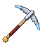

# Miner

The Miner earns XP by breaking ore and certain rocks, and as the trade grows the rock starts to give up **finds** on top of its normal drops: Diamond Fragments, Marble, Kairoseki, Dial Fragments, Pure Iron Ore and more. At the **Masonry** they turn those finds into marble blocks, iron and diamonds.

| | |
|---|---|
| Workstation | { .item-icon }**Masonry** |
| How it is made | 8 Stone around a Crafting Table (crafting table) |
| Tools | any pickaxe of the right tier; the **Enhanced Pick-axe** is made by the [Inventor](inventor.md) |
| Levels | 1 to 100; new finds up to level 50 |

## What counts

- The block must be broken **in Survival**, with a tool that would normally harvest it (a pickaxe of the right tier for an ore).
- **Silk Touch turns the trade off**: a block taken whole gives no XP and no finds.
- The Explosive Rock and Mine Mine no Mi's dials specifically need a **pickaxe**.

## XP from breaking

Ores pay Miner XP at any level, the rarer the more; Ancient Debris pays the most. Plain Deepslate, Tuff, Calcite and Diorite pay nothing of their own: they only pay when a find turns up. Each find that drops pays its own extra XP on top.

This table gives the XP each block pays when broken:

| Breaking | XP |
|---|---|
| any coal ores | 2 |
| any copper ores | 2 |
| Nether Quartz Ore | 2 |
| any iron ores | 4 |
| any redstone ores | 4 |
| any gold ores | 6 |
| any lapis ores | 6 |
| Kairoseki Ore, Deepslate Kairoseki Ore | 10 |
| any diamond ores | 12 |
| any emerald ores | 12 |
| Ancient Debris | 20 |

## Finds in the rock

From **Miner level 5**, some blocks can turn up finds as well as their normal drops.

- Each find is rolled **separately** every time the block is broken, so a block with several possible finds can give more than one at once.
- Each find opens at a Miner level; the professions book lists it as an unlock at the lowest level where it appears.
- A player who does not practise the Miner gets no finds at all.

This table lists every find, the block it comes from, its chance, the Miner level it needs and the extra XP it pays:

| Breaking | Can turn up | Chance | Level | XP |
|---|---|---|---|---|
| Explosive Rock | { .item-icon }Explosive Rock Fragment | 100 % | 5 | 6 |
| any diamond ores | { .item-icon }Diamond Fragment | 30 % | 5 | 4 |
| Axe Dial, Breath Dial, Eisen Dial, Flame Dial, Flash Dial, Impact Dial, Milky Dial, Reject Dial | { .item-icon }Dial Fragment | 100 % | 10 | 10 |
| Calcite | { .item-icon }Marble | 8 % | 10 | 6 |
| Diorite | { .item-icon }Marble | 4 % | 10 | 6 |
| Kairoseki Ore, Deepslate Kairoseki Ore | Kairoseki | 25 % | 15 | 4 |
| any iron ores | { .item-icon }Iron Scrap | 12 % | 18 | 8 |
| any iron ores | { .item-icon }Pure Iron Ore | 10 % | 25 | 8 |
| any coal ores | { .item-icon }Explosive Rock Fragment | 8 % | 28 | 10 |
| Deepslate | { .item-icon }Diamond Fragment | 0.4 % | 35 | 15 |
| Deepslate, Tuff | { .item-icon }Mysterious Parts | 0.3 % | 38 | 16 |
| Kairoseki Ore, Deepslate Kairoseki Ore | Dense Kairoseki | 10 % | 42 | 20 |
| any iron ores | { .item-icon }Pure Iron Ore | 15 % | 45 | 8 |
| Ancient Debris | Netherite Scrap | 25 % | 46 | 25 |
| Deepslate, Tuff | Kairoseki | 0.15 % | 50 | 30 |

A few finds need a word more:

- **Pure Iron Ore** from iron ores has two separate rolls: one from level 25 and a second one from level 45, on top of each other.
- **Mysterious Parts** (from level 38) and **Kairoseki** (from level 50) can turn up in plain Deepslate and Tuff, very rarely.

### The Explosive Rock

Red, cracked boulders two to three blocks across, half buried, found in **badlands, desert and mountain** biomes (roughly one chunk in five where they can generate).

- A **Miner of level 5 or more** who breaks one with a pickaxe gets 1 to 3 { .item-icon }**Explosive Rock Fragments**. About 12 % of the time, a **Rock Lizard** was hiding inside.
- Anyone else sets it off: a small blast that hurts but breaks no blocks. They get nothing.

### Dials

From **Miner 10**, breaking one of Mine Mine no Mi's dials (Axe, Breath, Eisen, Flame, Flash, Impact, Milky or Reject Dial) with a pickaxe shatters it into 2 to 4 { .item-icon }**Dial Fragments**, **instead of** the dial itself. Below level 10, the dial breaks and drops as normal.

### Marble

There is no marble ore: **Marble** only comes from breaking **Calcite** (8 %) and **Diorite** (4 %), from Miner 10.

## The Enhanced Pick-axe

{ .item-icon }The **Enhanced Pick-axe** is made by the [Inventor](inventor.md) at the Workshop (Inventor 25: 5 Diamond Fragments, 3 Mysterious Parts, 1 log).

- Diamond's mining tier, 1 800 uses, repaired with Diamond Fragments.
- "A Miner's finds turn up 25% more often". This adds up with the level-10 perk, for ×1.875 in all.

## The Masonry

The Masonry is the Miner's workstation. It is crafted from 8 Stone around a Crafting Table, and needs a pickaxe to be picked back up. Every recipe asks for a Miner level and pays Miner XP.

It turns Marble into building blocks (Marble Block, Slab, Stairs, Polished Marble and its slab), **Pure Iron Ore** into Iron Ingots, and **Diamond Fragments** into a Diamond. All marble blocks need at least a stone pickaxe to drop.

These are the Masonry's recipes:

| Makes | Level | XP | Ingredients |
|---|---|---|---|
| { .item-icon }Marble Block | 1 | 12 | 4 × { .item-icon }Marble |
| { .item-icon }Marble Slab ×6 | 5 | 20 | 3 × { .item-icon }Marble Block |
| { .item-icon }Marble Stairs ×4 | 8 | 26 | 3 × { .item-icon }Marble Block |
| { .item-icon }Polished Marble ×4 | 14 | 38 | 4 × { .item-icon }Marble Block |
| { .item-icon }Polished Marble Slab ×6 | 16 | 42 | 3 × { .item-icon }Polished Marble |
| Iron Ingot ×2 | 30 | 70 | { .item-icon }Pure Iron Ore |
| Diamond | 44 | 98 | 9 × { .item-icon }Diamond Fragment |

## Where the finds go

- **Explosive Rock Fragments** become Gunpowder for the [Chemist](chemist.md).
- **Dial Fragments** become the Mysterious Dial and the Jet Dial for the [Inventor](inventor.md).
- **Pure Iron Ore** goes into the Inventor's Magnet, Woodsman's Axe, Felling Saw and Hull Ram, the [Carpenter](carpenter.md)'s Adam boats, the [Blacksmith](blacksmith.md)'s Warabide Sword and several [Tailor](tailor.md) pieces.
- **Kairoseki** and **Dense Kairoseki** feed the Blacksmith's sea-stone weapons and handcuffs.

## Level perks

| Level | Perk | What it does |
|---|---|---|
| 10 | "Finds in the rock turn up 50% more often" | every find's chance ×1.5 (never above 100 %) |
| 25 | "10% chance an ore gives its drops twice" | one ore in ten drops its normal drops a second time |
| 40 | "20% chance an ore gives its drops twice" | replaces the 10 % |

## Advancements

The **Miner** tab opens at Miner level 1: Apprentice Miner (level 5), Diamond in the Rough (find a Diamond Fragment), Carved in Stone (find Marble), Sea-Prism Stone (get Kairoseki), Handle With Care (get Explosive Rock Fragments) and Shell Shock (get a Dial Fragment).
