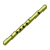
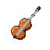
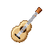
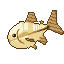
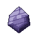

# Musician

The Musician writes **scores** at the **Music Stand** and plays them on an instrument for his crew. A tune gives everyone in the crew within reach a buff that lasts 20 minutes or more: speed, faster work, healing, attack, armour, luck, more XP or more Doriki. It is the one trade whose recipes already run to **level 100**.

| | |
|---|---|
| Workstation | { .item-icon }**Music Stand** |
| How it is made | crafting table, no level: Paper, a Note Block, Sticks |
| Instruments | made by the [Inventor](inventor.md) at the Workshop |
| Levels | 1 to 100; scores up to level 100 |
| XP | writing scores (10 + 2 × the recipe's level) and playing them |

## The Music Stand

You build the Music Stand at an ordinary crafting table. Anyone can build one:

| Top | Middle | Bottom |
|---|---|---|
| Paper, Note Block, Paper | —, Stick, — | Stick, —, Stick |

It faces you when you place it.

## Writing scores

Every score takes **2 Paper and an Ink Sac**, plus the tune's own ingredient. Tier II adds **2 Gold Nuggets**. Tier III uses a **Glow Ink Sac, a Gold Ingot and a Diamond Fragment**. Scores stack to 16; tier II scores are uncommon, and tier III scores are rare and shine.

## Playing a tune

1. **Carry an instrument.** You do not hold it: the **best instrument anywhere in your inventory** plays. "Best" means the one that reaches further, then the one that lasts longer.

    | Instrument | Tune reaches | Tune lasts | Uses |
    |---|---|---|---|
    | { .item-icon }Bamboo Flute | 8 blocks | 20 minutes | 32 |
    | { .item-icon }Violin | 12 blocks | 25 minutes | 64 |
    | { .item-icon }Guitar | 16 blocks | 30 minutes | 128 |

2. **Hold use with the score in hand.** You play for **3 seconds**, standing. Notes rise around you and the instrument sounds the tune's motif.
3. When the tune ends:
    - **you and every member of your crew within reach** get the tune's buff for the instrument's duration. "Crew" means Mine Mine no Mi's pirate crews. A player with no crew plays for himself alone, and nobody outside your crew gets anything, however close;
    - the **score is used up**;
    - the **instrument loses one use**.

Your crewmates see "&lt;you&gt; plays &lt;tune&gt; for the crew".

Who can play:

- only a player who practises the Musician trade ("Only a Musician can play a score" in Crew mode);
- your Musician level must reach the score's level ("This tune takes a Musician of level N");
- you need an instrument ("You need an instrument to play it").

**One tune at a time.** A new tune replaces the last. Tunes are separate from meal buffs and remedies, so a tune stays alongside a [Cook](cook.md)'s Appetite.

## The tiers

Every tune has three tiers, each its own score. The buff shows as I, II or III.

| Tier | Musician level | Strength |
|---|---|---|
| I | the tune's level | ×0.5 |
| II | 30 levels later | ×1 |
| III | 60 levels later (at most level 100) | ×2 |

## The eleven tunes

| Tune | Kind | Levels (I / II / III) | Ingredient | Effect (I / II / III) |
|---|---|---|---|---|
| { .item-icon }Swift Shanty | Movement | 1 / 31 / 61 | Sugar | **+5 / +10 / +20 % speed** |
| Work Song | Work | 5 / 35 / 65 | Iron Scrap | **breaks blocks 10 / 20 / 40 % faster** |
| Lullaby of Mending | Healing | 10 / 40 / 70 | Medicinal Herb | **heals half a heart every 12 / 6 / 3 seconds** |
| Sea Shanty | Movement | 15 / 45 / 75 | Forked-Tail Killifish | **+25 / +50 / +100 % swimming speed** |
| Battle March | Combat | 20 / 50 / 80 | Flame Powder | **+1 / +2 / +4 attack damage** |
| Lucky Tune | Work | 25 / 55 / 85 | Rabbit's Foot | **+0.5 / +1 / +2 luck** (better fishing and chest loot) |
| Iron Chorus | Combat | 30 / 60 / 90 | Pure Iron Ore | **+1.5 / +3 / +6 armour** and **+0.5 / +1 / +2 armour toughness** |
| Leaping Jig | Movement | 35 / 65 / 95 | Tree Frog | **jumps higher** (+0.05 / +0.1 / +0.2 jump boost) and **1.5 / 3 / 6 blocks of a fall forgiven** |
| Heartening Ballad | Healing | 40 / 70 / 100 | Golden Fruit | **Absorption equal to 20 / 30 / 40 % of your max health** when you hear it; gone once spent or when the tune ends |
| Craftsman's Song | Work | 45 / 75 / 100 | Mysterious Parts | **+5 / +10 / +20 % XP in every trade**; it adds up with a meal's Appetite |
| Hymn of Resolve | Combat | 50 / 80 / 100 | Sea King Scale | **+5 / +10 / +20 % Doriki from fights**; it adds up with a dish's Fighting Spirit |

## Musician XP

You earn XP two ways:

- **Writing scores** at the Music Stand: each recipe pays XP.
- **Playing**: each performance pays **10 + the tier's level + 10 for each crewmate who heard it** (up to 8 crewmates).

## Level perks

| Level | Perk | What it does |
|---|---|---|
| 10 | Encore | 20 % of the time, the score is **not used up** |
| 25 | Resonance | your tunes **carry 1.5× as far** (Flute 12, Violin 18, Guitar 24 blocks) |
| 40 | Long notes | your tunes **last 1.5× as long** (Flute 30 minutes, Violin 37:30, Guitar 45 minutes) |

## The recipes

Every score, with the Musician level that unlocks it and the XP it pays:

| Makes | Level | XP | Ingredients |
|---|---|---|---|
| { .item-icon }Swift Shanty Score I | 1 | 12 | 2 × Paper, Ink Sac, Sugar |
| { .item-icon }Work Song Score I | 5 | 20 | 2 × Paper, Ink Sac, { .item-icon }Iron Scrap |
| { .item-icon }Lullaby of Mending Score I | 10 | 30 | 2 × Paper, Ink Sac, { .item-icon }Medicinal Herb |
| { .item-icon }Sea Shanty Score I | 15 | 40 | 2 × Paper, Ink Sac, { .item-icon }Forked-Tail Killifish |
| { .item-icon }Battle March Score I | 20 | 50 | 2 × Paper, Ink Sac, { .item-icon }Flame Powder |
| { .item-icon }Lucky Tune Score I | 25 | 60 | 2 × Paper, Ink Sac, Rabbit's Foot |
| { .item-icon }Iron Chorus Score I | 30 | 70 | 2 × Paper, Ink Sac, { .item-icon }Pure Iron Ore |
| { .item-icon }Swift Shanty Score II | 31 | 72 | 2 × Paper, Ink Sac, 2 × Sugar, 2 × Gold Nugget |
| { .item-icon }Leaping Jig Score I | 35 | 80 | 2 × Paper, Ink Sac, { .item-icon }Tree Frog |
| { .item-icon }Work Song Score II | 35 | 80 | 2 × Paper, Ink Sac, 2 × { .item-icon }Iron Scrap, 2 × Gold Nugget |
| { .item-icon }Heartening Ballad Score I | 40 | 90 | 2 × Paper, Ink Sac, { .item-icon }Golden Fruit |
| { .item-icon }Lullaby of Mending Score II | 40 | 90 | 2 × Paper, Ink Sac, 2 × { .item-icon }Medicinal Herb, 2 × Gold Nugget |
| { .item-icon }Craftsman's Song Score I | 45 | 100 | 2 × Paper, Ink Sac, { .item-icon }Mysterious Parts |
| { .item-icon }Sea Shanty Score II | 45 | 100 | 2 × Paper, Ink Sac, 2 × { .item-icon }Forked-Tail Killifish, 2 × Gold Nugget |
| { .item-icon }Battle March Score II | 50 | 110 | 2 × Paper, Ink Sac, 2 × { .item-icon }Flame Powder, 2 × Gold Nugget |
| { .item-icon }Hymn of Resolve Score I | 50 | 110 | 2 × Paper, Ink Sac, { .item-icon }Sea King Scale |
| { .item-icon }Lucky Tune Score II | 55 | 120 | 2 × Paper, Ink Sac, 2 × Rabbit's Foot, 2 × Gold Nugget |
| { .item-icon }Iron Chorus Score II | 60 | 130 | 2 × Paper, Ink Sac, 2 × { .item-icon }Pure Iron Ore, 2 × Gold Nugget |
| { .item-icon }Swift Shanty Score III | 61 | 132 | 2 × Paper, Glow Ink Sac, 3 × Sugar, Gold Ingot, { .item-icon }Diamond Fragment |
| { .item-icon }Leaping Jig Score II | 65 | 140 | 2 × Paper, Ink Sac, 2 × { .item-icon }Tree Frog, 2 × Gold Nugget |
| { .item-icon }Work Song Score III | 65 | 140 | 2 × Paper, Glow Ink Sac, 3 × { .item-icon }Iron Scrap, Gold Ingot, { .item-icon }Diamond Fragment |
| { .item-icon }Heartening Ballad Score II | 70 | 150 | 2 × Paper, Ink Sac, 2 × { .item-icon }Golden Fruit, 2 × Gold Nugget |
| { .item-icon }Lullaby of Mending Score III | 70 | 150 | 2 × Paper, Glow Ink Sac, 3 × { .item-icon }Medicinal Herb, Gold Ingot, { .item-icon }Diamond Fragment |
| { .item-icon }Craftsman's Song Score II | 75 | 160 | 2 × Paper, Ink Sac, 2 × { .item-icon }Mysterious Parts, 2 × Gold Nugget |
| { .item-icon }Sea Shanty Score III | 75 | 160 | 2 × Paper, Glow Ink Sac, 3 × { .item-icon }Forked-Tail Killifish, Gold Ingot, { .item-icon }Diamond Fragment |
| { .item-icon }Battle March Score III | 80 | 170 | 2 × Paper, Glow Ink Sac, 3 × { .item-icon }Flame Powder, Gold Ingot, { .item-icon }Diamond Fragment |
| { .item-icon }Hymn of Resolve Score II | 80 | 170 | 2 × Paper, Ink Sac, 2 × { .item-icon }Sea King Scale, 2 × Gold Nugget |
| { .item-icon }Lucky Tune Score III | 85 | 180 | 2 × Paper, Glow Ink Sac, 3 × Rabbit's Foot, Gold Ingot, { .item-icon }Diamond Fragment |
| { .item-icon }Iron Chorus Score III | 90 | 190 | 2 × Paper, Glow Ink Sac, 3 × { .item-icon }Pure Iron Ore, Gold Ingot, { .item-icon }Diamond Fragment |
| { .item-icon }Leaping Jig Score III | 95 | 200 | 2 × Paper, Glow Ink Sac, 3 × { .item-icon }Tree Frog, Gold Ingot, { .item-icon }Diamond Fragment |
| { .item-icon }Craftsman's Song Score III | 100 | 210 | 2 × Paper, Glow Ink Sac, 3 × { .item-icon }Mysterious Parts, Gold Ingot, { .item-icon }Diamond Fragment |
| { .item-icon }Heartening Ballad Score III | 100 | 210 | 2 × Paper, Glow Ink Sac, 3 × { .item-icon }Golden Fruit, Gold Ingot, { .item-icon }Diamond Fragment |
| { .item-icon }Hymn of Resolve Score III | 100 | 210 | 2 × Paper, Glow Ink Sac, 3 × { .item-icon }Sea King Scale, Gold Ingot, { .item-icon }Diamond Fragment |

## Advancements

The **Music** tab ("Play for your crew: become a Musician") holds **Apprentice Musician** (Musician level 5), **First Performance** (play a tune) and one challenge, **Full House** (play a tune for three of your crew or more).
