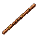
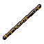
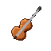
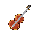
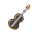
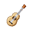
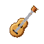
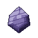
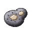

# Musician

The Musician writes **scores** at the **Music Stand** and plays them on an instrument for their crew. A tune gives every crewmate within reach a buff that lasts 20 minutes or more: speed, faster work, healing, attack, armour, luck, more XP or more Doriki. It is the one trade whose recipes already run to **level 100**.

| | |
|---|---|
| Workstation | { .block-mini }**Music Stand** |
| How it is made | crafting table, no level: Paper, a Note Block, Sticks |
| Instruments | made by the [Inventor](inventor.md) at the Workshop |
| Levels | 1 to 100; scores up to level 100 |
| XP | writing scores (10 + 2 × the recipe's level) and playing them |

## The Music Stand

You build the Music Stand at an ordinary crafting table. Anyone can build one:

| Top | Middle | Bottom |
|---|---|---|
| Paper, Note Block, Paper | —, Stick, — | Stick, —, Stick |

It faces you when you place it.

## Writing scores

Every score takes **2 Paper**, plus the tune's own ingredient (listed under [The eleven tunes](#the-eleven-tunes)):

| Tier | Ink | Tune's ingredient | Extra |
|---|---|---|---|
| I | an Ink Sac | 1 | — |
| II | an Ink Sac | 2 | 2 Gold Nuggets |
| III | a Glow Ink Sac | 3 | a Gold Ingot and a Diamond Fragment |

Scores stack to 16; tier II scores are uncommon, and tier III scores are rare and shine.

## Playing a tune

1. **Carry an instrument.** You do not need to hold it: the **best instrument anywhere in your inventory** plays. "Best" means the one that reaches furthest, then the one whose tune lasts longest.

    | Instrument | Tune reaches | Tune lasts | Uses |
    |---|---|---|---|
    | { .item-icon }Bamboo Flute | 8 blocks | 20 minutes | 32 |
    | { .item-icon }Fine Bamboo Flute | 10 blocks | 25 minutes | 48 |
    | { .item-icon }Master's Bamboo Flute | 12 blocks | 30 minutes | 64 |
    | { .item-icon }Violin | 12 blocks | 25 minutes | 64 |
    | { .item-icon }Fine Violin | 15 blocks | 30 minutes | 96 |
    | { .item-icon }Master's Violin | 18 blocks | 35 minutes | 128 |
    | { .item-icon }Guitar | 16 blocks | 30 minutes | 128 |
    | { .item-icon }Fine Guitar | 20 blocks | 35 minutes | 192 |
    | { .item-icon }Master's Guitar | 24 blocks | 40 minutes | 256 |

    The Fine and Master's ones are the [Inventor](inventor.md#for-the-musician)'s improvements of the plain ones: gilded, the Master's in black lacquer. Seated at a [grand piano](#the-grand-piano), you play the piano instead, whatever you carry.

2. **Hold use with the score in hand.** You play for **3 seconds**, standing. Notes rise around you and the instrument sounds the tune's motif.
3. When the tune ends:
    - **you and every member of your crew within reach** get the tune's buff for the instrument's duration. "Crew" means your Mine Mine no Mi pirate crew: nobody outside it gets anything, however close, and a player with no crew plays for themselves alone;
    - the **score is used up**;
    - the **instrument loses one use**.

Your crewmates see "&lt;you&gt; plays &lt;tune&gt; for the crew".

To play, you need:

- to practise the Musician trade ("Only a Musician can play a score" in Crew mode);
- a Musician level at least the score's level ("This tune takes a Musician of level N");
- an instrument ("You need an instrument to play it").

**One tune at a time.** A new tune replaces the last. Tunes are separate from meal buffs and remedies, so a tune stays alongside a [Cook](cook.md)'s Appetite.

## The grand piano

The [Inventor](inventor.md#for-the-musician) builds the **Grand Piano** (level 40), then a **Fine** one (level 70) and a **Master's** one (level 100). It carries further and lasts longer than anything you can carry:

| Piano | Tune reaches | Tune lasts |
|---|---|---|
| { .item-icon }Grand Piano | 20 blocks | 35 minutes |
| { .item-icon }Fine Grand Piano | 30 blocks | 45 minutes |
| { .item-icon }Master's Grand Piano | 40 blocks | 60 minutes |

- **Placing it**: it takes **2 × 4 blocks**, its stool included, and they must all be free. The block you aim at becomes the left half of the stool; the keys, the body and the tail run away from you.
- **Playing it**: right-click the piano to **sit down** at it, then use a score as usual. Only one player sits at a piano at a time ("Someone is already playing this piano").
- A piano is **never worn out**: it has no uses to lose.
- Break any part of it and the whole piano comes back as one item.

Like any instrument, the piano plays for **you and your crew within reach**: set it on your ship's deck, and the crew aboard hears it.

## The tiers

Every tune has three tiers, each its own score. The buff shows as I, II or III.

| Tier | Musician level | Strength |
|---|---|---|
| I | the tune's level | ×0.5 |
| II | 30 levels later | ×1 |
| III | 60 levels later (at most level 100) | ×2 |

## The eleven tunes

| Tune | Kind | Levels (I / II / III) | Ingredient | Effect (I / II / III) |
|---|---|---|---|---|
| { .item-icon }Swift Shanty | Movement | 1 / 31 / 61 | Sugar | **+5 / +10 / +20 % speed** |
| Work Song | Work | 5 / 35 / 65 | Iron Scrap | **breaks blocks 10 / 20 / 40 % faster** |
| Lullaby of Mending | Healing | 10 / 40 / 70 | Medicinal Herb | **heals half a heart every 12 / 6 / 3 seconds** |
| Sea Shanty | Movement | 15 / 45 / 75 | Forked-Tail Killifish | **+25 / +50 / +100 % swimming speed** |
| Battle March | Combat | 20 / 50 / 80 | Flame Powder | **+1 / +2 / +4 attack damage** |
| Lucky Tune | Work | 25 / 55 / 85 | Rabbit's Foot | **+0.5 / +1 / +2 luck** (better vanilla fishing loot and chest loot) |
| Iron Chorus | Combat | 30 / 60 / 90 | Pure Iron Ore | **+1.5 / +3 / +6 armour** and **+0.5 / +1 / +2 armour toughness** |
| Leaping Jig | Movement | 35 / 65 / 95 | Tree Frog | **jumps higher** (+0.05 / +0.1 / +0.2 jump boost) and **1.5 / 3 / 6 blocks of a fall forgiven** |
| Heartening Ballad | Healing | 40 / 70 / 100 | Golden Fruit | **Absorption equal to 20 / 30 / 40 % of your max health** when you hear it; it is gone once used up or when the tune ends |
| Craftsman's Song | Work | 45 / 75 / 100 | Mysterious Parts | **+5 / +10 / +20 % XP in every trade**; it adds up with a meal's Appetite |
| Hymn of Resolve | Combat | 50 / 80 / 100 | Sea King Scale | **+5 / +10 / +20 % Doriki from fights**; it adds up with a dish's Fighting Spirit |

## The lost tunes

Four more tunes are **not learned by level**. Their recipe has to be **found** first: a **Score Recipe**, read once (right-click) by anyone who practises the Musician trade, teaches it for good. Until then, the profession page shows the tune as "Find its recipe", and the Music Stand refuses it.

| Tune | Musician level | Ingredients (with 2 Paper and an Ink Sac) | Effect |
|---|---|---|---|
| { .item-icon }Moonlight Serenade | 10 | 2 Glowstone Dust | **night vision** |
| { .item-icon }Laboon's Song | 20 | a Sea King Scale | **breathe under water** |
| { .item-icon }Binks' Sake | 40 | 2 Ancient Rice | **harmful effects wear off twice as fast** |
| { .item-icon }Drums of Liberation | 60 | 2 Leather and a Gold Ingot | **+15 % attack speed** and **+50 % knockback resistance** |

A lost tune has **one tier only**: its score shines like a tier III one, and its effect lasts and reaches as far as the instrument says.

**Where the Score Recipes are found** (the rarer the tune, the rarer its recipe: out of 10 recipes, 4 Moonlight Serenades, 3 Laboon's Songs, 2 Binks' Sakes, 1 Drums of Liberation):

- **Chests**: 8 % of shipwreck supply and treasure chests, underwater ruins, buried treasure, dungeons, village cartographers' and woodland mansions' chests; **25 %** of Mine Mine no Mi's richest chests (the large pirate ship's treasure, the medium pirate ship's captain, the Marine battleship's treasure, the Marine bases' captains, the bandit fort's secret stash, the ghost ship's captain, the caravans).
- **Merchants' stalls**: 8 % of the travelling merchants' stalls, **35 %** of the Ship Merchant's ([Events at sea](../events-at-sea.md#the-ship-merchant)). Prices: 800, 1 500, 4 000 and 9 000 Belly.
- **Contracts**: 4 % of public contracts, 10 % of the contract kept for Merchants; the Ship Merchant's big orders bring one 30 % of the time (50 % for the Merchant's).

## Musician XP

You earn XP two ways:

- **Writing scores** at the Music Stand: each score pays 10 + 2 × its level (see [The recipes](#the-recipes)).
- **Playing**: each performance pays **10 + the score's level + 10 for each crewmate who heard it** (up to 8 crewmates).
- **On the stage of a [concert](../village-events.md#a-concert-on-the-square)**: the tune is for every player within reach, the villagers who came to listen count as listeners (up to 16), and the performance pays **twice** that.

## Level perks

| Level | Perk | What it does |
|---|---|---|
| 10 | "Encore: a score is not always used up when you play it" | 20 % of the time, the score is **not used up** |
| 25 | "Resonance: your tunes carry half as far again" | your tunes **reach 1.5× as far** (Flute 12, Violin 18, Guitar 24 blocks) |
| 40 | "Long notes: your tunes last half as long again" | your tunes **last 1.5× as long** (Flute 30 minutes, Violin 37:30, Guitar 45 minutes) |

## The recipes

Every score, with the Musician level that unlocks it and the XP it pays:

| Makes | Level | XP | Ingredients |
|---|---|---|---|
| { .item-icon }Swift Shanty Score I | 1 | 12 | 2 × Paper, Ink Sac, Sugar |
| { .item-icon }Work Song Score I | 5 | 20 | 2 × Paper, Ink Sac, { .item-icon }Iron Scrap |
| { .item-icon }Lullaby of Mending Score I | 10 | 30 | 2 × Paper, Ink Sac, { .item-icon }Medicinal Herb |
| { .item-icon }Moonlight Serenade Score (recipe to find) | 10 | 30 | 2 × Paper, Ink Sac, 2 × Glowstone Dust |
| { .item-icon }Sea Shanty Score I | 15 | 40 | 2 × Paper, Ink Sac, { .item-icon }Forked-Tail Killifish |
| { .item-icon }Battle March Score I | 20 | 50 | 2 × Paper, Ink Sac, { .item-icon }Flame Powder |
| { .item-icon }Laboon's Song Score (recipe to find) | 20 | 50 | 2 × Paper, Ink Sac, { .item-icon }Sea King Scale |
| { .item-icon }Lucky Tune Score I | 25 | 60 | 2 × Paper, Ink Sac, Rabbit's Foot |
| { .item-icon }Iron Chorus Score I | 30 | 70 | 2 × Paper, Ink Sac, { .item-icon }Pure Iron Ore |
| { .item-icon }Swift Shanty Score II | 31 | 72 | 2 × Paper, Ink Sac, 2 × Sugar, 2 × Gold Nugget |
| { .item-icon }Leaping Jig Score I | 35 | 80 | 2 × Paper, Ink Sac, { .item-icon }Tree Frog |
| { .item-icon }Work Song Score II | 35 | 80 | 2 × Paper, Ink Sac, 2 × { .item-icon }Iron Scrap, 2 × Gold Nugget |
| { .item-icon }Binks' Sake Score (recipe to find) | 40 | 90 | 2 × Paper, Ink Sac, 2 × { .item-icon }Ancient Rice |
| { .item-icon }Heartening Ballad Score I | 40 | 90 | 2 × Paper, Ink Sac, { .item-icon }Golden Fruit |
| { .item-icon }Lullaby of Mending Score II | 40 | 90 | 2 × Paper, Ink Sac, 2 × { .item-icon }Medicinal Herb, 2 × Gold Nugget |
| { .item-icon }Craftsman's Song Score I | 45 | 100 | 2 × Paper, Ink Sac, { .item-icon }Mysterious Parts |
| { .item-icon }Sea Shanty Score II | 45 | 100 | 2 × Paper, Ink Sac, 2 × { .item-icon }Forked-Tail Killifish, 2 × Gold Nugget |
| { .item-icon }Battle March Score II | 50 | 110 | 2 × Paper, Ink Sac, 2 × { .item-icon }Flame Powder, 2 × Gold Nugget |
| { .item-icon }Hymn of Resolve Score I | 50 | 110 | 2 × Paper, Ink Sac, { .item-icon }Sea King Scale |
| { .item-icon }Lucky Tune Score II | 55 | 120 | 2 × Paper, Ink Sac, 2 × Rabbit's Foot, 2 × Gold Nugget |
| { .item-icon }Drums of Liberation Score (recipe to find) | 60 | 130 | 2 × Paper, Ink Sac, 2 × Leather, Gold Ingot |
| { .item-icon }Iron Chorus Score II | 60 | 130 | 2 × Paper, Ink Sac, 2 × { .item-icon }Pure Iron Ore, 2 × Gold Nugget |
| { .item-icon }Swift Shanty Score III | 61 | 132 | 2 × Paper, Glow Ink Sac, 3 × Sugar, Gold Ingot, { .item-icon }Diamond Fragment |
| { .item-icon }Leaping Jig Score II | 65 | 140 | 2 × Paper, Ink Sac, 2 × { .item-icon }Tree Frog, 2 × Gold Nugget |
| { .item-icon }Work Song Score III | 65 | 140 | 2 × Paper, Glow Ink Sac, 3 × { .item-icon }Iron Scrap, Gold Ingot, { .item-icon }Diamond Fragment |
| { .item-icon }Heartening Ballad Score II | 70 | 150 | 2 × Paper, Ink Sac, 2 × { .item-icon }Golden Fruit, 2 × Gold Nugget |
| { .item-icon }Lullaby of Mending Score III | 70 | 150 | 2 × Paper, Glow Ink Sac, 3 × { .item-icon }Medicinal Herb, Gold Ingot, { .item-icon }Diamond Fragment |
| { .item-icon }Craftsman's Song Score II | 75 | 160 | 2 × Paper, Ink Sac, 2 × { .item-icon }Mysterious Parts, 2 × Gold Nugget |
| { .item-icon }Sea Shanty Score III | 75 | 160 | 2 × Paper, Glow Ink Sac, 3 × { .item-icon }Forked-Tail Killifish, Gold Ingot, { .item-icon }Diamond Fragment |
| { .item-icon }Battle March Score III | 80 | 170 | 2 × Paper, Glow Ink Sac, 3 × { .item-icon }Flame Powder, Gold Ingot, { .item-icon }Diamond Fragment |
| { .item-icon }Hymn of Resolve Score II | 80 | 170 | 2 × Paper, Ink Sac, 2 × { .item-icon }Sea King Scale, 2 × Gold Nugget |
| { .item-icon }Lucky Tune Score III | 85 | 180 | 2 × Paper, Glow Ink Sac, 3 × Rabbit's Foot, Gold Ingot, { .item-icon }Diamond Fragment |
| { .item-icon }Iron Chorus Score III | 90 | 190 | 2 × Paper, Glow Ink Sac, 3 × { .item-icon }Pure Iron Ore, Gold Ingot, { .item-icon }Diamond Fragment |
| { .item-icon }Leaping Jig Score III | 95 | 200 | 2 × Paper, Glow Ink Sac, 3 × { .item-icon }Tree Frog, Gold Ingot, { .item-icon }Diamond Fragment |
| { .item-icon }Craftsman's Song Score III | 100 | 210 | 2 × Paper, Glow Ink Sac, 3 × { .item-icon }Mysterious Parts, Gold Ingot, { .item-icon }Diamond Fragment |
| { .item-icon }Heartening Ballad Score III | 100 | 210 | 2 × Paper, Glow Ink Sac, 3 × { .item-icon }Golden Fruit, Gold Ingot, { .item-icon }Diamond Fragment |
| { .item-icon }Hymn of Resolve Score III | 100 | 210 | 2 × Paper, Glow Ink Sac, 3 × { .item-icon }Sea King Scale, Gold Ingot, { .item-icon }Diamond Fragment |

## Advancements

The **Music** tab ("Play for your crew: become a Musician") holds **Apprentice Musician** (Musician level 5), **First Performance** (play a tune) and one challenge, **Full House** (play a tune for three of your crew or more).
