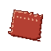

# Tailor

The Tailor sews Mine Mine no Mi's clothing at the **Sewing Table**: hats, capes, masks, glasses and the characters' outfits, which the base mod ships but never lets players make. The Tailor also sews the [Carpenter](carpenter.md)'s boat sails, and makes two materials of their own.

| | |
|---|---|
| Workstation | { .item-icon }**Sewing Table** |
| How it is made | String, any Wool, Shears on top; 3 planks in the middle; plank, empty, plank at the bottom |
| Recipes | 103 |
| Levels | 1 to 100; new recipes up to level 50 |

Every recipe asks for a Tailor level and pays Tailor XP: 12 XP at level 1, rising to 110 at level 50.

## What the Sewing Table makes

- **The Tailor's own materials:**
    - { .item-icon }**Scrap of Cloak** (level 1: 2 wool and 1 String give 2).
    - { .item-icon }**Mask Fragment** (level 14: 3 Clay Balls and 1 Yellow Dye).
    - They go into the Bandana (level 1) and the Sogeking Mask (level 29).
- **Boat sails** for the Carpenter's boats: the Boat Sail (12), the Fine Sail (28) and the Master's Sail (44). Each better sail is sewn from the one before. See [Boats](../boats.md).
- **Base-mod items taken from the crafting table**: the Flag (1), the Umbrella (4) and the Medic Bag (8). See the takeover on the [Blacksmith](blacksmith.md) page.
- **Uniforms and headwear**: pirate and Marine uniforms (3 and 4), the Tricorne (6), Sniper Goggles (10), the Wizard Hat (12), the Plume Hat (15), the Bicorne (18), the Wide Brim Hat (20), the Pirate and Marine Captain Capes (22), the MH5 Gas Mask (24), the CP9 outfit (38), the Vice Admiral outfit (45) and the Fleet Admiral's Hat (50).
- **The Straw Hat crew**: the Straw Hat (2), Luffy's (7), Zoro's (8), Usopp's (9) and Sanji's (11) outfits, the two Chopper's Hats (26 and 27), the Sogeking Mask (29), Franky's Glasses and Shirt (34) and the Soul King Crown (41).
- **Other characters' outfits and accessories**, from level 13 up: Kuro, Kuroobi, Arlong, Smoker, Mr 1, Mr 3 and Mr 5, Crocodile, Ace and Sabo's hats, Kizaru, Law, Senor Pink, Killer, Kuma, Doflamingo, Mihawk and more.

The recipes are spread evenly up to level 50 (24 at levels 1–10, 22 at 11–20, 23 at 21–30, 19 at 31–40, 15 at 41–50).

### Ingredients from the other trades

Besides wool of many colours, string and leather, the recipes call on the whole crew:

- the [Hunter](hunter.md)'s catches: hides (lizards, frogs, the A-Class Toad, the Mole), wings (butterflies, moths, the Flying Penguin), fireflies, the Rock Lizard;
- the [Fisher](fisher.md)'s fish (Forked-Tail Killifish, Shark, Missile Manta Ray) and Sea King Scales and Fins;
- the [Farmer](farmer.md)'s Ancient Rice and Medicinal Herb;
- the [Miner](miner.md)'s Pure Iron Ore, Diamond Fragments and Explosive Rock Fragments;
- Iron Scrap, Mysterious Parts, and powders such as Thunder Powder and Flame Powder;
- Mine Mine no Mi's Cola, and a Seagull for the Fleet Admiral's Hat.

These are all the Sewing Table's recipes:

| Makes | Level | XP | Ingredients |
|---|---|---|---|
| Bandana | 1 | 12 | 2 × { .item-icon }Scrap of Cloak, String |
| Flag | 1 | 12 | 3 × Stick, 4 × any wool |
| { .item-icon }Scrap of Cloak ×2 | 1 | 12 | 2 × any wool, String |
| Straw Hat | 2 | 14 | 6 × { .item-icon }Ancient Rice, Red Wool, String |
| Pirate Boots | 3 | 16 | 2 × Leather, any hides |
| Pirate Pants | 3 | 16 | 4 × Black Wool, String |
| Pirate Shirt | 3 | 16 | 3 × Red Wool, 2 × White Wool, String |
| Marine Boots | 4 | 18 | 2 × Leather, Black Dye |
| Marine Hat | 4 | 18 | 3 × White Wool, Blue Wool |
| Marine Pants | 4 | 18 | 4 × Blue Wool, String |
| Marine Shirt | 4 | 18 | 4 × White Wool, Blue Wool, String |
| Umbrella | 4 | 18 | 3 × any wool, 2 × Stick |
| Tricorne | 6 | 22 | 3 × Black Wool, any hides, Leather, Gold Nugget |
| Luffy's Pants | 7 | 24 | 4 × Blue Wool, White Wool |
| Luffy's Sandals | 7 | 24 | 2 × { .item-icon }Ancient Rice, String |
| Luffy's Shirt | 7 | 24 | 5 × Red Wool, Gold Nugget |
| Medic Bag | 8 | 26 | 2 × String, 5 × Leather, Lapis Lazuli |
| Zoro's Boots | 8 | 26 | 2 × Leather, any hides |
| Zoro's Pants | 8 | 26 | 4 × Black Wool, 2 × Green Wool |
| Zoro's Shirt | 8 | 26 | 5 × White Wool, String |
| Usopp's Boots | 9 | 28 | 2 × Leather, any hides, String |
| Usopp's Overall | 9 | 28 | 5 × Brown Wool, String, Gold Nugget |
| Usopp's Pants | 9 | 28 | 4 × Brown Wool, String, any hides |
| Sniper Goggles | 10 | 30 | 2 × any hides, 2 × Glass Pane, Iron Ingot, String |
| Sanji's Pants | 11 | 32 | 4 × Black Wool, String |
| Sanji's Shirt | 11 | 32 | 4 × Blue Wool, White Wool, String |
| Sanji's Shoes | 11 | 32 | 2 × Leather, Black Dye, { .item-icon }Pure Iron Ore |
| { .item-icon }Boat Sail | 12 | 34 | 4 × White Wool, 2 × String, 2 × Stick, any planks |
| Wizard Hat | 12 | 34 | 4 × Purple Wool, { .item-icon }Thunder Powder, Gold Nugget, String |
| Cabaji's Scarf | 13 | 36 | 3 × Blue Wool, 2 × White Wool, String |
| Kuro's Glasses | 14 | 38 | 2 × Glass Pane, 2 × Iron Nugget |
| Kuro's Pants | 14 | 38 | 4 × Black Wool, String |
| Kuro's Shoes | 14 | 38 | 2 × Black Wool, any hides |
| Kuro's Suit | 14 | 38 | 5 × Black Wool, White Wool, Gold Nugget |
| { .item-icon }Mask Fragment | 14 | 38 | 3 × Clay Ball, Yellow Dye |
| Plume Hat | 15 | 40 | 3 × any wool, 2 × any wings, Feather, Leather, Gold Nugget |
| Big Red Nose | 16 | 42 | 2 × Red Dye, 2 × Slimeball, Clay Ball |
| Chew's Pants | 17 | 44 | 4 × any wool, String |
| Chew's Shirt | 17 | 44 | 4 × any wool, { .item-icon }Forked-Tail Killifish, String |
| Chew's Shoes | 17 | 44 | 2 × any hides, String |
| Bicorne | 18 | 46 | 4 × Black Wool, 2 × Leather, 2 × Gold Ingot, any wings |
| Heart Glasses | 19 | 48 | 2 × Glass Pane, 2 × Red Dye, { .item-icon }Pure Iron Ore, Gold Nugget |
| Kuroobi's Ki | 19 | 48 | 5 × White Wool, Black Wool |
| Kuroobi's Pants | 19 | 48 | 4 × Black Wool, { .item-icon }Missile Manta Ray |
| Kuroobi's Shoes | 19 | 48 | 2 × Leather, any hides |
| Wide Brim Hat | 20 | 50 | 4 × any wool, 2 × any hides, String |
| Arlong's Hat | 21 | 52 | 3 × Black Wool, Gold Nugget |
| Arlong's Pants | 21 | 52 | 4 × Black Wool, String |
| Arlong's Shirt | 21 | 52 | 4 × White Wool, { .item-icon }Shark, String |
| Arlong's Shoes | 21 | 52 | 2 × Leather, { .item-icon }Sea King Scale |
| Marine Captain Cape | 22 | 54 | 5 × White Wool, 2 × Blue Wool, 2 × Gold Ingot |
| Pirate Captain Cape | 22 | 54 | 5 × Black Wool, 2 × Red Wool, 2 × Gold Ingot |
| Smoker Boots | 23 | 56 | 2 × Leather, any hides |
| Smoker Jacket | 23 | 56 | 5 × White Wool, any hides, Charcoal |
| Smoker Pants | 23 | 56 | 4 × Blue Wool, String |
| MH5 Gas Mask | 24 | 58 | 2 × Leather, 2 × Glass Pane, 2 × Iron Ingot, Charcoal, Yellow Dye, { .item-icon }Iron Scrap |
| Mr 5's Glasses | 24 | 58 | 2 × Glass Pane, Iron Nugget, Gunpowder |
| Mr 5's Pants | 24 | 58 | 4 × any wool, String |
| Mr 5's Shirt | 24 | 58 | 4 × any wool, Gunpowder |
| Mr 5's Shoes | 24 | 58 | 2 × Leather, { .item-icon }Explosive Rock Fragment |
| Chopper's Hat | 26 | 62 | 4 × Pink Wool, White Wool, Red Dye, { .item-icon }Medicinal Herb |
| Chopper's Hat | 27 | 64 | 4 × Blue Wool, White Wool, Red Dye, { .item-icon }Medicinal Herb |
| { .item-icon }Fine Sail | 28 | 66 | { .item-icon }Boat Sail, 3 × White Wool, 2 × any wings, 2 × String |
| Mr 3's Glasses | 28 | 66 | 2 × Glass Pane, Honeycomb, Gold Nugget |
| Mr 3's Pants | 28 | 66 | 4 × any wool, Honeycomb |
| Mr 3's Shirt | 28 | 66 | 4 × any wool, Honeycomb, { .item-icon }Nectar |
| Mr 3's Shoes | 28 | 66 | 2 × Leather, Honeycomb |
| Sogeking Mask | 29 | 68 | 5 × Clay Ball, 3 × { .item-icon }Scrap of Cloak, { .item-icon }Mask Fragment |
| Blugori Hood | 30 | 70 | 3 × Brown Wool, 2 × any hides, String |
| Fluffy Cape | 31 | 72 | 4 × White Wool, 2 × { .item-icon }Mole, 2 × String, Gold Ingot |
| Mr 1's Pants | 32 | 74 | 4 × any wool, { .item-icon }Pure Iron Ore |
| Mr 1's Shirt | 32 | 74 | 4 × any wool, 2 × { .item-icon }Pure Iron Ore |
| Mr 1's Shoes | 32 | 74 | 2 × Leather, { .item-icon }Pure Iron Ore |
| Ace's Hat | 33 | 76 | 3 × Orange Wool, 2 × Leather, Red Dye, Blue Dye, Gold Nugget, { .item-icon }Flame Powder |
| Franky's Glasses | 34 | 78 | 2 × Glass Pane, 2 × { .item-icon }Iron Scrap |
| Franky's Shirt | 34 | 78 | 4 × any wool, Cola, { .item-icon }Iron Scrap, { .item-icon }Mysterious Parts |
| Sabo's Hat | 35 | 80 | 4 × Black Wool, any hides, 2 × Glass Pane, Blue Dye, Gold Ingot |
| Crocodile's Pants | 36 | 82 | 4 × Black Wool, any hides |
| Crocodile's Shoes | 36 | 82 | 2 × { .item-icon }Rock Lizard, Gold Nugget |
| Crocodile's Suit | 36 | 82 | 4 × Black Wool, 2 × { .item-icon }Rock Lizard, { .item-icon }Mole, Gold Ingot |
| Kizaru's Glasses | 37 | 84 | 2 × Glass Pane, Orange Dye, 2 × Gold Ingot, 2 × any fireflies |
| CP9 Boots | 38 | 86 | 2 × Leather, Black Dye, { .item-icon }Pure Iron Ore |
| CP9 Jacket | 38 | 86 | 5 × Black Wool, White Wool, Gold Nugget |
| CP9 Pants | 38 | 86 | 4 × Black Wool, String |
| Law's Hat | 39 | 88 | 4 × White Wool, 2 × Black Dye, 2 × { .item-icon }Mole |
| Senor Pink's Bonnet | 40 | 90 | 3 × Pink Wool, White Wool |
| Senor Pink's Diaper | 40 | 90 | 3 × White Wool, String |
| Senor Pink's Shirt | 40 | 90 | 5 × Pink Wool, White Wool, Rabbit Hide |
| Killer's Mask | 41 | 92 | 3 × { .item-icon }Pure Iron Ore, 2 × { .item-icon }Iron Scrap, Blue Dye, White Dye, Leather |
| Soul King Crown | 41 | 92 | 3 × Gold Ingot, { .item-icon }Diamond Fragment, Red Dye |
| Kuma Boots | 42 | 94 | 2 × Leather, { .item-icon }Mysterious Parts |
| Kuma Pants | 42 | 94 | 4 × Black Wool, any hides |
| Kuma Shirt | 42 | 94 | 4 × Black Wool, White Wool, { .item-icon }Diamond Fragment |
| Bastille Mask | 43 | 96 | { .item-icon }Shark, { .item-icon }Sea King Fin, 2 × Iron Ingot, 2 × Leather, Gray Dye |
| { .item-icon }Master's Sail | 44 | 98 | { .item-icon }Fine Sail, 2 × White Wool, 2 × { .item-icon }Sea King Scale, Gold Ingot, 2 × String |
| Who's Who Mask | 44 | 98 | 3 × any hides, 2 × Black Dye, 2 × Gold Ingot, { .item-icon }Diamond Fragment |
| Vice Admiral Boots | 45 | 100 | 2 × Leather, any hides, Gold Nugget |
| Vice Admiral Jacket | 45 | 100 | 5 × White Wool, 2 × Gold Ingot, { .item-icon }Diamond Fragment |
| Vice Admiral Pants | 45 | 100 | 4 × White Wool, Blue Wool |
| White Walkie Coat | 46 | 102 | 6 × White Wool, 2 × Leather, { .item-icon }Diamond Fragment |
| Doflamingo's Glasses | 47 | 104 | 2 × Glass Pane, Red Dye, 2 × Gold Ingot, 2 × { .item-icon }Diamond Fragment |
| Mihawk's Hat | 48 | 106 | 4 × Black Wool, 2 × Feather, any wings, Gold Ingot, { .item-icon }Diamond Fragment |
| Fleet Admiral's Hat | 50 | 110 | 4 × White Wool, { .item-icon }Seagull, 2 × Gold Ingot, Diamond, Blue Wool |

## Level perks

| Level | Perk | What it does |
|---|---|---|
| 10 | "Double stitch: 10% of your work comes off the table twice" | 10 % chance a piece comes out twice: "A second piece off the table: …" |
| 25 | "Sturdy seams: what you sew comes with Unbreaking I" | for items that have durability and no Unbreaking yet |
| 30 | "Master's cut: what you sew is a master's work, signed" | armour pieces you sew get +1 Armor and +0.5 Armor Toughness when worn, and read "Master's work" and "Sewn by" your name |
| 40 | "Offcuts: a quarter of your work gives an ingredient back" | 25 % chance one ingredient (never a tool) comes back: "Saved from the offcuts: …" |

The Umbrella, Medic Bag and Flag are made only here while the server's **takeOverBaseRecipes** setting is on (the default); see [Configuration](../configuration.md).

## Advancements

The **Tailoring** tab opens when you become a Tailor: Apprentice Tailor (level 5), King of Snipers (sew the Sogeking Mask) and the challenge **Fleet Admiral** (sew the Fleet Admiral's Hat).
