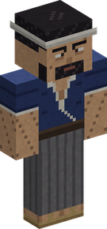

# Village events

Now and then something happens in a [village](villages.md) near you. Three **events** come to a village's market square, and a fourth to its port; they stay for a while and go:

| Event | How often | How long | What it brings |
|---|---|---|---|
| [A concert on the square](#a-concert-on-the-square) | every 5 to 8 days | 1 day | a stage where a tune is worth twice its XP, and two lost tunes' score recipes for sale |
| [A fever in the village](#a-fever-in-the-village) | every 7 to 10 days | 1 day | remedies to bring, paid in Belly and Chemist XP, and 20 % off the village's stalls |
| [A swordsmith from Wano](#a-swordsmith-from-wano) | every 8 to 12 days | 2 days | the base mod's named blades, forged on commission |
| [A fishing tournament](#a-fishing-tournament) | every 6 to 9 days | 1 day | medals for the biggest catch of the day, paid in Belly and Fisher XP, and a trophy |

The three visitors of the square, in 3D (drag to turn, scroll or pinch to zoom):

Days are in-game days (one day = 20 real minutes), and the wait between two events of a kind is drawn anew each time. Each event can be turned off, or made to come more or less often, in the [configuration](configuration.md#village-events).

They are told like the [events out in the world](events-at-sea.md#how-you-hear-of-them): in the chat, with the village's name and its coordinates, as rumours sold by Mine Mine no Mi's barkeepers, and on the villages' notice boards: see [The news on the notice board](#the-news-on-the-notice-board). The barkeepers' rumours and the boards tell of every event, those of the villages and those [out in the world](events-at-sea.md) alike. One square holds one event at a time, and no event comes to a dead village. The fishing tournament is held on the quay: the square's events do not stand in its way.

## A concert on the square

<figure markdown>

<figcaption>The Travelling Musician, at his guitar</figcaption>
</figure>

A small stage goes up on the market square for a day, and a **Travelling Musician** comes with it. He opens the concert and plays between two rests; the villagers gather before the stage to listen.

**Step onto the stage and he leaves it to you.** A tune played there:

- is for **every player within reach**, whatever their crew;
- counts the **villagers** who came to listen as your audience, up to **sixteen listeners**;
- is worth **twice its Musician XP**.

At his stall the travelling musician sells **two of the lost tunes' score recipes**, for 800 to 9,000 Belly. With a score in your hand, a right click on a villager plays the score instead of starting a chat.

See the [Musician](trades/musician.md) for the tunes, the instruments and the XP of a performance.

## A fever in the village

<figure markdown>

<figcaption>The Village Doctor</figcaption>
</figure>

The people of a village fall ill for a day. **A third of the adults** have it: some keep to their beds, the others drag themselves about. A doctor, the **Village Doctor**, sets up on the square, by the notice board.

Right click him to see his list: **three everyday remedies** of the [Chemist](trades/chemist.md)'s, a few of each, among

- Healing Candy,
- Dual-Action Tonic,
- Healing Tonic,
- Stamina Tonic,
- Antidote Powder.

Anyone may bring a part of the list, and every remedy is paid in **Belly** and in **Chemist XP** (the XP if you practise the trade).

When the list is filled the village is **cured**, and for **three days** its merchants take **20 % off their stalls** for everyone who brought something. A Merchant keeps the better of this and his own Bargain, not both.

If nobody helps, the fever passes on its own at the end of the day: nobody dies of it.

## A swordsmith from Wano

<figure markdown>

<figcaption>The Swordsmith from Wano</figcaption>
</figure>

A travelling swordsmith, the **Swordsmith from Wano**, stops for two days on the square, by the notice board. Right click him to see his **commissions**: four of the base mod's named blades each visit, which until now only the luck of a trader gave.

| Blade | Made from | Materials | Price |
|---|---|---|---|
| Sandai Kitetsu, Kikoku | a **Katana** forged by a Blacksmith | 4 Pure Iron Ore, 2 Diamond Fragments | 10,000 Belly |
| Durandal | a **Broadsword** forged by a Blacksmith | 4 Pure Iron Ore, 2 Diamond Fragments | 10,000 Belly |
| Wado Ichimonji, Nidai Kitetsu, Shusui, Enma, Ame no Habakiri (Great Grade) | a **Warabide Sword** forged by a Blacksmith | 6 Pure Iron Ore, 4 Diamond Fragments, 2 Dense Kairoseki | 20,000 Belly |

Each visit he offers two of the first three and two of the Great Grade.

- The blade you bring must have been **made at the Forge**: it carries its smith's name ("Forged by ..."). A blade bought from a trader, or forged before 0.3.0, carries no name and he does not take it.
- The blade is ready **six in-game hours** later. If he has left by then, the next swordsmith hands it over, in any village.
- What the [Blacksmith](trades/blacksmith.md)'s own skill had put on his blade passes to the new one.
- One order at a time for each player.

## A fishing tournament

A **Tournament Judge** sets up for a day on the quay of a village that has a port, on the sea or on a river, within 800 blocks of a player. The chat and the barkeepers' rumours say where, and name **the catch of the day**:

> *A fishing tournament is held at the port of &lt;village&gt;, near 1200, -340. The biggest &lt;fish&gt; landed today takes the trophy: the judge is on the quay until tomorrow.*

| | |
|---|---|
| How often | every 6 to 9 days |
| How long | 1 day |
| Where | the quay of a village with a port, within 800 blocks of a player |
| Settings | [`fishingTournament`](configuration.md#village-events) |

**The catch of the day** is something that bites in that village's waters, near the surface. It is never harder to land than your [Fisher](trades/fisher.md)'s level allows, and never asks for more than level 20. It is never the fish of a [school](events-at-sea.md#a-school-of-fish) that is passing.

Fish where you like while the tournament runs, then bring your best one to the judge: **right click him with it in your hand**. He measures it against what its kind can reach:

| Medal | The catch reaches | It pays |
|---|---|---|
| Gold | nine tenths of the way up its kind's range of sizes | 10 times its worth, in Belly and in Fisher XP |
| Silver | three quarters | 6 times |
| Bronze | six tenths | 3 times |

- His window gives the sizes in **centimetres**, tells what the catch in your hand would take, and shows the biggest catch measured so far.
- He **hands the catch back** and pays at once.
- **Only a catch you landed yourself since the tournament began counts**: its tooltip says so.
- **One weigh-in** for each angler: pick your best.
- The Fisher XP is for those who practise the trade; the medal and its Belly are for anyone.
- The gold gives a title: **Golden Hook**.

### The Fishing Trophy

When the day ends, **the biggest catch measured** takes the trophy, if it reached **silver at least**; of two as big, the first measured. The **Fishing Trophy** is the fish itself mounted on a plaque, with its size, your name, the village and the day.

It is handed to you wherever you are, at your next coming if you are away. Hang it on a wall.

## The news on the notice board

A village's [notice board](villages.md#the-notice-board) has two notes: the day's orders, and the **news**.

- The news tells of **every event running within 2,000 blocks** of the board, those of the villages and those [out in the world](events-at-sea.md), as a barkeeper would tell it.
- Each piece of news says **how long the event still lasts**: more than a day, about so many hours, or less than an hour.
- A ship at anchor gives its coordinates; a school of fish, a fallen star, a migration, a storm or the fog give a way and a distance, as their announcements do.
- It costs nothing: you only have to come and read.

The barkeepers' rumours (1,000 Belly) tell of the same events, one at a time: the nearest to the barkeeper.
