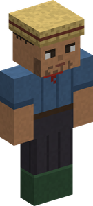
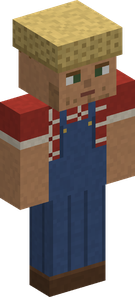
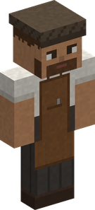
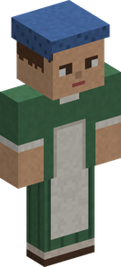
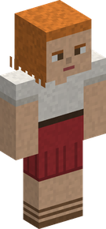
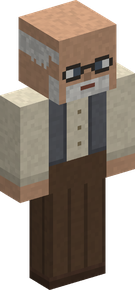
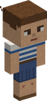
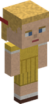

# Villages

The islands are lived in. **One Piece villages** rise in the plains, in the meadows and on the beaches, each with its own name, its people and their day. They are where the [merchants](merchants-and-contracts.md) set up their stalls, where the merchant ship anchors, and where the [village events](village-events.md) happen.

!!! note "Only in new land"
    Villages are part of the world's generation: they appear in land that has not been explored yet. In a world started before 0.3.0, sail out to find them. Minecraft's own villages still appear beside them, unless the server turns them off: see [Configuration](configuration.md#villages).

## What a village is made of

| | |
|---|---|
| **The market square** | a well, a bell, the notice board and four stalls. The travelling merchants set up here. |
| **The tavern** | with its barkeeper, who sells the rumours of the events. In the evening a musician plays there: a flute, a violin or a guitar, and the Musician's own tunes. |
| **Trade buildings** | four to six of them: restaurant, forge, workshop, laboratory, sewing room, tannery, masonry. |
| **Houses** | one inhabitant in every house and every workshop. |
| **By the water** | a port with its piers, a shipyard and a fisherman's house on stilts, and on the sea a lighthouse. A fishing boat, and sometimes a dinghy, are moored at the piers. |
| **Inland** | a windmill, with its fields of wheat, Bitter Grass and Medicinal Herb. |
| **The farm** | animals in its pen; a cat or a dog hangs about the square. |

A village on a slope has roads that climb from house to house: every door is joined to the market square, with never more than one block to step up. Smoke rises from the chimneys (each wears a **Chimney Cap**, a [block](blocks.md#village-blocks) you can take for your own roof), and the bell rings at dawn and at dusk.

**Every village has a name**: Honey Village, Anchor Town, Komura... It comes up on your screen as you walk in, and the Navigator's [Log Book](bestiary-and-logbook.md) keeps the names of the villages you have been to.

## The people

Fishermen, farmers, craftsmen and townspeople live there, with **two or three children** in each village. Right click one to hear what he has to say.

| Time of day | Where they are |
|---|---|
| Morning and afternoon | at work: the fishermen on the pier, the farmer at the mill, the craftsmen at the workshops |
| Noon | on the market square |
| Evening | at the tavern |
| Night, or when danger comes | at home |

The children play tag on the square by day and go home before the adults. Two villagers who cross stop for a word.

The villagers have **eight looks**; the two children stand half as tall as an adult.

<figure markdown>

<figcaption>Fisherman</figcaption>
</figure>

<figure markdown>

<figcaption>Farmer</figcaption>
</figure>

<figure markdown>

<figcaption>Craftsman</figcaption>
</figure>

<figure markdown>

<figcaption>Townswoman</figcaption>
</figure>

<figure markdown>

<figcaption>Young Woman</figcaption>
</figure>

<figure markdown>

<figcaption>Old Man</figcaption>
</figure>

<figure markdown>
{ style="height: 64px" }
<figcaption>Boy</figcaption>
</figure>

<figure markdown>
{ style="height: 64px" }
<figcaption>Girl</figcaption>
</figure>

In 3D: drag to turn, scroll or pinch to zoom; the buttons change the look.

**They know who you are.** A pirate whose bounty has reached **100,000 Belly** is known: people step away from him and have only a wary word. A Marine is welcome.

Pirates and bandits do not appear in the middle of a village.

## Hands off the villagers

| What you do | What it costs |
|---|---|
| Strike a civilian | your bounty rises by 100 Belly, and the village is **closed to you for a day** |
| Kill a civilian | your bounty rises by 1,000 Belly, and the village is closed to you for **three days** |
| The same to a child | double |
| Row a moored boat away from the port | a theft: it costs what a blow costs |

A player whose faction has no bounty, a Marine, loses loyalty instead. The civilians around run home, and the village's Marines come for you.

While a village is **closed** to you, its people refuse to talk, its merchants do not trade with you and its notice board will not deal with you. Sitting in a moored boat at the pier costs nothing; rowing it away does.

## The notice board

On the market square, a board shows **five small orders every morning**, one for each supplying trade: fishing, hunting, mining, farming and cooking.

- An order asks for one to three of an everyday good of that trade.
- It pays **1.3 to 1.5 times** what the goods are worth to their merchant, in Belly, with a Merchant's sales bonus on top.
- It pays **XP in the trade** too, if you practise it: half of what producing the goods gave.
- One order in four adds a small gift.
- The first player to deliver takes the order.

The bigger orders are the merchants' [contracts](merchants-and-contracts.md).

## Marines

One village in two has a small **Marine post** with a few soldiers. A few villages stand next to a large **Marine base**, with its captains and its prison.

## Life and death of a village

**New inhabitants.** A village does not stay empty after a death. Three days later, at dawn, someone new moves into the house: a fisherman after a fisherman, a child after a child, a musician at the tavern again. They only arrive while nobody is looking. The farm's animals and the cat or dog of the square come back the same way.

**A village can die.** Kill all the people of a village but one, before anyone new has moved in, and the village is dead for good:

- nobody comes to live there again, and the last inhabitant leaves at dawn;
- the travelling merchants and the merchant ship stay away, and its notice board is closed;
- its name comes up in grey, as an abandoned village;
- everyone on the server is told, and the killers share a very large bounty: **25,000 Belly for each inhabitant the village had**, split by how many each of them killed.

## Finding one

- A Navigator's [Sea Chart](trades/navigator.md) of the village kind leads to the nearest of these villages not yet charted, and to one of Minecraft's villages when there is none in reach.
- The arrival of the [merchant ship](events-at-sea.md#the-merchant-ship) names the village it anchors off, when there is one with a port near. A port on a river is too shallow for it.
- The [village events](village-events.md) are announced with the name of their village and its coordinates.
