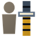
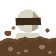

# Status effects

The **14 status effects** InoFruits adds, and what applies them.

| Effect | Kind | Applied by |
|---|---|---|
| { .effect-icon } **Amahada**{ #effect-amahada } | Beneficial | [Amahada](fruits/mitsu-mitsu-no-mi.md#amahada) |
| { .effect-icon } **Belly Crawl**{ #effect-belly-crawl } | Beneficial | [Belly Crawl](fruits/wani-wani-no-mi-model-crocodile.md#belly-crawl) |
| { .effect-icon } **Chibukure**{ #effect-chibukure } | Beneficial | [Chibukure](fruits/mushi-mushi-no-mi-model-mosquito.md#chibukure) |
| { .effect-icon } **Ekibyo**{ #effect-ekibyo } | Harmful | [Ekibyo](fruits/nezu-nezu-no-mi-model-rat.md#ekibyo) |
| { .effect-icon } **Joki**{ #effect-joki } | Harmful | [Kumori](fruits/yuge-yuge-no-mi.md#kumori), [Logia Invulnerability Yuge](fruits/yuge-yuge-no-mi.md#logia-invulnerability-yuge), [Suijoki Funshin](fruits/yuge-yuge-no-mi.md#suijoki-funshin) |
| { .effect-icon } **Kiza**{ #effect-kiza } | Harmful | [Kiza Dashi](fruits/kiza-kiza-no-mi.md#kiza-dashi) |
| { .effect-icon } **Kohaku**{ #effect-kohaku } | Harmful | [Kohaku](fruits/mitsu-mitsu-no-mi.md#kohaku) |
| { .effect-icon } **Marked**{ #effect-marked } | Harmful | [Shirushi](fruits/iro-iro-no-mi.md#shirushi) |
| { .effect-icon } **Namakura**{ #effect-namakura } | Harmful | [Mitsu Goromo](fruits/mitsu-mitsu-no-mi.md#mitsu-goromo) |
| { .effect-icon } **Nebatsuki**{ #effect-nebatsuki } | Harmful | [Amahada](fruits/mitsu-mitsu-no-mi.md#amahada), [Mitsu Goromo](fruits/mitsu-mitsu-no-mi.md#mitsu-goromo), [Mitsu Numa](fruits/mitsu-mitsu-no-mi.md#mitsu-numa), [Mitsu Suberi](fruits/mitsu-mitsu-no-mi.md#mitsu-suberi) |
| { .effect-icon } **Nomikomi**{ #effect-nomikomi } | Harmful | [Nomikomi](fruits/tsuchi-tsuchi-no-mi.md#nomikomi) |
| { .effect-icon } **Shio Form**{ #effect-shio-form } | Beneficial | [Shio Nagare](fruits/shio-shio-no-mi.md#shio-nagare) |
| { .effect-icon } **Shiozuke**{ #effect-shiozuke } | Harmful | [Logia Invulnerability Shio](fruits/shio-shio-no-mi.md#logia-invulnerability-shio), [Shio Nagare](fruits/shio-shio-no-mi.md#shio-nagare), [Shio no Ame](fruits/shio-shio-no-mi.md#shio-no-ame), [Shio no Wa](fruits/shio-shio-no-mi.md#shio-no-wa), [Shiozuke](fruits/shio-shio-no-mi.md#shiozuke) |
| { .effect-icon } **War Paint**{ #effect-war-paint } | Beneficial | [Ikusa Gesho](fruits/iro-iro-no-mi.md#ikusa-gesho) |
