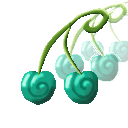

# Bai Bai no Mi

{ .mod-icon }

| | |
|---|---|
| **Type** | Paramecia |
| **Theme** | Multiplication |
| **Box** | { .box-icon } Golden |
| **Chance per opening** | golden **4.13%**, iron **0.207%**, wooden **0.010%** ([how it works](index.md#box-odds)) |
| **Abilities** | 3: 3 active, 0 passive |

Found in the base mod's **golden Devil Fruit box**. Eat it and its abilities appear in the ability menu, grouped under the fruit.

!!! note "About the values"
    The values are those of the ability's tooltip in game, with the base mod's default settings. Damage is shown on the base mod's scale, as in the ability screen.

## Bai Bunshin { #bai-bunshin }

{ .ability-icon } *Active*

Splits the user into three clones with the same gear that fight alongside them for 30 seconds.

| Stat | Value |
|---|---|
| Cooldown | 120 s |

## Baizo { #baizo }

{ .ability-icon } *Active*

Every clone next to the user splits again up to a limit, the new ones lasting as long as the old ones had left.

| Stat | Value |
|---|---|
| Cooldown | 90 s |

## Fukusei { #fukusei }

{ .ability-icon } *Active*

Makes a permanent copy of the item in the user's main hand.

| Stat | Value |
|---|---|
| Cooldown | 300 s |
