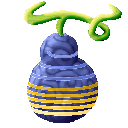

# Chiku Chiku no Mi

{ .mod-icon }

| | |
|---|---|
| **Type** | Paramecia |
| **Box** | { .box-icon } Wooden |
| **Chance per opening** | wooden **2.45%** ([how it works](index.md#box-odds)) |
| **Abilities** | 4: 3 active, 1 passive |

Found in the base mod's **wooden Devil Fruit box**. Eat it and its abilities appear in the ability menu, grouped under the fruit.

!!! note "About the values"
    The values are those of the ability's tooltip in game, with the base mod's default settings. Damage is shown on the base mod's scale, as in the ability screen.

## Chikuseki { #chikuseki }

{ .ability-icon } *Passive*

Absorbs 30% of every hit the user takes and stores the full force of it

## Chikudan { #chikudan }

{ .ability-icon } *Active*

Releases all the stored force forward as a single blast, emptying the battery.

| Stat | Value |
|---|---|
| Cooldown | 2–10 s |
| Damage | 0–24 |

## Chikuken { #chikuken }

{ .ability-icon } *Active · Punch*

Charges the next punch with all the stored force, emptying the battery on hit.

| Stat | Value |
|---|---|
| Cooldown | 3–13 s |
| Damage | 0–32 |

## Kaiho { #kaiho }

{ .ability-icon } *Active*

Releases all the stored force at once in every direction around the user.

| Stat | Value |
|---|---|
| Cooldown | 3–15 s |
| Damage | 0–30 |
| Range | 6 blocks (area) |
