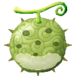
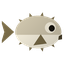
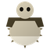
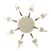
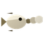
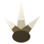

# Fugu Fugu no Mi, Model: Pufferfish

{ .mod-icon }

**Zoan** · { .box-icon } Wooden box · 7 abilities

Found in the base mod's **wooden Devil Fruit box**. Eat it and its abilities appear in the ability menu, grouped under the fruit.

!!! note "About the values"
    The values are those of the ability's tooltip in game, with the base mod's default settings. Damage is shown on the base mod's scale, as in the ability screen.

## Fugu Fugu Guard Point { #fugu-fugu-guard-point }

{ .ability-icon } *Active · Transformation*

Transforms the user into a pufferfish, which focuses on defense, good underwater but too round for most doors.

## Fugu Fugu Heavy Point { #fugu-fugu-heavy-point }

{ .ability-icon } *Active · Transformation*

Covers the user's chest, arms and legs in spiky pufferfish skin

## Bocho { #bocho }

{ .ability-icon } *Active*

The user puffs up into a spiky ball, pushing everything nearby away.

The hybrid's belly is bigger, pushing things away from further

| Stat | Value |
|---|---|
| Cooldown | 15 s |
| Damage | 6–9 |
| Range | 3.5–5 blocks (area) |

## Togeuchi { #togeuchi }

{ .ability-icon } *Active*

The user shoots a ring of spines out of their body in every direction.

The hybrid's belly throws more spines, and they hit harder

| Stat | Value |
|---|---|
| Cooldown | 8 s |
| Damage | 2–3 |

## Hosui { #hosui }

{ .ability-icon } *Active*

The user blows out a jet of air that throws them backwards.

| Stat | Value |
|---|---|
| Cooldown | 7 s |

## Toge { #toge }

{ .ability-icon } *Passive*

Enemies hitting the user in melee while in a form take some of the damage back.

## Doku { #doku }

{ .ability-icon } *Passive*

While in a form, anyone the user hits and anyone hitting the user gets poisoned.
