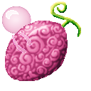

# Gamu Gamu no Mi

{ .mod-icon }

| | |
|---|---|
| **Type** | Paramecia |
| **Theme** | Chewing gum |
| **Box** | { .box-icon } Iron |
| **Chance per opening** | iron **2.32%**, wooden **0.116%** ([how it works](index.md#box-odds)) |
| **Abilities** | 5: 4 active, 1 passive |

Found in the base mod's **iron Devil Fruit box**. Eat it and its abilities appear in the ability menu, grouped under the fruit.

!!! note "About the values"
    The values are those of the ability's tooltip in game, with the base mod's default settings. Damage is shown on the base mod's scale, as in the ability screen.

## Neba Dan { #neba-dan }

{ .ability-icon } *Active*

Spits a ball of gum that sticks the target in place for a second

| Stat | Value |
|---|---|
| Cooldown | 2 s |
| Damage | 2 |

## Fuusen { #fuusen }

{ .ability-icon } *Active*

The user blows a gum bubble that floats slowly and pops on whatever it touches.

| Stat | Value |
|---|---|
| Cooldown | 11 s |
| Damage | 3–5 |
| Range | 3.5 blocks (area) |

## Kikyu { #kikyu }

{ .ability-icon } *Active*

The user blows a gum balloon in the air and floats down safely from any height

| Stat | Value |
|---|---|
| Hold | 10 s |
| Cooldown | 8 s |

## Banji Gamu { #banji-gamu }

{ .ability-icon } *Active*

Shoots a strand of gum up to 30 blocks and pulls in whatever it catches.

| Stat | Value |
|---|---|
| Hold | 6 s |
| Cooldown | 9 s |
| Range | 30 blocks (line) |

## Nebaashi { #nebaashi }

{ .ability-icon } *Passive*

Sticky gum on the feet lets the user climb walls and hang from ceilings.
