# Hone Hone no Mi

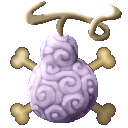{ .mod-icon }

| | |
|---|---|
| **Type** | Paramecia |
| **Theme** | Bone |
| **Box** | { .box-icon } Iron |
| **Chance per opening** | iron **2.26%**, wooden **0.113%** ([how it works](index.md#box-odds)) |
| **Abilities** | 6: 6 active, 0 passive |
| **Transformations** | [Hone Hone Point](#hone-hone-point) |
| **Amplified by Hone Hone Point** | [Bone Throw](#bone-throw), [Bone Blade](#bone-blade), [Bone Shards](#bone-shards), [Bone Mend](#bone-mend), [Spare Bone](#spare-bone) |

In 3D: drag to turn, scroll or pinch to zoom.

Found in the base mod's **iron Devil Fruit box**. Eat it and its abilities appear in the ability menu, grouped under the fruit.

!!! note "About the values"
    The values are those of the ability's tooltip in game, with the base mod's default settings. Damage is shown on the base mod's scale, as in the ability screen.

## Hone Hone Point { #hone-hone-point }

{ .ability-icon } *Active · Transformation*

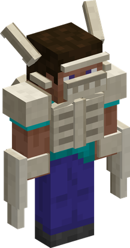{ .form-picture }

The user wears their skeleton on the outside, which makes the other bone techniques stronger while active

## Bone Throw { #bone-throw }

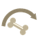{ .ability-icon } *Active*

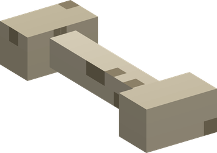{ .form-picture }

While [Hone Hone Point](#hone-hone-point) is active, this ability is amplified: it becomes 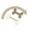{ .ability-mini }**Ossified Bone Throw**.

Throws a bone that comes back to the user, hitting enemies both ways.

| Stat | Value |
|---|---|
| Damage type | Projectile, Blunt |
| Haki | Imbuing |
| Cooldown | 7 s |
| Projectile damage | 6 |

## Bone Blade { #bone-blade }

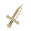{ .ability-icon } *Active*

While [Hone Hone Point](#hone-hone-point) is active, this ability is amplified: it becomes 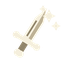{ .ability-mini }**Ossified Bone Blade**.

Grows a long bone blade out of the user's arm that can be used as a sword.

| Stat | Value |
|---|---|
| Damage type | Slash |
| Haki | Imbuing |

## Bone Shards { #bone-shards }

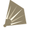{ .ability-icon } *Active*

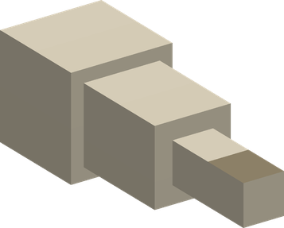{ .form-picture }

While [Hone Hone Point](#hone-hone-point) is active, this ability is amplified: it becomes 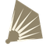{ .ability-mini }**Ossified Bone Shards**.

Shoots a burst of bone splinters in a short cone, which break apart at range

| Stat | Value |
|---|---|
| Damage type | Projectile, Slash |
| Haki | Imbuing |
| Cooldown | 5 s |
| Projectile damage | 2 |

## Bone Mend { #bone-mend }

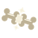{ .ability-icon } *Active*

While [Hone Hone Point](#hone-hone-point) is active, this ability is amplified: it becomes 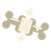{ .ability-mini }**Ossified Bone Mend**.

The user knits their bones back together, healing while the ability is held.

| Stat | Value |
|---|---|
| Hold | 10 s |
| Cooldown | 20 s |

## Spare Bone { #spare-bone }

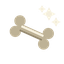{ .ability-icon } *Active*

While [Hone Hone Point](#hone-hone-point) is active, this ability is amplified: it becomes { .ability-mini }**Ossified Spare Bone**.

The user grows a spare bone and drops it in their hand

| Stat | Value |
|---|---|
| Cooldown | 1 s |
