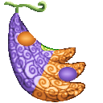
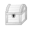
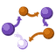
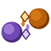
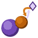
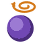

# Ichi Ichi no Mi

{ .mod-icon }

| | |
|---|---|
| **Type** | Paramecia |
| **Theme** | Swapping |
| **Box** | { .box-icon } Iron |
| **Chance per opening** | iron **2.32%**, wooden **0.116%** ([how it works](index.md#box-odds)) |
| **Abilities** | 5: 4 active, 1 passive |

Found in the base mod's **iron Devil Fruit box**. Eat it and its abilities appear in the ability menu, grouped under the fruit.

!!! note "About the values"
    The values are those of the ability's tooltip in game, with the base mod's default settings. Damage is shown on the base mod's scale, as in the ability screen.

## Irekae { #irekae }

{ .ability-icon } *Active*

The user instantly swaps places with whatever they are looking at

| Stat | Value |
|---|---|
| Cooldown | 15 s |
| Range | 128 blocks (line) |

## Zen Irekae { #zen-irekae }

{ .ability-icon } *Active*

Every living thing within 20 blocks swaps places at once, including the user.

| Stat | Value |
|---|---|
| Cooldown | 20 s |
| Range | 20 blocks (area) |

## Surikae { #surikae }

{ .ability-icon } *Active*

Swaps the item the user is holding with the item held by the first target in the way.

| Stat | Value |
|---|---|
| Cooldown | 20 s |
| Range | 128 blocks (line) |

## Hikikae { #hikikae }

{ .ability-icon } *Active*

Trades the item the user is holding for the target they're looking at, pulling them in close.

| Stat | Value |
|---|---|
| Cooldown | 20 s |
| Range | 128 blocks (line) |

## Memai { #memai }

{ .ability-icon } *Passive*

Anyone moved by the user's swaps gets slowed and can't jump for 3 seconds
