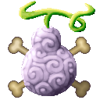
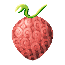
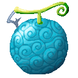
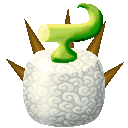
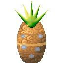
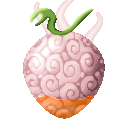
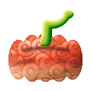
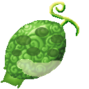
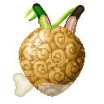
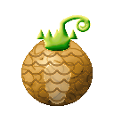

# Fruits

InoFruits adds **28 Devil Fruits**. Pick one to see its abilities.

## Paramecia

| Fruit | Box | Abilities |
|---|---|---|
| { .fruit-icon } [**Bai Bai no Mi**](bai-bai-no-mi.md) | Golden | [Bai Bunshin](bai-bai-no-mi.md#bai-bunshin), [Baizo](bai-bai-no-mi.md#baizo), [Fukusei](bai-bai-no-mi.md#fukusei) |
| { .fruit-icon } [**Chiku Chiku no Mi**](chiku-chiku-no-mi.md) | Wooden | [Chikuseki](chiku-chiku-no-mi.md#chikuseki), [Chikudan](chiku-chiku-no-mi.md#chikudan), [Chikuken](chiku-chiku-no-mi.md#chikuken), [Kaiho](chiku-chiku-no-mi.md#kaiho) |
| { .fruit-icon } [**Gamu Gamu no Mi**](gamu-gamu-no-mi.md) | Iron | [Neba Dan](gamu-gamu-no-mi.md#neba-dan), [Fuusen](gamu-gamu-no-mi.md#fuusen), [Kikyu](gamu-gamu-no-mi.md#kikyu), [Banji Gamu](gamu-gamu-no-mi.md#banji-gamu), [Nebaashi](gamu-gamu-no-mi.md#nebaashi) |
| { .fruit-icon } [**Hone Hone no Mi**](hone-hone-no-mi.md) | Iron | [Hone Hone Point](hone-hone-no-mi.md#hone-hone-point), [Bone Throw](hone-hone-no-mi.md#bone-throw), [Bone Blade](hone-hone-no-mi.md#bone-blade), [Bone Shards](hone-hone-no-mi.md#bone-shards), [Bone Mend](hone-hone-no-mi.md#bone-mend), [Spare Bone](hone-hone-no-mi.md#spare-bone) |
| { .fruit-icon } [**Ichi Ichi no Mi**](ichi-ichi-no-mi.md) | Iron | [Irekae](ichi-ichi-no-mi.md#irekae), [Zen Irekae](ichi-ichi-no-mi.md#zen-irekae), [Surikae](ichi-ichi-no-mi.md#surikae), [Hikikae](ichi-ichi-no-mi.md#hikikae), [Memai](ichi-ichi-no-mi.md#memai) |
| { .fruit-icon } [**Iro Iro no Mi**](iro-iro-no-mi.md) | Wooden | [Enogu Dama](iro-iro-no-mi.md#enogu-dama), [Shirushi](iro-iro-no-mi.md#shirushi), [Hogoshoku](iro-iro-no-mi.md#hogoshoku), [Ikusa Gesho](iro-iro-no-mi.md#ikusa-gesho), [Enogu](iro-iro-no-mi.md#enogu) |
| { .fruit-icon } [**Kane Kane no Mi**](kane-kane-no-mi.md) | Wooden | [Komyaku](kane-kane-no-mi.md#komyaku), [Meate](kane-kane-no-mi.md#meate), [Nakami](kane-kane-no-mi.md#nakami), [Kiun](kane-kane-no-mi.md#kiun) |
| { .fruit-icon } [**Kiza Kiza no Mi**](kiza-kiza-no-mi.md) | Wooden | [Kiza Dashi](kiza-kiza-no-mi.md#kiza-dashi), [Hikisage](kiza-kiza-no-mi.md#hikisage), [Kiza Modoshi](kiza-kiza-no-mi.md#kiza-modoshi) |
| { .fruit-icon } [**Kobo Kobo no Mi**](kobo-kobo-no-mi.md) | Wooden | [Te Kobo](kobo-kobo-no-mi.md#te-kobo), [Hako Kobo](kobo-kobo-no-mi.md#hako-kobo), [Chi Kobo](kobo-kobo-no-mi.md#chi-kobo), [Hara Kobo](kobo-kobo-no-mi.md#hara-kobo) |
| { .fruit-icon } [**Mitsu Mitsu no Mi**](mitsu-mitsu-no-mi.md) | Iron | [Mitsu Numa](mitsu-mitsu-no-mi.md#mitsu-numa), [Mitsu Goromo](mitsu-mitsu-no-mi.md#mitsu-goromo), [Mitsu Gusuri](mitsu-mitsu-no-mi.md#mitsu-gusuri), [Kohaku](mitsu-mitsu-no-mi.md#kohaku), [Amahada](mitsu-mitsu-no-mi.md#amahada), [Mitsu Suberi](mitsu-mitsu-no-mi.md#mitsu-suberi) |
| { .fruit-icon } [**Neji Neji no Mi**](neji-neji-no-mi.md) | Wooden | [Neji Neji Point](neji-neji-no-mi.md#neji-neji-point), [Rasen](neji-neji-no-mi.md#rasen), [Nejikiri](neji-neji-no-mi.md#nejikiri), [Nejikomi](neji-neji-no-mi.md#nejikomi), [Totsushin](neji-neji-no-mi.md#totsushin) |
| { .fruit-icon } [**Suji Suji no Mi**](suji-suji-no-mi.md) | Iron | [Suji Suji Upper Point](suji-suji-no-mi.md#suji-suji-upper-point), [Suji Suji Lower Point](suji-suji-no-mi.md#suji-suji-lower-point), [Suji Suji Full Point](suji-suji-no-mi.md#suji-suji-full-point), [Hasai](suji-suji-no-mi.md#hasai), [Choyaku](suji-suji-no-mi.md#choyaku) |
| { .fruit-icon } [**Tsuri Tsuri no Mi**](tsuri-tsuri-no-mi.md) | Wooden | [Ipponzuri](tsuri-tsuri-no-mi.md#ipponzuri), [Tsuriage](tsuri-tsuri-no-mi.md#tsuriage), [Kaginawa](tsuri-tsuri-no-mi.md#kaginawa), [Tsuribito](tsuri-tsuri-no-mi.md#tsuribito) |
| { .fruit-icon } [**Wata Wata no Mi**](wata-wata-no-mi.md) | Wooden | [Wata Yoroi](wata-wata-no-mi.md#wata-yoroi), [Watagumo](wata-wata-no-mi.md#watagumo), [Wataho](wata-wata-no-mi.md#wataho), [Watazumi](wata-wata-no-mi.md#watazumi) |

## Logia

| Fruit | Box | Abilities |
|---|---|---|
| { .fruit-icon } [**Kaze Kaze no Mi**](kaze-kaze-no-mi.md) | Golden | [Logia Invulnerability Kaze](kaze-kaze-no-mi.md#logia-invulnerability-kaze), [Kaze Special Fly](kaze-kaze-no-mi.md#kaze-special-fly), [Toppu](kaze-kaze-no-mi.md#toppu), [Josho](kaze-kaze-no-mi.md#josho), [Oroshi](kaze-kaze-no-mi.md#oroshi), [Shippu](kaze-kaze-no-mi.md#shippu), [Kamaitachi](kaze-kaze-no-mi.md#kamaitachi), [Fuuheki](kaze-kaze-no-mi.md#fuuheki), [Tatsumaki](kaze-kaze-no-mi.md#tatsumaki) |
| { .fruit-icon } [**Shio Shio no Mi**](shio-shio-no-mi.md) | Golden | [Logia Invulnerability Shio](shio-shio-no-mi.md#logia-invulnerability-shio), [Kessho no Yari](shio-shio-no-mi.md#kessho-no-yari), [Shiozuke](shio-shio-no-mi.md#shiozuke), [Shio-barai](shio-shio-no-mi.md#shio-barai), [Shio no Ame](shio-shio-no-mi.md#shio-no-ame), [Shio Nagare](shio-shio-no-mi.md#shio-nagare), [Shio no Wa](shio-shio-no-mi.md#shio-no-wa) |
| { .fruit-icon } [**Tsuchi Tsuchi no Mi**](tsuchi-tsuchi-no-mi.md) | Golden | [Logia Invulnerability Tsuchi](tsuchi-tsuchi-no-mi.md#logia-invulnerability-tsuchi), [Dochu](tsuchi-tsuchi-no-mi.md#dochu), [Jibashiri](tsuchi-tsuchi-no-mi.md#jibashiri), [Kabe](tsuchi-tsuchi-no-mi.md#kabe), [Nomikomi](tsuchi-tsuchi-no-mi.md#nomikomi), [Tsubute](tsuchi-tsuchi-no-mi.md#tsubute), [Tsuchi Tsuchi Golem](tsuchi-tsuchi-no-mi.md#tsuchi-tsuchi-golem) |
| { .fruit-icon } [**Yuge Yuge no Mi**](yuge-yuge-no-mi.md) | Iron | [Logia Invulnerability Yuge](yuge-yuge-no-mi.md#logia-invulnerability-yuge), [Kumori](yuge-yuge-no-mi.md#kumori), [Netto](yuge-yuge-no-mi.md#netto), [Suijoki Funshin](yuge-yuge-no-mi.md#suijoki-funshin), [Funshutsu](yuge-yuge-no-mi.md#funshutsu), [Suijoki Bakuhatsu](yuge-yuge-no-mi.md#suijoki-bakuhatsu), [Musu](yuge-yuge-no-mi.md#musu) |

## Zoan

| Fruit | Box | Abilities |
|---|---|---|
| { .fruit-icon } [**Fugu Fugu no Mi, Model: Pufferfish**](fugu-fugu-no-mi-model-pufferfish.md) | Wooden | [Fugu Fugu Guard Point](fugu-fugu-no-mi-model-pufferfish.md#fugu-fugu-guard-point), [Fugu Fugu Heavy Point](fugu-fugu-no-mi-model-pufferfish.md#fugu-fugu-heavy-point), [Bocho](fugu-fugu-no-mi-model-pufferfish.md#bocho), [Togeuchi](fugu-fugu-no-mi-model-pufferfish.md#togeuchi), [Hosui](fugu-fugu-no-mi-model-pufferfish.md#hosui), [Toge](fugu-fugu-no-mi-model-pufferfish.md#toge), [Doku](fugu-fugu-no-mi-model-pufferfish.md#doku) |
| { .fruit-icon } [**Isa Isa no Mi, Model: Whale**](isa-isa-no-mi-model-whale.md) | Wooden | [Isa Isa Guard Point](isa-isa-no-mi-model-whale.md#isa-isa-guard-point), [Isa Isa Heavy Point](isa-isa-no-mi-model-whale.md#isa-isa-heavy-point), [Taiatari](isa-isa-no-mi-model-whale.md#taiatari), [Shiofuki](isa-isa-no-mi-model-whale.md#shiofuki), [Utagoe](isa-isa-no-mi-model-whale.md#utagoe), [Isa Rideable](isa-isa-no-mi-model-whale.md#isa-rideable) |
| { .fruit-icon } [**Ita Ita no Mi, Model: Ferret**](ita-ita-no-mi-model-ferret.md) | Iron | [Ita Ita Walk Point](ita-ita-no-mi-model-ferret.md#ita-ita-walk-point), [Ita Ita Heavy Point](ita-ita-no-mi-model-ferret.md#ita-ita-heavy-point), [Weasel Bound](ita-ita-no-mi-model-ferret.md#weasel-bound), [Rending Claws](ita-ita-no-mi-model-ferret.md#rending-claws), [Ferret Dart](ita-ita-no-mi-model-ferret.md#ferret-dart), [Saigoppe](ita-ita-no-mi-model-ferret.md#saigoppe), [Death Sleep](ita-ita-no-mi-model-ferret.md#death-sleep) |
| { .fruit-icon } [**Kani Kani no Mi, Model: Crab**](kani-kani-no-mi-model-crab.md) | Wooden | [Kani Kani Guard Point](kani-kani-no-mi-model-crab.md#kani-kani-guard-point), [Kani Kani Heavy Point](kani-kani-no-mi-model-crab.md#kani-kani-heavy-point), [Yokobashiri](kani-kani-no-mi-model-crab.md#yokobashiri), [Hasamikomi](kani-kani-no-mi-model-crab.md#hasamikomi) |
| { .fruit-icon } [**Kero Kero no Mi, Model: Frog**](kero-kero-no-mi-model-frog.md) | Iron | [Kero Kero Walk Point](kero-kero-no-mi-model-frog.md#kero-kero-walk-point), [Kero Kero Heavy Point](kero-kero-no-mi-model-frog.md#kero-kero-heavy-point), [Shita](kero-kero-no-mi-model-frog.md#shita), [Hoppu](kero-kero-no-mi-model-frog.md#hoppu), [Nendeki](kero-kero-no-mi-model-frog.md#nendeki), [Shita Muchi](kero-kero-no-mi-model-frog.md#shita-muchi), [Tobitsuki](kero-kero-no-mi-model-frog.md#tobitsuki) |
| { .fruit-icon } [**Mushi Mushi no Mi, Model: Mosquito**](mushi-mushi-no-mi-model-mosquito.md) | Iron | [Mushi Mushi Fly Point](mushi-mushi-no-mi-model-mosquito.md#mushi-mushi-fly-point), [Mushi Mushi Heavy Point](mushi-mushi-no-mi-model-mosquito.md#mushi-mushi-heavy-point), [Mushi Mushi Flight](mushi-mushi-no-mi-model-mosquito.md#mushi-mushi-flight), [Mushi](mushi-mushi-no-mi-model-mosquito.md#mushi), [Kyuketsu](mushi-mushi-no-mi-model-mosquito.md#kyuketsu), [Chibukure](mushi-mushi-no-mi-model-mosquito.md#chibukure), [Kabashira](mushi-mushi-no-mi-model-mosquito.md#kabashira) |
| { .fruit-icon } [**Nezu Nezu no Mi, Model: Rat**](nezu-nezu-no-mi-model-rat.md) | Wooden | [Nezu Nezu Walk Point](nezu-nezu-no-mi-model-rat.md#nezu-nezu-walk-point), [Nezu Nezu Heavy Point](nezu-nezu-no-mi-model-rat.md#nezu-nezu-heavy-point), [Ekibyo](nezu-nezu-no-mi-model-rat.md#ekibyo), [Hassho](nezu-nezu-no-mi-model-rat.md#hassho), [Hige](nezu-nezu-no-mi-model-rat.md#hige), [Kajiru](nezu-nezu-no-mi-model-rat.md#kajiru) |
| { .fruit-icon } [**Usa Usa no Mi, Model: Hare**](usa-usa-no-mi-model-hare.md) | Wooden | [Usa Usa Walk Point](usa-usa-no-mi-model-hare.md#usa-usa-walk-point), [Usa Usa Heavy Point](usa-usa-no-mi-model-hare.md#usa-usa-heavy-point), [Ushiro Geri](usa-usa-no-mi-model-hare.md#ushiro-geri), [Datto](usa-usa-no-mi-model-hare.md#datto), [Usagitobi](usa-usa-no-mi-model-hare.md#usagitobi) |
| { .fruit-icon } [**Wani Wani no Mi, Model: Crocodile**](wani-wani-no-mi-model-crocodile.md) | Iron | [Wani Wani Walk Point](wani-wani-no-mi-model-crocodile.md#wani-wani-walk-point), [Wani Wani Heavy Point](wani-wani-no-mi-model-crocodile.md#wani-wani-heavy-point), [Death Roll](wani-wani-no-mi-model-crocodile.md#death-roll), [Tail Sweep](wani-wani-no-mi-model-crocodile.md#tail-sweep), [Lunging Bite](wani-wani-no-mi-model-crocodile.md#lunging-bite), [Belly Crawl](wani-wani-no-mi-model-crocodile.md#belly-crawl) |
| { .fruit-icon } [**Zuku Zuku no Mi, Model: Owl**](zuku-zuku-no-mi-model-owl.md) | Iron | [Zuku Zuku Fly Point](zuku-zuku-no-mi-model-owl.md#zuku-zuku-fly-point), [Zuku Zuku Assault Point](zuku-zuku-no-mi-model-owl.md#zuku-zuku-assault-point), [Zuku Zuku Flight](zuku-zuku-no-mi-model-owl.md#zuku-zuku-flight), [Anshi](zuku-zuku-no-mi-model-owl.md#anshi), [Washizukami](zuku-zuku-no-mi-model-owl.md#washizukami), [Habataki](zuku-zuku-no-mi-model-owl.md#habataki), [Kazakiribane](zuku-zuku-no-mi-model-owl.md#kazakiribane) |
