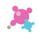
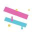

# Iro Iro no Mi

{ .mod-icon }

**Paramecia** · { .box-icon } Wooden box · 5 abilities

Found in the base mod's **wooden Devil Fruit box**. Eat it and its abilities appear in the ability menu, grouped under the fruit.

Chance per box opening: wooden box **2.45%** ([how it works](index.md#box-odds)).

!!! note "About the values"
    The values are those of the ability's tooltip in game, with the base mod's default settings. Damage is shown on the base mod's scale, as in the ability screen.

## Enogu Dama { #enogu-dama }

{ .ability-icon } *Active*

Throws a paint blob that does a little damage and blinds the target for 5 seconds

| Stat | Value |
|---|---|
| Cooldown | 6 s |
| Projectile damage | 2 |

## Shirushi { #shirushi }

{ .ability-icon } *Active*

Applies { .effect-mini }[Marked](../effects.md#effect-marked)

Paints a mark on the first target in the way which can be seen through walls.

| Stat | Value |
|---|---|
| Cooldown | 15 s |
| Range | 12 blocks (line) |

## Hogoshoku { #hogoshoku }

{ .ability-icon } *Active*

The user takes on the colors of what's behind them, only works while standing still

| Stat | Value |
|---|---|
| Hold | 30 s |
| Cooldown | 20 s |

## Ikusa Gesho { #ikusa-gesho }

{ .ability-icon } *Active*

Applies { .effect-mini }[War Paint](../effects.md#effect-war-paint)

Paints the user for battle, giving a different bonus for each of the 16 colors.

White: +2 toughness.

Orange: immune to fire.

Magenta: +0.3 knockback resistance.

Light Blue: +30% jump height.

Yellow: +4 armour.

Lime: never hungry.

Pink: +4 max health.

Gray: +8 fall resistance.

Light Gray: haste.

Cyan: +20% attack speed.

Purple: +2 luck.

Blue: +15% movement speed.

Brown: +0.3 friction.

Green: double natural regeneration.

Red: +2 punch damage.

Black: night vision.

| Stat | Value |
|---|---|
| Hold | 30 s |
| Cooldown | 30 s |

## Enogu { #enogu }

{ .ability-icon } *Active*

Produces some dye, changing the ability mode picks the next one of the 16 colors

The color picked also changes Shirushi's mark, Enogu Dama's splash and Ikusa Gesho's bonus.

| Stat | Value |
|---|---|
| Cooldown | 1 s |
