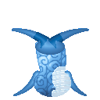

# Isa Isa no Mi, Model: Whale

{ .mod-icon }

**Zoan** · Wooden box · 6 abilities

Found in the base mod's **wooden Devil Fruit box**. Eat it and its abilities appear in the ability menu, grouped under the fruit.

!!! note "About the values"
    The values are those of the ability's tooltip in game, with the base mod's default settings. Damage is shown on the base mod's scale, as in the ability screen.

## Isa Isa Guard Point { #isa-isa-guard-point }

{ .ability-icon } *Active · Transformation*

Transforms the user into a whale, which focuses on defense, barely moving on land but very fast in water.

## Isa Isa Heavy Point { #isa-isa-heavy-point }

{ .ability-icon } *Active · Transformation*

Transforms the user into a whale hybrid that can still walk at normal speed.

## Taiatari { #taiatari }

{ .ability-icon } *Active*

Requires Isa Isa Heavy Point or Isa Isa Guard Point to be active.

**Heavy Point**: The user jumps in the air and falls flat, crushing everything around them.

| Stat | Value |
|---|---|
| Cooldown | 15 s |
| Damage | 8 |
| Range | 4.5 blocks (area) |

**Guard Point**: A whole whale lands instead of a person, reaching almost twice as far

| Stat | Value |
|---|---|
| Cooldown | 15 s |
| Damage | 14 |
| Range | 8 blocks (area) |

## Shiofuki { #shiofuki }

{ .ability-icon } *Active*

Requires Isa Isa Heavy Point or Isa Isa Guard Point to be active.

**Heavy Point**: Makes a column of water burst in front of the user launching enemies up and putting out fires.

| Stat | Value |
|---|---|
| Cooldown | 8 s |
| Range | 2.5 blocks (area) |

**Guard Point**: The whole whale spouts further ahead, wider and higher

| Stat | Value |
|---|---|
| Cooldown | 8 s |
| Range | 4 blocks (area) |

## Utagoe { #utagoe }

{ .ability-icon } *Active*

Requires Isa Isa Heavy Point or Isa Isa Guard Point to be active.

**Heavy Point**: The user sings, making themselves and nearby allies resistant to damage.

| Stat | Value |
|---|---|
| Cooldown | 20 s |
| Range | 8 blocks (area) |

**Guard Point**: The whole whale's song carries further and lasts longer

| Stat | Value |
|---|---|
| Cooldown | 20 s |
| Range | 14 blocks (area) |

## Isa Rideable { #isa-rideable }

{ .ability-icon } *Passive*

Allows other players to ride on the whale's back

Requires Isa Isa Guard Point to be active.
