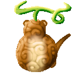
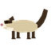
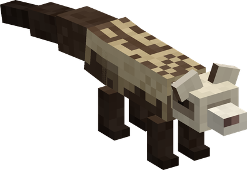
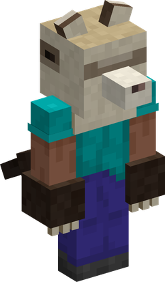
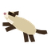
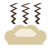
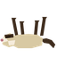

# Ita Ita no Mi, Model: Ferret

{ .mod-icon }

| | |
|---|---|
| **Type** | Zoan |
| **Box** | { .box-icon } Iron |
| **Chance per opening** | iron **2.26%**, wooden **0.113%** ([how it works](index.md#box-odds)) |
| **Abilities** | 7: 7 active, 0 passive |
| **Transformations** | [Ita Ita Walk Point](#ita-ita-walk-point), [Ita Ita Heavy Point](#ita-ita-heavy-point) |

Its forms in 3D: drag to turn, scroll or pinch to zoom.

Found in the base mod's **iron Devil Fruit box**. Eat it and its abilities appear in the ability menu, grouped under the fruit.

!!! note "About the values"
    The values are those of the ability's tooltip in game, with the base mod's default settings. Damage is shown on the base mod's scale, as in the ability screen.

## Ita Ita Walk Point { #ita-ita-walk-point }

{ .ability-icon } *Active · Transformation*

{ .form-picture }

Transforms the user into a ferret, which focuses on speed and staying low to the ground

## Ita Ita Heavy Point { #ita-ita-heavy-point }

{ .ability-icon } *Active · Transformation*

{ .form-picture }

Transforms the user into a ferret hybrid, which focuses on speed and claw attacks.

## Weasel Bound { #weasel-bound }

{ .ability-icon } *Active*

The user leaps far forward and hits everything under them when landing

Requires Ita Ita Heavy Point or Ita Ita Walk Point to be active.

| Stat | Value |
|---|---|
| Cooldown | 6 s |
| Damage | 2 |
| Range | 2.5 blocks (area) |

## Rending Claws { #rending-claws }

{ .ability-icon } *Active · Punch*

Slashes the target with thin claws making it bleed.

## Ferret Dart { #ferret-dart }

{ .ability-icon } *Active*

Dashes forward in an instant hitting anything in the way

Requires Ita Ita Heavy Point or Ita Ita Walk Point to be active.

| Stat | Value |
|---|---|
| Cooldown | 4 s |
| Damage | 3 |
| Range | 7 blocks (line) |

## Saigoppe { #saigoppe }

{ .ability-icon } *Active*

Releases a foul musk that makes everyone nearby dizzy, sick and slow.

Requires Ita Ita Heavy Point or Ita Ita Walk Point to be active.

| Stat | Value |
|---|---|
| Cooldown | 20 s |
| Range | 5 blocks (area) |

## Death Sleep { #death-sleep }

{ .ability-icon } *Active*

The ferret plays dead, taking less damage while lying down and healing quickly

Requires Ita Ita Walk Point to be active.

| Stat | Value |
|---|---|
| Cooldown | 10–20 s |
| Hold | 10 s |
