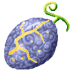

# Kane Kane no Mi

{ .mod-icon }

**Paramecia** · { .box-icon } Wooden box · 4 abilities

Found in the base mod's **wooden Devil Fruit box**. Eat it and its abilities appear in the ability menu, grouped under the fruit.

Chance per box opening: wooden box **2.45%** ([how it works](index.md#box-odds)).

!!! note "About the values"
    The values are those of the ability's tooltip in game, with the base mod's default settings. Damage is shown on the base mod's scale, as in the ability screen.

## Komyaku { #komyaku }

{ .ability-icon } *Active*

Highlights everything valuable within 32 blocks for 12 seconds, even through walls.

| Stat | Value |
|---|---|
| Cooldown | 15 s |
| Range | 32 blocks (area) |

## Meate { #meate }

{ .ability-icon } *Active*

Marks the most valuable thing within 64 blocks for 2 minutes.

| Stat | Value |
|---|---|
| Cooldown | 20 s |
| Range | 64 blocks (area) |

## Nakami { #nakami }

{ .ability-icon } *Active*

Shows what's inside the container the user is looking at without opening it

| Stat | Value |
|---|---|
| Cooldown | 5 s |
| Range | 32 blocks (line) |

## Kiun { #kiun }

{ .ability-icon } *Passive*

The user is always lucky and Devil Fruit boxes upgrade three times as often.

**Stats while active**

| Stat | Value |
|---|---|
| Luck | +2 |
