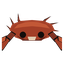
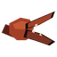
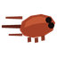
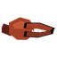

# Kani Kani no Mi, Model: Crab

**Zoan** · Wooden box · 4 abilities

Found in the base mod's **wooden Devil Fruit box**. Eat it and its abilities appear in the ability menu, grouped under the fruit.

!!! note "About the values"
    The values are those of the ability's tooltip in game, with the base mod's default settings. Damage is shown on the base mod's scale, as in the ability screen.

## Kani Kani Guard Point { #kani-kani-guard-point }

{ .ability-icon } *Active · Transformation*

Transforms the user into a crab, which focuses on defense, can breathe underwater and walk on the sea floor.

## Kani Kani Heavy Point { #kani-kani-heavy-point }

{ .ability-icon } *Active · Transformation*

Grows a shell over the chest and a pincer on each arm, making the user hard to push and slow

## Yokobashiri { #yokobashiri }

{ .ability-icon } *Active*

Dashes with a burst of speed and no wind up, sideways when in the shell form

| Stat | Value |
|---|---|
| Cooldown | 4 s |

## Hasamikomi { #hasamikomi }

{ .ability-icon } *Active*

Grabs whatever is in front of the user with a claw and drags it around.

The pincers crush harder and the last squeeze makes the target bleed

| Stat | Value |
|---|---|
| Cooldown | 10 s |
| Damage | 4–6 |
