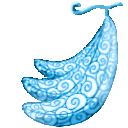

# Kaze Kaze no Mi

{ .mod-icon }

**Logia** · { .box-icon } Golden box · 9 abilities

Found in the base mod's **golden Devil Fruit box**. Eat it and its abilities appear in the ability menu, grouped under the fruit.

Chance per box opening: golden box **4.13%**, iron box **0.207%**, wooden box **0.010%** ([how it works](index.md#box-odds)).

!!! note "About the values"
    The values are those of the ability's tooltip in game, with the base mod's default settings. Damage is shown on the base mod's scale, as in the ability screen.

## Logia Invulnerability Kaze { #logia-invulnerability-kaze }

{ .ability-icon } *Passive*

Allows the user to avoid attacks by instinctively transforming parts of their body into their specific element

## Kaze Special Fly { #kaze-special-fly }

{ .ability-icon } *Passive*

Allows the user to fly, going faster when not in combat

## Toppu { #toppu }

{ .ability-icon } *Active*

Shoots a gust of wind where the user is looking, blowing away everything in front of them.

| Stat | Value |
|---|---|
| Cooldown | 9 s |
| Damage | 5 |
| Range | 14 blocks (cone) |

## Josho { #josho }

{ .ability-icon } *Active*

Creates a column of rising air that lifts anything inside up to 18 blocks.

| Stat | Value |
|---|---|
| Hold | 8 s |
| Cooldown | 15 s |
| Range | 2.5 blocks (area) |

## Oroshi { #oroshi }

{ .ability-icon } *Active*

A downward wind slams everything in the air within 12 blocks into the ground

| Stat | Value |
|---|---|
| Cooldown | 10 s |
| Damage | 7 |
| Range | 12 blocks (area) |

## Shippu { #shippu }

{ .ability-icon } *Active*

The user turns into wind and rushes forward in a line, cutting and launching everything caught in it.

| Stat | Value |
|---|---|
| Cooldown | 12 s |
| Hold | 3 s |
| Damage | 8 |

## Kamaitachi { #kamaitachi }

{ .ability-icon } *Active*

Throws a flat spinning disc of air that flies straight without dropping.

| Stat | Value |
|---|---|
| Cooldown | 4 s |
| Projectile damage | 10 |

## Fuuheki { #fuuheki }

{ .ability-icon } *Active*

Creates a wall of spinning air that deflects every projectile coming within 4 blocks.

| Stat | Value |
|---|---|
| Hold | 6 s |
| Cooldown | 14 s |
| Range | 4 blocks (area) |

## Tatsumaki { #tatsumaki }

{ .ability-icon } *Active*

Creates a tornado where the user is looking, which moves wherever they look next.

| Stat | Value |
|---|---|
| Hold | 6 s |
| Cooldown | 25 s |
| Damage | 5 |
| Range | 40 blocks (area) |
