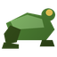
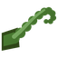
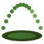
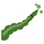
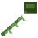

# Kero Kero no Mi, Model: Frog

**Zoan** · Iron box · 7 abilities

Found in the base mod's **iron Devil Fruit box**. Eat it and its abilities appear in the ability menu, grouped under the fruit.

!!! note "About the values"
    The values are those of the ability's tooltip in game, with the base mod's default settings. Damage is shown on the base mod's scale, as in the ability screen.

## Kero Kero Walk Point { #kero-kero-walk-point }

{ .ability-icon } *Active · Transformation*

Transforms the user into a frog, which focuses on jumping and staying low

## Kero Kero Heavy Point { #kero-kero-heavy-point }

{ .ability-icon } *Active · Transformation*

Transforms the user into a frog hybrid with human hands, a frog head and frog legs.

## Shita { #shita }

{ .ability-icon } *Active*

Shoots out the tongue, pulling whoever it hits in close and holding them.

| Stat | Value |
|---|---|
| Cooldown | 7 s |
| Range | 48 blocks (line) |
| Damage | 3 |

## Hoppu { #hoppu }

{ .ability-icon } *Active*

The user jumps up from the ground and slams anything under them when coming down.

| Stat | Value |
|---|---|
| Cooldown | 8 s |
| Range | 3.5 blocks (area) |

## Nendeki { #nendeki }

{ .ability-icon } *Passive*

The user's skin is sticky, the next projectile that hits them gets stuck without doing damage

## Shita Muchi { #shita-muchi }

{ .ability-icon } *Active*

Whips the tongue out, hurting whatever it hits without pulling it.

| Stat | Value |
|---|---|
| Cooldown | 4 s |
| Range | 48 blocks (line) |
| Damage | 9 |

## Tobitsuki { #tobitsuki }

{ .ability-icon } *Active*

Sticks the tongue onto a target or block and pulls the user to it

| Stat | Value |
|---|---|
| Cooldown | 6 s |
| Range | 48 blocks (line) |
