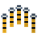
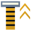

# Kiza Kiza no Mi

{ .mod-icon }

| | |
|---|---|
| **Type** | Paramecia |
| **Theme** | Slider |
| **Box** | { .box-icon } Wooden |
| **Chance per opening** | wooden **2.32%** ([how it works](index.md#box-odds)) |
| **Abilities** | 6: 6 active, 0 passive |
| **Effects applied** | { .effect-mini }[Kiza](../effects.md#effect-kiza) |

Found in the base mod's **wooden Devil Fruit box**. Eat it and its abilities appear in the ability menu, grouped under the fruit.

!!! note "About the values"
    The values are those of the ability's tooltip in game, with the base mod's default settings. Damage is shown on the base mod's scale, as in the ability screen.

## Kiza Dashi { #kiza-dashi }

{ .ability-icon } *Active*

Applies { .effect-mini }[Kiza](../effects.md#effect-kiza)

Puts a slider on the target the user is looking at for 20 seconds

| Stat | Value |
|---|---|
| Cooldown | 3 s |
| Range | 9 blocks (line) |

## Hikisage { #hikisage }

{ .ability-icon } *Active*

Pulls down the slider on a marked target and gives the user what gets taken off.

| Stat | Value |
|---|---|
| Cooldown | 12 s |
| Range | 9 blocks (line) |

## Kiza Modoshi { #kiza-modoshi }

{ .ability-icon } *Active*

The user pulls back their own sliders, removing every bad effect on them at once

| Stat | Value |
|---|---|
| Cooldown | 60 s |

## Kiza Maki { #kiza-maki }

{ .ability-icon } *Active*

Applies { .effect-mini }[Kiza](../effects.md#effect-kiza)

Puts a slider on every enemy in a wide cone in front of the user, for 10 seconds.

| Stat | Value |
|---|---|
| Cooldown | 16 s |
| Range | 12 blocks (cone) |

## Oshiage { #oshiage }

{ .ability-icon } *Active*

Pushes up the slider on a marked ally by pulling down the user's own: the user loses speed or strength and the ally gains it.

| Stat | Value |
|---|---|
| Cooldown | 12 s |
| Range | 12 blocks (line) |

## Zen Hikisage { #zen-hikisage }

{ .ability-icon } *Active*

Pulls the master down: every marked body around the user loses both speed and strength at once, and the user takes a share of each.

| Stat | Value |
|---|---|
| Cooldown | 40 s |
| Range | 16 blocks (area) |
