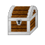

# Kiza Kiza no Mi

{ .mod-icon }

**Paramecia** · { .box-icon } Wooden box · 3 abilities

Found in the base mod's **wooden Devil Fruit box**. Eat it and its abilities appear in the ability menu, grouped under the fruit.

!!! note "About the values"
    The values are those of the ability's tooltip in game, with the base mod's default settings. Damage is shown on the base mod's scale, as in the ability screen.

## Kiza Dashi { #kiza-dashi }

{ .ability-icon } *Active*

Puts a slider on the target the user is looking at for 20 seconds

| Stat | Value |
|---|---|
| Cooldown | 3 s |
| Range | 9 blocks (line) |

## Hikisage { #hikisage }

{ .ability-icon } *Active*

Pulls down the slider on a marked target and gives the user what gets taken off.

| Stat | Value |
|---|---|
| Cooldown | 12 s |
| Range | 9 blocks (line) |

## Kiza Modoshi { #kiza-modoshi }

{ .ability-icon } *Active*

The user pulls back their own sliders, removing every bad effect on them at once

| Stat | Value |
|---|---|
| Cooldown | 60 s |
