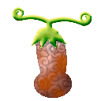
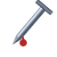
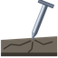
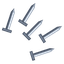
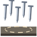
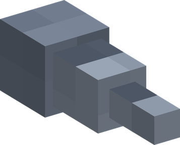
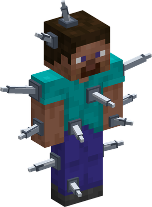
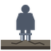
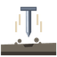

# Kugi Kugi no Mi

{ .mod-icon }

| | |
|---|---|
| **Type** | Paramecia |
| **Theme** | Nails |
| **Box** | { .box-icon } Wooden |
| **Chance per opening** | wooden **2.32%** ([how it works](index.md#box-odds)) |
| **Abilities** | 6: 6 active, 0 passive |
| **Transformations** | [Kugi Yoroi](#kugi-yoroi) |
| **Effects applied** | { .effect-mini }[Nailed](../effects.md#effect-nailed) |

In 3D: drag to turn, scroll or pinch to zoom.

Found in the base mod's **wooden Devil Fruit box**. Eat it and its abilities appear in the ability menu, grouped under the fruit.

!!! note "About the values"
    The values are those of the ability's tooltip in game, with the base mod's default settings. Damage is shown on the base mod's scale, as in the ability screen.

## Kugizuke { #kugizuke }

{ .ability-icon } *Active*

{ .form-picture }

Applies { .effect-mini }[Nailed](../effects.md#effect-nailed)

Throws a big nail that pins the target to the ground where it stands.

| Stat | Value |
|---|---|
| Cooldown | 12 s |
| Damage | 5 |

## Kugibari { #kugibari }

{ .ability-icon } *Active*

{ .form-picture }

Applies { .effect-mini }[Nailed](../effects.md#effect-nailed)

Throws a spread of small nails; each one slows the target more, and three of them pin it down.

| Stat | Value |
|---|---|
| Cooldown | 8 s |
| Damage | 2.5 |

## Kugi Ame { #kugi-ame }

{ .ability-icon } *Active*

{ .form-picture }

Applies { .effect-mini }[Nailed](../effects.md#effect-nailed)

Marks the targeted spot, then rains small nails down on it; each one slows, and three of them pin a target down.

| Stat | Value |
|---|---|
| Cooldown | 14 s |
| Range | 4 blocks (area) |
| Damage | 2.5 |

## Kugi Yoroi { #kugi-yoroi }

{ .ability-icon } *Active · Transformation*

{ .form-picture }

Applies { .effect-mini }[Nailed](../effects.md#effect-nailed)

Nails stand out of the user's whole body: melee attackers are hurt and keep a nail, and anything pressed against the user is hurt every second.

| Stat | Value |
|---|---|
| Cooldown | 16 s |
| Hold | 10 s |
| Damage | 2.5 |

## Kugi Dome { #kugi-dome }

{ .ability-icon } *Active*

The user nails their own feet to the ground: they cannot move, take no knockback and take less damage until they stop.

| Stat | Value |
|---|---|
| Cooldown | 10 s |
| Hold | 10 s |

## Kuginuki { #kuginuki }

{ .ability-icon } *Active*

Rips out every nail in every body nearby at once, dealing more damage the more nails there were.

| Stat | Value |
|---|---|
| Cooldown | 14 s |
| Range | 20 blocks (area) |
| Damage | 7–23 |
